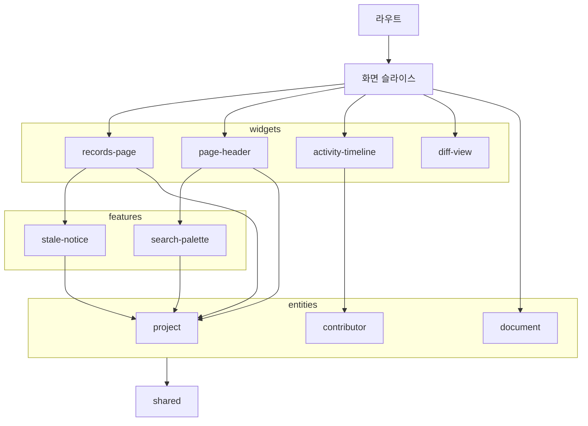
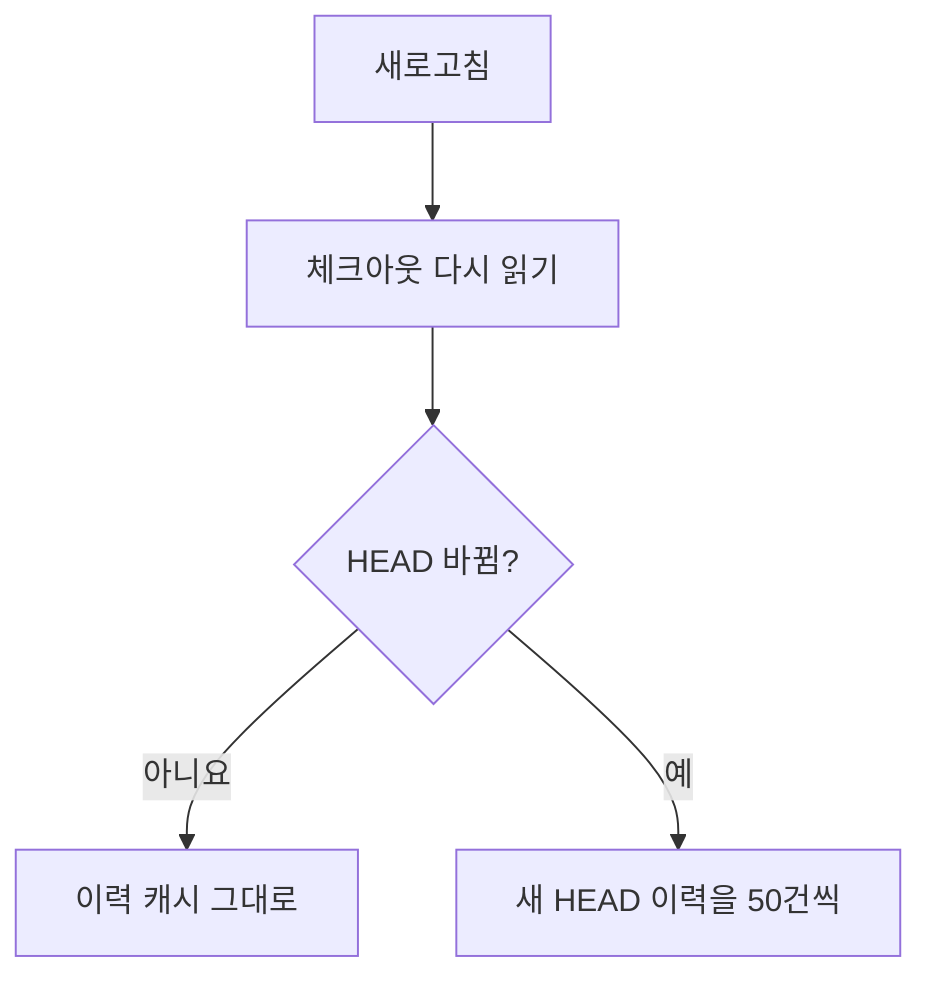

브라우저는 CLI 로컬 서버가 제공하는 읽기 전용 React SPA다. 대시보드, 요구사항, 프로젝트 지침, 결정기록, 참여자, Git 상태를 보여 주며 요구사항을 편집하거나 승인을 만들지 않는다. 이 지침은 브라우저 코드를 고칠 때 따르는 규칙을 둔다. 규칙을 정한 맥락과 검토한 대안은 결정기록에 있으므로, 규칙을 바꾸기 전에 `records list --doc I-5x5yhjlk4u`로 읽는다.

## 경로와 URL 상태

`/`는 `/dashboard`로 replace 리다이렉트한다. 화면의 상태는 종류마다 둘 곳이 정해져 있다.

| 상태 | 둘 곳 |
| :--- | :--- |
| 목록을 대체하는 상세의 대상(기능 ID·참여자 이메일·문서 ID·커밋) | Router 경로 매개변수 |
| 같은 화면 안의 상태(기능 상세의 `tab`, 지침의 `file`, 검색어 `q`, 필터·정렬·페이지) | Router의 검증된 search params |
| CLI 응답·조회 오류·재조회 상태 | TanStack Query |
| 모바일 메뉴 등 일시 UI | 컴포넌트 또는 app provider |
| 표시 언어·화면 모드·색 조합·메뉴 폭 | 그 브라우저의 localStorage |

검색 입력은 URL을 replace하고, 상세 이동은 뒤로가기로 복원한다. 필터·정렬의 기본값은 주소에 쓰지 않으며, 목록에서 상세로 갈 때와 돌아올 때 그대로 넘긴다. 검색창은 입력값을 URL에 직접 묶지 않고 필드가 값을 들고 URL에 따라 반영한다(`widgets/records-page/ui/SearchFilter.tsx`).

모든 화면 머리의 문서 검색 입구와 `mod+K`는 같은 검색창을 열고, 검색창에는 별도 주소를 두지 않는다.

## 코드 구성

FSD의 계층·의존 방향·공개 API 규칙은 [프론트엔드 코드 스타일](references/code-style.md)을 따른다. 단일 화면의 api/model/ui는 그 page에 두고, 여러 화면이 공유하는 조회·도메인 표현만 entities, 공통 화면 블록은 widgets에 둔다. `features`에는 사용자 동작인 문서 검색(`search-palette`)과 뒤처진 화면의 새로 고침 알림(`stale-notice`)이 있고, 셸·머리 막대 위젯과 `records-page`가 가져다 쓴다. 주요 슬라이스의 의존은 아래와 같다.

| 슬라이스 | 맡는 것 |
| :--- | :--- |
| `app/routes` | 라우트 파일과 search params 검증. 화면 컴포넌트는 pages에 둔다 |
| `pages/*` | 화면마다 하나: overview·features·instructions·activity·commit·contributors·git-status·settings·about·getting-started·changelog·not-found. `commit`은 커밋 페이지, 기록 상세, 커밋 전 페이지(`/records/working`)를 함께 맡는다 |
| `widgets/records-page` | 명세·문서 화면이 함께 쓰는 틀: 세션·명세 조회, 머리 막대, 골격, 오류, 검색 인자 |
| `widgets/activity-timeline` | 결정기록 목록·대시보드가 쓰는 타임라인. 커밋 페이지와 기록 상세도 그 기록 묶기(`groupRecords`)를 쓴다 |
| `widgets/diff-view` | 줄 단위 diff(`LineDiff`) |
| `widgets/page-header`·`app-shell` | 머리 막대, 셸 |
| `features/search-palette` | 검색창(`SearchPalette`)과 머리의 검색 버튼(`SearchTrigger`) |
| `features/stale-notice` | 탭으로 돌아올 때 지문을 물어 화면이 뒤처졌는지 보는 훅(`useBehind`)과 알림(`StaleNotice`) |
| `entities/project` | 세션·명세·이력·커밋 전 작업·지문 Query와 미커밋 여부 훅(`useWorkingChanges`) |
| `entities/contributor`·`document` | 작성자 표시, 설계 문서 표시와 문서의 커밋 상태 Token(`StateToken`) |

틀(`records-page`)은 다른 위젯을 직접 부르지 않도록 머리 막대 부품(`PageHeader`)을 화면에서 받는다. CSS 모듈은 파일마다 클래스 이름을 바꾸므로 한 선택자에 다른 슬라이스의 클래스를 섞지 않는다. 틀이 화면의 요소를 알아봐야 하면 속성(`data-page-footer`)으로 표시한다.

화면 문구는 `shared/i18n`의 `t()`·`tNodes()`로 가져오고, 규칙은 [CLI 아키텍처](../cli-architecture/index.md)의 사용자에게 보이는 문구 절을 따른다. 소개 본문은 `packages/intro/<lang>/intro.md`를 `shared/i18n`이 가져오고, 맨 앞 로고 블록은 같은 패키지의 로고 파일을 번들한 이미지로 보여 준다.

## 데이터 흐름

QueryClient는 앱에서 하나만 만든다. 조회 키에는 계약 이름과 버전, origin, 서버 세션, worktree를 넣어 다른 세션의 캐시를 이어 보여 주지 않는다. 읽기 HTTP는 AbortSignal을 전달하고, 서버 상태를 localStorage에 영구 저장하지 않는다. 자동 재시도는 하지 않으며(`retry: false`) 상태 갱신 POST를 반복하지 않는다.

> [!IMPORTANT]
> 처음 로딩·빈 결과·조회 실패를 구분하고, 실패를 빈 목록이나 clean으로 바꾸지 않는다. 재조회가 실패하면 이전 자료와 확인 시각을 유지하고, 세션 변경·계약 불일치는 다시 연결하게 한다.

파일 변경을 자동으로 통지받는다고 가정하지 않고 헤더의 새로고침으로 갱신한다. 그래서 명세 조회는 만료되지 않는다(staleTime 무한). 이력은 HEAD·조건마다 `useInfiniteQuery`로 50건씩 이어 읽고, 다음 페이지가 실패해도 기존 목록을 보존한다.

같은 HEAD의 이력은 바뀌지 않으므로 새로고침은 체크아웃만 다시 읽는다. 셸은 미커밋 변경을 보이려고 명세 API를 따로 호출하지 않는다.

첫 조회의 골격은 200ms 뒤에 나타나 최소 300ms 머문다(`useLoadingHold`). 골격은 화면별 실제 배치를 그 화면의 여백·간격 클래스를 그대로 써서 본뜬다. 검색어 입력은 타자가 멈춘 뒤 500ms에 반영하며, `shared/lib/search`의 값(`typingDelay`) 하나를 화면 검색창과 검색창 팔레트가 함께 쓴다. 재조회 중에는 현재 목록을 유지한다.

## 레이아웃

AppShell은 wash 변형의 inset 배치다. 왼쪽 메뉴는 기본 240px이고 조절 범위와 저장은 화면 구성 설계를 따른다. 메뉴와 바닥은 같은 배경이고, 본문은 둥근 모퉁이·테두리·낮은 그림자의 카드 안에 있으며 카드가 스크롤 컨테이너다. 64rem 미만에서는 카드의 여백·모퉁이·그림자를 없앤다.

메뉴 머리는 폭 128px(8 × `--spacing-4`)의 워드마크이며 글자색으로 그린다. 워드마크·섹션 제목·메뉴 아이콘·바닥의 버전은 메뉴 아이콘 자리를 왼쪽 기준선으로 함께 쓴다. 워드마크는 메뉴 항목과 같은 안쪽 여백을, 버전은 ghost 버튼의 여백만큼 당겨 그 선에 세운다. 워드마크 아래 여백은 두지 않아 메뉴가 로고에 붙는다.

페이지 헤더는 폴더 아이콘·프로젝트명 뒤에 이동 경로를 잇는 얇은 바다. 중간 계층은 링크, 마지막은 텍스트다. 오른쪽에는 검색 입구, 조회 시각(`<time>` + "조회"), 새로고침 ghost 버튼을 나란히 둔다. 검색 입구는 열리는 입력칸과 같은 모양이고 단축키를 새겨 둔다.

| 폭 48rem 미만 | 처리 |
| :--- | :--- |
| 검색 입구 | 아이콘만 남김 |
| 조회 시각 | 숨김 |
| 지침 파일 목록 | 내용 위로 옮김 |
| 목록 필터 | 검색칸이 한 줄을 다 쓰고, 선택 상자는 같은 폭 두 칸 |

머리 막대, 페이지 제목, 필터 줄, 본문은 같은 좌우 여백(`--spacing-5`)을 써서 화면의 왼쪽 끝이 한 줄에 선다. 화면이 본문 안에서 여백을 더 두지 않는다.

헤더와 목록 위에는 안내 문장을 두지 않는다. "로컬 읽기 전용" 같은 문구, 제목 옆 개수 배지, 활동·요구사항 목록 위의 미커밋 안내를 두지 않고, 설명·경로는 본문에 둔다. 미커밋 표시는 Git 상태 메뉴의 StatusDot과 Git 상태 페이지의 Banner가 맡는다.

| 화면 | 본문 폭 |
| :--- | :--- |
| 커밋 페이지(`/records/commits/<커밋>`), 기록 상세(`/records/<기록 ID>`) | 96rem 컬럼 |
| 그 밖의 화면 | 64rem 중앙 컬럼 |

페이지별 zoom이나 root font-size 변경은 두지 않는다.

### 활동 타임라인

한 항목은 커밋 하나이고, 본문은 커밋이 더한 결정기록마다 한 묶음이다(구성은 화면 구성 설계의 타임라인 절). 묶음은 기록 제목, 결정의 첫 줄, 문서 줄 순서이고 그 사이는 `--spacing-1`이다. 결정의 첫 줄은 CSS로 한 줄에서 자르고 46rem 폭까지만 흐른다. 섹션 전체는 목록에 두지 않는다. 묶음을 나누는 선은 두지 않고 간격으로만 나누며, 기록 묶음 사이는 `--spacing-6`(묶음마다 위아래 `--spacing-3`), 커밋 머리·기록 묶음들·기록 없는 변경 사이는 `--spacing-5`다. 세로 선은 타임라인의 것 하나뿐이다.

문서 줄은 변경·문서 종류 배지와 `기능 · 문서 제목` 순서이고, 제목은 고정 폭 칸 없이 배지 바로 뒤에 붙으며 모든 요소가 세로 가운데에 선다. 배지는 `entities/document`의 `ChangeBadge`로, 변경 종류 토큰과 문서 종류 토큰(`KindToken`)을 안쪽 모서리를 없애 붙인 한 덩어리다. 문서 종류는 변경 종류의 초록·파랑·빨강·보라와 겹치지 않게 요구사항 teal, 설계 orange, 위키 pink, 지침 cyan, 기능 기본색이다. 커밋 페이지의 문서 절 머리, 기록 상세의 문서 행, 참여자의 최근 활동도 같은 배지를, 커밋 페이지의 "결정기록 없이 바뀐 문서" 칩은 문서 종류 토큰만 쓴다. 기능 제목은 누를 수 없는 옅은 글자이고 줄이 좁으면 먼저 줄어든다. 링크는 문서 제목 하나이며, 기록 아래의 문서는 기록 상세의 그 문서를, 기록 없는 변경은 커밋 페이지의 그 문서 절을 연다. 위키 페이지와 기능 소개는 제목만 둔다.

### 커밋 페이지와 기능 상세

diff의 지운 줄·더한 줄 바탕은 `--color-background-red`·`--color-background-green`을, 표시 없는 줄의 구문 색은 Astryx `tokenize`와 `--color-syntax-*`를 쓴다. 나머지 비교 규칙은 화면 구성 설계의 변경 비교 절에 있다.

기능 상세의 요구사항·설계 절 옆에는 세로 줄을 두지 않는다. 어느 절을 보러 왔는지는 빗금 바탕이 알리고, 밖에서 연 주소도 그 절에서 시작한다. 기능 소개는 목차 옆 요구사항 열 안에 둔다.

## 목록 표

목록 표의 한 행은 한 줄이고 모든 행의 높이가 같다. 행마다 다른 높이는 열을 훑는 눈이 걸리게 하므로, 보조 설명은 제목 옆에서 남은 폭만 쓰고 넘치면 자른다. 대부분의 행이 같은 값을 갖는 항목은 열로 두지 않고 예외인 행에만 표시를 붙인다. 수량 열은 숫자와 함께 가장 큰 값 대비 ProgressBar를 둬 다른 행과 견주게 한다.

정렬은 별도 Selector가 아니라 견줄 값이 있는 열의 머리에 둔다. 처음 누른 열은 그 열이 읽히는 방향으로 열고(이름은 오름차순, 개수·날짜는 내림차순) 한 번 더 누르면 뒤집는다. 행이 묶인 표에서는 플러그인에 정렬을 맡기지 않고 화면이 묶음 단위로 정렬한다. 좁혀진 목록은 남은 개수와 전체 개수를 함께 알린다.

목록처럼 같은 요소가 여러 번 그려지는 곳에서는 Astryx Text의 `maxLines`를 쓰지 않고 CSS로 자른다(한 줄 `text-overflow: ellipsis`, 여러 줄 `-webkit-line-clamp`). `maxLines`는 잘림 여부를 재려고 요소마다 레이아웃을 강제한다. 한 번만 그려지는 곳(이동 경로 등)은 잘렸을 때의 툴팁이 쓸모 있어 그대로 쓴다. 이어 붙는 목록은 항목을 memo 컴포넌트로 두고 그 자료를 동일성으로 비교해 새 항목만 그린다.

## 차트

집계 차트에는 차트 라이브러리를 추가하지 않는다. 문서 다이어그램의 mermaid만 예외다. 대시보드의 부분-전체 막대와 일자별 변경 막대는 인라인 SVG로 그리고, 크기 비교는 Astryx ProgressBar를 쓴다.

| 항목 | 규칙 |
| :--- | :--- |
| 계열 색 | Astryx 데이터 토큰을 파랑 → 주황 → 보라 → 초록 순서로 고정(인접 쌍의 색각 이상 분리 검증을 통과한 순서). 꼬리는 `--color-data-neutral` |
| 글자 | 텍스트 토큰만. 계열 색을 입히지 않음 |
| 계열 하나 | 범례 대신 무엇을 센 범위인지 적음 |
| 계열 둘 이상 | 항상 범례를 두고 각 항목에 값과 비율을 직접 적음 |
| 분할 사이 | 표면색 2px 간격 |

## 서버와 계약

서버 경로는 `server/routes/`의 경로 표에 한 줄씩 둔다(메서드·경로·세션·쿼리 스키마·처리 함수). 쿼리 스키마는 `@gitifact/contracts`에 두어 브라우저와 함께 쓴다. 모든 요청의 공통 검사는 `server/http/guard.ts` 한 곳이고 서버 프레임워크는 쓰지 않는다.

체크아웃(`/api/v1/specs`)은 저장 규약의 상한이 있어 통째로 받고 화면이 거른다. 이력은 끝이 없으므로 화면이 받은 범위에서 거르거나 세지 않는다. 필터·검색어·건수·페이지는 서버가 전체 이력에 대해 답하고(`/api/v1/history`), 개요의 집계도 서버 요약(`/api/v1/history/summary`)을 쓴다. 참여자와 기능별 작성자는 캐시의 커밋 기록에서 HEAD의 모든 커밋을 센다.

이력은 CLI와 함께 쓰는 캐시 `.gitifact/cache/index.db`가 답하고, git은 캐시에 없는 커밋을 읽을 때만 부른다([CLI 아키텍처](../cli-architecture/index.md)). Windows에서 git 프로세스는 하는 일과 무관하게 한 번에 약 80ms이므로, 기록 수나 파일 수만큼 git을 띄우는 읽기를 새로 만들지 않는다.

## 문서 렌더링

Markdown은 Astryx의 안전한 렌더링을 쓰고 원시 HTML을 실행하지 않는다. 쓸 수 있는 표기는 [문서 표기](../writing-docs/references/markdown-notation.md)를 따른다. 테마 토큰은 `light-dark(a, b)` 문자열일 수 있으므로, CSS 변수를 스스로 읽지 못하는 라이브러리에는 토큰의 선언값이 아니라 그 토큰으로 칠한 요소의 계산된 색을 넘긴다. 테스트도 계산된 색을 비교한다.

문서 본문의 상대 링크는 원문을 바꾸지 않고 그릴 때 해석한다. 해석 규칙과 대상별 표시는 문서 표시 설계의 문서 링크 절에 있다(`shared/ui/document/resolveDocumentLink.ts`). 이메일 기반 아바타는 로컬에서 생성하며 외부 서비스에 이메일을 보내지 않는다.

시작하기 본문은 `packages/intro/<lang>/getting-started.md`를 소개와 같은 `shared/i18n` 경로로 번들하며 프로젝트 명세 API를 호출하지 않는다. 소개의 CLI 안내 링크는 앱 안에서 `/getting-started`로 연결한다.

## 표시 언어

설정에서 브라우저 설정·한국어·영어를 고르고, 선택은 같은 출처의 localStorage에 저장해 storage 이벤트로 열린 탭에 반영한다. 기본은 `navigator.language`이며 미지원 언어는 영어다.

Astryx locale·날짜·소개·시작하기·패치노트도 같은 언어를 따르고, 사용자 문서는 번역하지 않는다. API에는 Accept-Language로 표시 언어만 전달하며 JSON 계약을 바꾸지 않는다. 언어를 바꿔도 현재 주소·검색·선택이나 프로젝트 Query 캐시를 초기화하지 않는다.

## 더 읽을 것

| 파일 | 내용 |
| :--- | :--- |
| [코드 스타일](references/code-style.md) | 파일·컴포넌트·상태 작성 규칙 |
| [디자인 시스템](references/design-system.md) | Astryx 배치, 글꼴, 스크롤, 아이콘·색, 검증 |
| [개발 환경](references/development.md) | 의존성, 개발 서버, Astryx API 확인, 화면 검증 |
