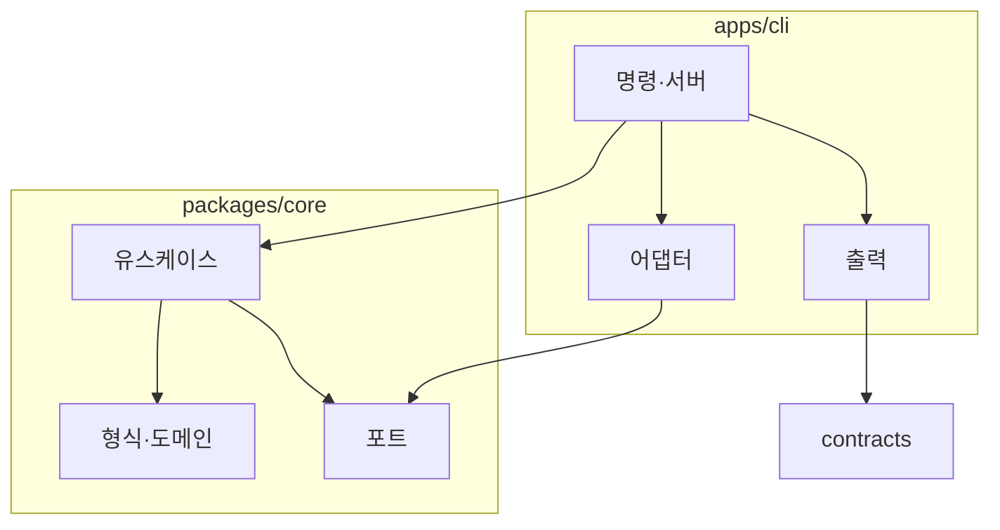
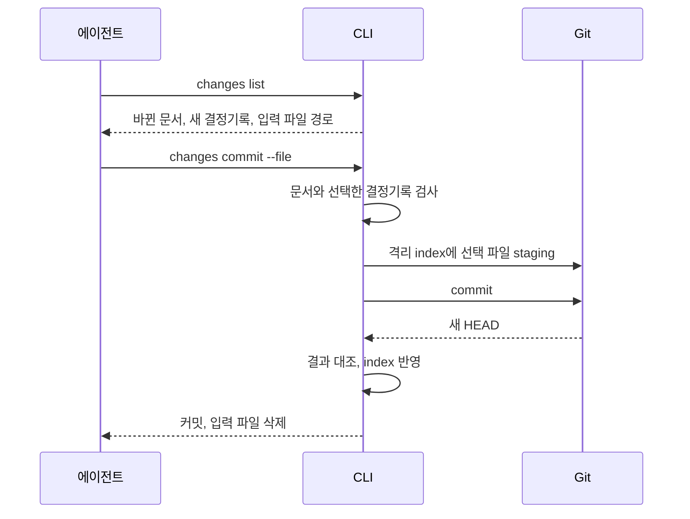

CLI는 사용자 입력과 실행 환경을 받아 제품 규칙을 실행하는 진입점이다. 터미널 명령과 브라우저 API가 같은 규칙을 사용한다. 이 지침의 규칙을 정한 맥락과 검토한 대안은 결정기록에 있으므로, 규칙을 바꾸기 전에 `records list --doc I-zdpwuta64o`로 읽는다.

## 코드 책임

명령과 서버는 인자와 환경을 확인해 core를 호출하고 결과를 출력한다. core는 Git 실행·전역 시간·파일 시스템을 직접 호출하지 않고, 필요한 경계를 작은 port로 정의해 CLI의 어댑터가 구현한다. 모든 함수에 인터페이스나 클래스를 만들지는 않는다.

| 경로 | 책임 |
| :--- | :--- |
| `apps/cli/src/main.ts` | 프로세스 시작과 명령 연결(Commander) |
| `commands/` | 인자 해석, 유스케이스 호출, 출력 형식 선택. `changes.ts`가 커밋 잠금과 복구 자료를 맡는다 |
| `adapters/git/` | Git 실행과 스냅샷 읽기, 0.7 저장소 읽기(`store-reader.ts`) |
| `adapters/filesystem/` | 설정·문서 파일 쓰기, 커밋 입력 폴더, 에셋·링크 경고, 사용자 편집을 보존하는 원자적 쓰기, 지침 폴더 읽기(`instruction-folder.ts`)와 AGENTS.md 읽기(`agents-file.ts`) |
| `adapters/cache/` | 캐시 `.gitifact/cache/index.db`: 문서·참조·검색·이력 |
| `adapters/registry/` | npm 최신 버전 조회 |
| `adapters/github/` | `feedback`의 `gh` 실행과 이슈 작성 주소 |
| `output/` | core 결과를 버전 있는 DTO로 변환 |
| `server/` | `browser-server`(수명), `http/`(검사·라우터·응답·앱 파일), `routes/`(경로 표), `checkout/`(작업 폴더 체크아웃), `commit/`(커밋의 소스 변경) |
| `shared/i18n/` | 사용자에게 보이는 문구와 언어별 Markdown |
| `packages/core/src/domain/` | 문서·저장소 상태·읽기 오류 |
| `formats/` | 공개 형식별 파싱·검증(문서·이유·0.7 저장소·패치노트) |
| `use-cases/` | 조회·검사·비교의 작업 흐름 |
| `ports/` | 외부 입력 계약(저장소 읽기) |
| `shared/i18n/` | 검증 메시지 |
| `packages/contracts/src/versions/` | 외부 JSON 계약과 런타임 검증 |

Git·파일 어댑터는 CLI만 쓰는 동안 앱 안에 둔다.

## 계약과 오류

내부 domain 모델과 외부 JSON DTO를 구분한다. `contracts`는 브라우저에서도 실행 가능한 타입·검증·오류 코드를 제공하고 Node.js 전용 코드를 포함하지 않는다. CLI 출력과 HTTP 응답은 같은 버전별 DTO를 쓴다.

stdout에는 선택한 출력 형식만 내보내고 로그·진행 상황은 stderr로 보낸다. 검사 실패·진단 발견·미실행을 하나의 boolean으로 합치지 않는다. 오류는 언어와 무관한 `code`를 반드시 가지며, 호출 코드와 에이전트는 코드나 오류 타입으로 분기하고 메시지 본문을 비교하지 않는다.

형식 해석은 공개 버전별로 분리하고 과거 의미를 보존하며 알 수 없는 형식으로 쓰지 않는다. Git 명령에는 shell 문자열 대신 인자 배열을 쓰고 경로·참조·종료 코드를 확인한다. Git과 파일 접근은 호출된 현재 checkout 기준이다.

## 사용자에게 보이는 문구

언어 하나는 폴더 하나다. CLI·core·브라우저는 각자 `src/shared/i18n/<lang>/`에 문구를 두고 배치를 똑같이 맞춘다. 한국어(`ko`)와 영어(`en`)를 지원한다.

| 문구 | 위치 |
| :--- | :--- |
| 명령·옵션 설명, 텍스트 출력, 오류 메시지, 화면 문구 | `<lang>/messages.json` |
| 에이전트 지침, GITIFACT 블록, 패치노트 (CLI) | `<lang>/docs/*.md`, `<lang>/block.md`, `<lang>/changelog.md` |
| 제품 소개 글 (브라우저 소개 페이지·README·랜딩 사이트 공용) | `packages/intro/<lang>/intro.md` |

- 문구는 `t(key, values)`로 가져온다. 키는 `init.inputChanged`처럼 점으로 구분한 평평한 문자열이고, 값은 `{name}` 자리에 넣으며 문장을 코드에서 이어 붙이지 않는다. 브라우저에서 `<time>`·`<Link>` 같은 요소가 문장 안에 들어가면 `tNodes()`를 쓴다.
- 키 타입은 JSON에서 파생하므로 없는 키는 컴파일 오류다. 새 언어는 `Record<MessageKey, string>`으로 선언해 누락을 잡는다. 패키지마다 테스트가 호출별 자리 이름과 쓰지 않는 키를 검사한다.
- 명령·옵션 설명은 `main.ts`에만 둔다. 요구사항 본문 문법(`조건:`·`기대 동작:`)은 화면 문구가 아니므로 카탈로그로 옮기지 않는다. Astryx 컴포넌트 자체 문구는 Astryx의 `InternationalizationProvider` 카탈로그를 따른다.
- 패치노트는 Keep a Changelog 형식에 절 제목을 `Added`·`Changed`·`Removed`·`Fixed`로 고정하고, core 파서가 그 밖의 형식을 거부한다. 버전을 올릴 때 맨 앞에 항목을 쓴다.

같은 내용을 두 곳에 두지 않는다. 사본이 필요한 곳은 테스트가 원본과 대조한다.

| 내용 | 원본 | 규칙 |
| :--- | :--- | :--- |
| GITIFACT 블록의 요청 분류 예시 | workflow 지침 | 블록은 지침의 요약이며 예시가 원문에 있는지 테스트로 대조한다 |
| 버전 번호 | package.json, 패치노트 | README·소개 글에 적지 않는다 |
| README | 소개 글 | README.md는 영어 소개, README.ko.md는 한국어 소개, apps/cli/README.md는 영어 시작하기의 사본이며 테스트로 일치를 확인한다 |
| 로고 | `packages/intro/assets/` | 다른 곳에 두지 않는다 |
| 소개 글의 링크 | 소개 글 | GitHub·사이트·브라우저에서 같게 읽히도록 절대 URL만 쓴다 |

브라우저 소개 페이지는 원시 HTML을 렌더링하지 않으므로, 소개 글 맨 앞의 로고 블록을 번들한 로고 이미지로 바꾸고 요구사항 링크만 앱 안 경로로 바꾼다.

표시 언어는 프로젝트 설정에 저장하지 않는다. CLI는 `--lang`, `GITIFACT_LANG`, `LC_ALL`, `LC_MESSAGES`, `LANG`, 운영체제 언어 순으로 정하며 미지원 언어는 영어다. 브라우저는 자체 설정을 쓴다. 문서·JSON 키·오류 코드·ID·저장 규약은 표시 언어와 무관하다.

## 저장 규약

`.gitifact/config.json`은 `schemaVersion: 3`과 `baseline`만 쓴다. baseline은 최초 도입 기준점이며 규약 버전 변경으로 갱신하지 않는다.

문서는 파일 하나가 문서 하나이고, 구조 정보는 모두 YAML 프론트매터에 둔다. 본문은 산문이며 CLI가 데이터를 뽑으려고 파싱하지 않는다. 형식 규칙은 core의 `formats/document-file.ts`·`formats/record-file.ts`와 `use-cases/check-documents.ts` 한 곳에 있고 `check`와 `changes commit`이 같은 검사를 쓴다.

| 파일 | 프론트매터 |
| :--- | :--- |
| `.gitifact/spec/<기능>/index.md` | `id`(S-), `title`, `description` |
| `.gitifact/spec/<기능>/requirements/<slug>.md` | `id`(R-), `title`, `description`, `order` |
| `.gitifact/spec/<기능>/design/<slug>.md` | `id`(D-), `title`, `description`, `order`, `requirements`, `sources` |
| `.gitifact/wiki/**/*.md` | `id`(W-), `title`, `description` |
| `.gitifact/instructions/<이름>/index.md` | `id`(I-), `title`, `description` |
| `.gitifact/instructions/<이름>/**/*.md`(`index.md` 밖) | `title`, `description`. 그 지침에 딸린 참고 파일이며 ID가 없고 본문을 검사하지 않는다. Markdown이 아닌 파일은 프론트매터가 없다 |
| `.gitifact/records/<yyyymmdd>/<DR-ID>.md` | `id`(DR-), `title`, `docs`, 선택 `draft`. 본문은 맥락·결정·검토한 대안 `##` 섹션뿐이다 |

- **ID:** CLI가 발급하는 소문자 base32 10자다. 기능 S-, 요구사항 R-, 설계 D-, 위키 W-, 지침 I-, 결정기록 DR-(D-·R-와 겹치지 않게 두 글자). `H-`는 기록 도입 전 이유의 ID로, 과거 커밋에서 이력용으로만 읽으며 0.7 파서와 함께 1.0.0에서 지운다. 경로·제목과 독립적이며 파일을 옮겨도 바뀌지 않는다. 소속은 폴더 위치로만 정한다.
- **필드:** `title`(200자)과 `description`(300자)은 한 줄·필수다. `order`는 0~999999 정수이고 같은 폴더 안에서 겹치면 오류다. 설계의 `requirements`는 있는 R-만, `sources`는 `{id, note?}` 또는 `{title, url, note?}`(http·https)다. 프론트매터 끝의 `draft: true`는 `specs new`·`instructions new`·`records new`가 붙이며 남아 있으면 검사가 실패한다.
- **본문:** 필수다. 코드 블록 밖의 `#` 제목과 gitifact HTML 주석을 금지한다. UTF-8이며 NUL·단독 CR·BOM을 금지하고 CRLF는 LF로 읽는다. 파일 하나는 1MB까지 읽는다.
- **개요 파일:** 요구사항이나 설계가 있는 기능은 `index.md`, 설계가 하나라도 있으면 `design/overview.md`가 필수다.
- **결정기록:** 기록 하나가 파일 하나다. 기록에는 종류가 없고 맥락·결정(필수)과 검토한 대안(선택)을 섹션으로 두며, 섹션은 한국어나 영어 제목으로 쓰며 500자까지다. `docs`는 지워진 문서도 가리킬 수 있다. 작성자·시각은 기록을 더한 커밋에서 읽는다. 아직 커밋하지 않은 기록은 `.gitifact/records/`의 `git status`로 찾고, 이력은 커밋이 더한 기록 파일만 읽는다. 모든 기록 파일을 읽는 경로를 만들지 않는다. 작업 폴더에 남은 `.gitifact/history.jsonl`은 `REASONS_FILE_REMOVED` 문제다.
- **에셋:** `.gitifact/assets/` 아래 파일이며 ID가 없다. 권장 크기(파일당 1MB, 전체 50MB)와 확장자를 넘거나 참조가 없으면 경고만 낸다.
- **캐시:** `.gitifact/cache/index.db`는 문서·참조·검색·이력의 파생물이다. 원본은 파일과 Git이며 지우거나 형식 번호가 다르면 다시 만든다. 폴더 안의 `.gitignore`(`*`)로 커밋에서 빠진다.

> [!IMPORTANT]
> 커밋된 결정기록은 수정·삭제하지 않는다(`RECORD_ALTERED`). 결정이 바뀌면 새 기록을 쓴다.

옛 형식은 쓰지 않는다. schemaVersion 2(0.7) 저장소는 거부하고 `guide show migrate`의 절차로 에이전트가 옮기라고 안내한다. `.tryce` 경로, `tryce-*` 마커, 구형 JSON 기록, Tryce 설정, schemaVersion 1은 지원하지 않는다. 전환 커밋은 `Gitifact-Migration: 0.8.0` 트레일러를 가지며, 그 이전 커밋의 이력은 0.7 파서(`formats/store.ts`의 읽기, `adapters/git/store-reader.ts`)로 읽어 브라우저에 보인다. 기록 도입 전 커밋이 `history.jsonl`에 더한 줄과 0.7 이유는 첫 문장을 제목으로 하고 맥락 섹션만 있는 기록으로 읽는다.

> [!NOTE]
> 0.7 파서, `history.jsonl` 줄 읽기, `guide show migrate`는 1.0.0에서 지운다. 그때까지 읽기 전용으로 두고 쓰기 코드는 두지 않는다.

## 조회와 커밋 흐름

문서는 에이전트가 파일을 직접 고치며 저장 명령은 없다. 명령은 리소스마다 `list`·`show`·`new`를 둔다(`specs`·`instructions`·`records`). 새 문서는 `specs new`·`instructions new`가, 결정기록은 결정한 때 `records new`가 ID를 발급하고 뼈대를 쓴다. 검사는 최상위 `check` 하나다. 최상위에는 리소스와 `check` 밖에 시스템 명령(`init`·`update`·`browser`·`guide`)만 둔다. 목록은 같은 공통 옵션(`--q`·`--author`·`--sort`·`--limit`·`--fields`·`--format`)을 같은 뜻으로 받는다. 모든 조회는 캐시를 거치며, 캐시는 명령마다 수정 시각·크기가 바뀐 문서만 다시 읽는다.

커밋은 `changes list`로 바뀐 문서와 입력 파일 경로를 받고, 에이전트가 그 파일에 JSON(`paths`·`message`·`authorization`, 마이그레이션이면 `migration: true`)을 써서 `changes commit --file`로 넘긴다.

| 조건 | 처리 |
| :--- | :--- |
| 옮긴 문서의 옛 경로나 새 경로 하나만 `paths`에 있음 | 거부한다 |
| 커밋된 결정기록이 바뀌거나 지워짐 | 거부한다 |
| 바뀐 문서를 `paths`에 담지 않음 | 다음 커밋으로 남긴다 |
| 수정·이동·삭제한 문서를 설명하는 기록이 없음 | `withoutRecord`로 알리고 커밋한다 |
| 기존 staging이 있음 | 거부한다 |
| Git 필터가 staging된 원문을 바꿈(줄바꿈 정규화 제외) | 거부한다 |
| 훅이 staging을 바꿈 | 거부한다 |
| 커밋이 거부됨 | index를 실행 전으로 두고 파일은 그대로 둔다 |
| HEAD가 바뀌어 결과가 불확실함 | 잠금 폴더(`<git dir>/gitifact-changes-commit.lock`)에 복구 자료를 보존한다 |

> [!WARNING]
> 기존 staging이 있으면 커밋이 거부되므로 문서를 옮기거나 지울 때 `git mv`·`git rm`을 쓰지 않는다. 상세는 `gitifact guide show commit`에 있다.

커밋 메시지 트레일러는 `Gitifact-Req`(요구사항)·`Gitifact-Design`(설계)·`Gitifact-Doc`(기능·위키·지침)·`Gitifact-Record`(결정기록)이고 CLI만 붙인다. 메시지에 `Gitifact-`로 시작하는 줄이 있으면 거부한다.

## 로컬 서버

`node:http`로 제공하며 별도 프레임워크를 두지 않는다. 127.0.0.1에 바인딩하고 Host·Origin·세션 헤더를 검증한다. 클라이언트의 임의 경로로 로컬 파일이나 명령을 실행하지 않으며, 편집 endpoint와 명령 실행 endpoint는 두지 않는다.

GET은 정의한 조회만 수행하고 재검사는 별도 POST(`/api/v1/status/refresh`)로 받아 중복 실행을 제어한다. 문서가 참조하는 에셋은 `/api/v1/assets/<경로>`로 `.gitifact/assets/` 아래의 일반 파일(20MB 이하, 링크 제외)만 제공한다. 이미지는 본문에 표시하고 그 밖의 파일은 내려받게 한다.

## 외부 요청

CLI가 외부로 보내는 요청은 둘이다. 첫째, `init`·`update`·`update --check` 실행 시 `registry.npmjs.org/gitifact`의 최신 버전을 조회하며 프로젝트 정보는 보내지 않는다. 3초 안에 답이 없으면 확인 불가로 처리하고 동작을 막지 않는다. `GITIFACT_NO_UPDATE_CHECK`로 끈다. 브라우저 서버는 새 버전을 조회하지 않는다. 이 요청은 `adapters/registry/`에만 두고, 테스트는 조회 함수를 주입해 네트워크 없이 실행한다.

둘째, `feedback`은 사용자가 확인한 이슈를 사용자의 `gh`로 Gitifact 저장소에 만든다. CLI는 GitHub API를 직접 부르거나 토큰을 읽지 않고, `gh`가 없으면 이슈 작성 주소만 출력한다. 본문에 붙이는 환경 정보는 버전·운영체제·Node·`schemaVersion`뿐이다. `gh` 실행은 `adapters/github/`에만 두고, 테스트는 실행 함수를 주입하거나 `gh`가 없는 PATH로 실행한다.

## 빌드·배포·테스트

core·contracts를 먼저 빌드하고 browser, cli 순으로 빌드한다. CLI 패키징은 필요한 내부 코드와 메시지 JSON을 번들하고, 브라우저 정적 파일과 `apps/cli/src/shared/i18n/<lang>/`의 Markdown(지침·블록·패치노트)을 `dist/i18n/<lang>/`으로 수집한다. 배포 검증은 packed artifact를 새 임시 폴더에 설치해 수행한다(`pnpm test:package`). 이때 설치본 패치노트의 첫 버전이 package.json 버전과 같은지, README·소개 페이지에 버전 번호가 없는지도 확인한다.

| 대상 | 시험하는 것 |
| :--- | :--- |
| core | 고정 입력으로 형식·상태 전이·진단 |
| Git·파일 어댑터 | 임시 저장소에서 index·작업 트리·이력·worktree를 구분해서 |
| CLI | 인자, stdout/stderr, 종료 코드, 잘못된 형식과 실패 후 복구 |
| 서버 | 조회 범위·재검사·정적 파일·잘못된 입력 |

검증 명령과 기준은 [검증](../verification/index.md)을 따른다.

## 배포 버전과 Git 태그

npm에 게시하는 CLI 버전 `X.Y.Z`와 Git 태그 `vX.Y.Z`를 맞춘다. `apps/cli/package.json`의 버전을 기준으로, 검증하고 실제 게시한 코드 커밋에 주석 태그(annotated tag)를 붙인다. npm 게시를 확인한 뒤 해당 태그만 origin에 푸시하고, 버전·커밋·태그와 확인 결과를 `docs/releases.md`에 기록한다.

게시한 태그는 이동하거나 덮어쓰지 않는다. 배포 후 수정은 새 버전으로 게시한다. 이 규칙은 0.7.0부터이며 그 이전 버전의 태그는 소급해서 만들지 않는다.
