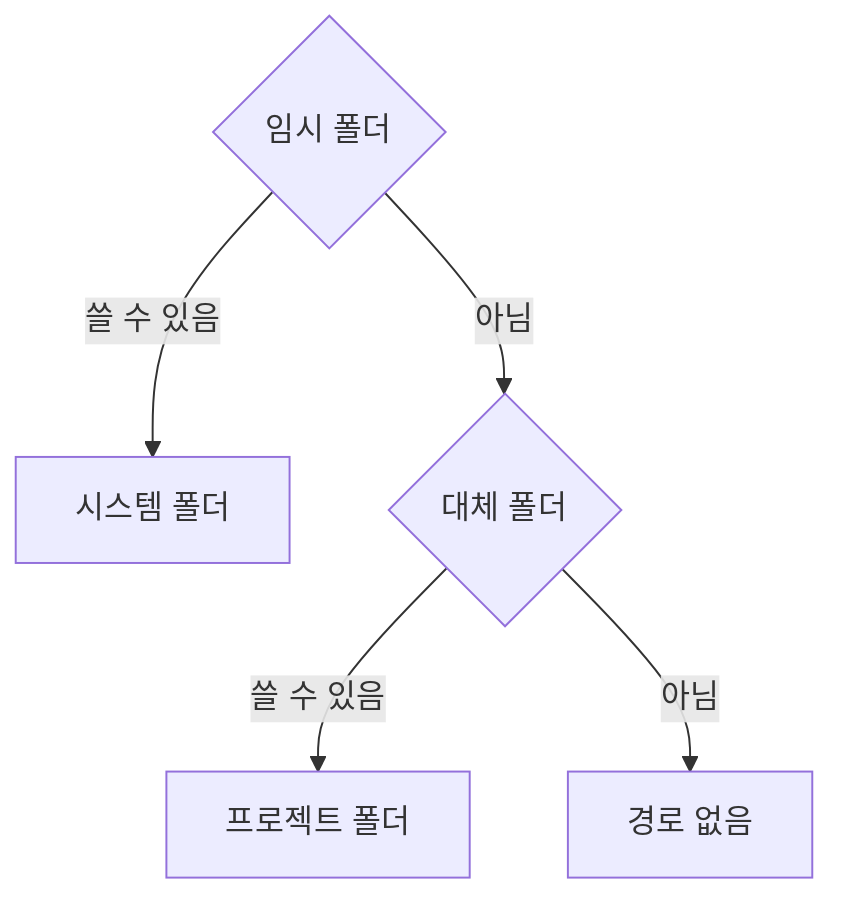
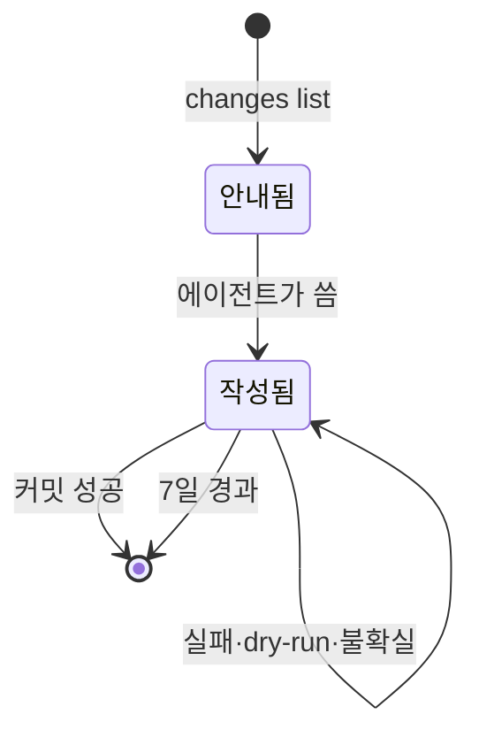

에이전트가 쓰는 입력 파일은 커밋 입력(`commit.json`) 하나다. 이 파일은 생겨도 CLI가 정한 한곳에 모이고 저절로 사라진다. 경로와 정리는 새 명령 없이 에이전트가 커밋 전에 이미 실행하는 `changes list`에 싣는다. 문서는 파일을 직접 고치므로 저장 입력은 없다.

## 폴더 선택

`apps/cli/src/adapters/filesystem/agent-inputs.ts`의 `prepareAgentInputs`가 `changes list` 때마다 폴더를 고른다. 폴더를 만들고 시험 파일을 쓸 수 있어야 쓸 수 있는 폴더로 본다. 심볼릭 링크이거나 폴더가 아니면 쓸 수 없는 것으로 본다.

| 결과 | 경로 | 비고 |
| :--- | :--- | :--- |
| 시스템 폴더 | `os.tmpdir()/gitifact/<키>` | 키는 저장소 실제 경로(Windows는 소문자)의 SHA-256 앞 16자 |
| 프로젝트 폴더 | `.gitifact/tmp/` | `*` 한 줄짜리 `.gitignore`를 만들어 폴더가 자기 자신까지 무시한다. Git 상태와 커밋 대상에 나타나지 않는다 |
| 경로 없음 | — | JSON의 `inputs`가 `null`이고 조회는 계속한다 |

경로는 JSON의 `inputs.commit`, 텍스트 출력의 "커밋 입력 파일:" 줄로 알린다. 에이전트는 경로를 따로 물어볼 필요가 없다.

## 입력 파일의 수명

커밋이 성공(outcome `committed`)하면 `discardAgentInput`이 입력 파일을 지우고 결과에 `inputRemoved`를 싣는다. 실패·dry-run·결과가 불확실한 커밋은 파일을 남겨 원인을 고친 뒤 같은 입력으로 다시 실행하게 한다. 삭제에 실패하면 `inputRemoved`가 `false`일 뿐 명령 결과는 바뀌지 않는다.

> [!IMPORTANT]
> CLI는 위 두 폴더 중 하나의 바로 아래에 있는 일반 파일만 지운다. 심볼릭 링크, `.gitignore`, 폴더 밖에 둔 입력 파일은 커밋이 성공해도 지우지 않는다.

기간 정리는 `changes list` 때 선택된 폴더에서 수정 시각이 7일 지난 일반 파일을 지운다. 하위 폴더와 `.gitignore`는 건드리지 않는다.

## 읽기 한도와 표준 입력

`changes commit --file <경로>`는 1 MiB 이하의 일반 파일만 읽는다. `--file -`는 표준 입력을 같은 1 MiB 한도로 읽으며, 이때는 지울 파일이 없어 `inputRemoved`를 싣지 않는다.

지침 블록과 workflow·commit 지침은 입력을 inputs 경로에 쓰고, 조회 결과와 지침 출력은 파일로 보관하지 않도록 안내한다. 짧은 입력은 표준 입력으로 넘겨도 된다.

## 테스트

테스트 fixture는 TEMP·TMP·TMPDIR을 임시 저장소 안으로 돌려 실제 사용자 임시 폴더를 쓰지 않는다. 쓸 수 없는 임시 폴더는 이 변수가 일반 파일을 가리키게 해 흉내 내고, 기간 정리는 폴더와 시계를 주입해 시험한다(`apps/cli/test/agent-inputs.test.mjs`).
