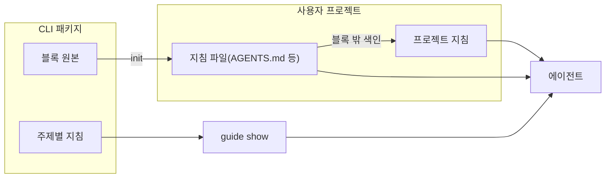

## 지침의 구성과 전달

CLI 패키지가 지침 Markdown을 담고, `init`·`update`가 쓰는 블록과 `guide` 명령으로 사용자 프로젝트에 전달한다. 이 저장소의 AGENTS.md나 명세를 사용자에게 배포하는 방식에 의존하지 않는다.

| 대상 | 원본 | 비고 |
| :--- | :--- | :--- |
| 블록 원본 | `apps/cli/src/shared/i18n/<lang>/block.md` | AGENTS.md·CLAUDE.md 등의 마커 사이에 쓴다 |
| 주제별 지침 | `apps/cli/src/shared/i18n/<lang>/docs/<topic>.md` | topic은 workflow·spec·design·instructions·records·writing·commit·migrate. 파일 이름이 곧 topic이고 폴더에 다른 파일은 없다 |

지침 파일마다 프론트매터에 `title`·`description`을 두고 `guide list`가 그것으로 목록을 만든다. 빌드는 이 파일들을 `dist/i18n/<lang>/docs/<topic>.md`로 번들한다. 패키지 설치·블록 갱신과 사용자 문단 보존 검사는 전달 경로를 검증할 뿐이며, 독립 에이전트의 실제 작성 행동은 별도 검증 대상이다.

## 세션 시작과 명세를 읽는 때

블록과 workflow 지침은 세션을 시작할 때 `instructions list --all`로 지침을 모두 읽게 한다. 지침은 프로젝트에서 어떻게 일할지를 담고 수가 적어 한 번에 읽는다. 명세는 시작할 때 읽지 않는다. 제품 동작 이야기가 나오면 `specs list --type requirement`로 기능별 요구사항을 보고 이미 있는지, 부딪히는지 확인하게 하고, 코드를 고치기 전에는 그 기능의 요구사항과 설계를 `specs show`로 읽게 한다. 목록은 20개씩(명세는 기능 20개씩) 오므로 끝에 나온 `--after <값>`으로 필요한 만큼 이어 읽게 한다.

> [!NOTE]
> 명세를 읽을 때를 에이전트가 판단하므로, 판단을 놓치면 이미 있는 요구사항을 모르고 새로 만들 수 있다. CLI는 이를 검사하지 않는다.

## 사용자 스토리 안내

`guide show spec`의 작성 규칙과 요구사항 파일 예시가 사용자 역할·목표·이유를 담은 스토리를 안내한다. 수용 조건은 조건·기대 동작 형식을 유지한다. 새 요구사항과 요청받은 개정 범위에 적용하며 기존 ID와 확정 제약을 보존하고, 모르는 동기는 만들지 않는다. 별도 제약은 범위와 제약 절에, 내부 구현 방식은 설계에 둔다. 특정 문형을 CLI 파서로 강제하지 않는다.

## 문서 문체 지침

문체는 `writing.md` 한 파일이며 `guide show writing`으로만 읽는다. spec·design·instructions 지침은 "문체는 `gitifact guide show writing`을 따른다" 한 줄로 가리키고 규칙을 복사하지 않는다. 블록의 규칙 목록에도 같은 한 줄을 둔다. CLI는 문체를 검사하지 않는다. 화면 문구와 인용·코드는 문체 교정 대상이 아니라는 예외를 지침 본문에 적는다.

## 프로젝트 지침 안내

`guide show`는 모든 topic에서 CLI가 담은 파일을 그대로 출력한다. 프로젝트 파일로 바뀌는 topic은 없다. 이 프로젝트에서 어떻게 일하는지는 프로젝트가 쓰는 지침(`.gitifact/instructions/`)이 담고, 어떤 작업 때 어느 지침을 읽을지는 AGENTS.md의 블록 밖 색인이 알린다. `init`은 지침이나 색인을 만들지 않는다.

블록은 "요구사항·설계·코드를 바꾸기 전에 블록 밖 색인에서 작업에 맞는 지침을 읽는다"와 "지침과 색인을 만들거나 고치기 전에 `guide show instructions`를 읽는다"를 안내한다. `instructions` topic은 지침 폴더 형식, 색인 쓰는 법, 명세와의 관계, 결정을 남기는 곳, 커밋을 다룬다.

> [!NOTE]
> `changes commit`은 `.gitifact` 안에서 문서·결정기록·설정·에셋만 커밋한다. 남아 있는 `.gitifact/overrides/` 파일은 이 명령으로 커밋할 수 없다.

## 기록 보기 요청

블록 규칙은 요구사항·프로젝트 현황·변경 이력을, workflow 지침은 여기에 패치노트까지 더해 보여 달라는 요청을 `browser` 실행과 연결한다. `browser`는 URL을 출력한 뒤 종료하지 않으므로 백그라운드 실행을 명시한다. 이미 띄운 서버가 있으면 새로 띄우지 않고 URL을 다시 알린다. 기본 브라우저를 자동으로 여는 옵션(`--open`)은 두지 않는다.
