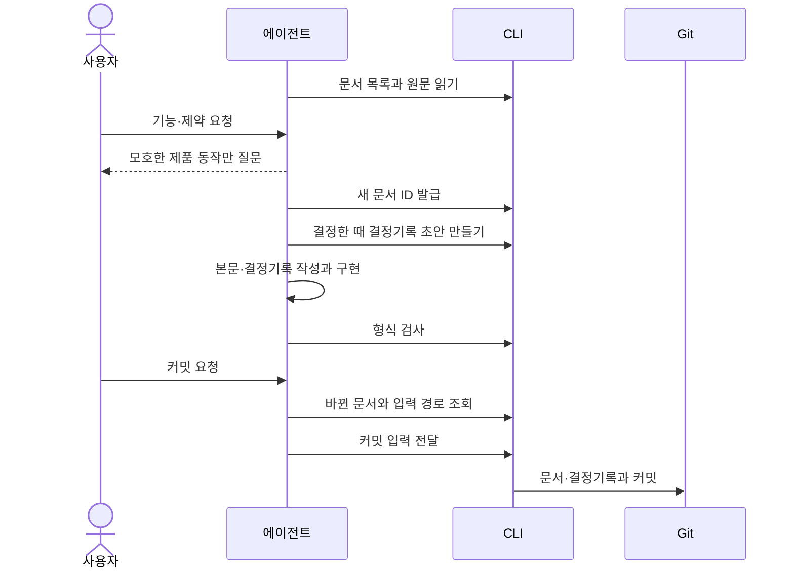

## 개요

사용자는 평소처럼 에이전트와 제품을 만들고, 에이전트가 대화의 요구사항을 문서로 정리해 CLI로 검사·커밋한다. 그 절차는 AGENTS.md 등의 GITIFACT 블록과 `gitifact guide`의 지침이 안내한다. 별도 대화 수집 서버나 에디터 감시 기능은 두지 않는다.

| 파일 | 다루는 것 |
| :--- | :--- |
| data | 커밋 입력 파일의 위치와 정리, 읽기 한도 |
| interface | 지침 주제 구성, 사용자 스토리·문체·프로젝트 지침 안내의 전달, 기록 보기 안내 |

## 구조와 책임

| 구성 요소 | 맡는 것 |
| :--- | :--- |
| 에이전트 | 자연어와 프로젝트 지침을 해석하고 제품 요구사항과 단순 작업 지시를 구분한다. 모든 채팅이 아니라 유지할 제품 동작과 제약만 정리한다. 문서 본문은 파일을 직접 고친다 |
| 지침 블록 | 시작할 때 확인할 환경, 요청 분류와 규칙의 요약 |
| 주제별 지침(`guide show <topic>`) | 명세 작성과 커밋 시점에 대조할 절차와 형식 |
| CLI | 문서·결정기록의 ID 발급과 뼈대 생성, 형식 검사, Git 커밋 |
| 요구사항 파일(`requirements/<slug>.md`) | 원하는 동작 |
| 설계 파일(`design/<축>.md`) | 구현 구조와 처리 방식 |

CLI는 사용자 의도나 구현의 적합성을 판정하지 않는다. 이력은 Git에 커밋된 최종 내용을 기준으로 한다. 초안을 고칠 때마다 승인·note·별도 사건을 만들지 않으며, 자동 기록을 커밋 권한으로 해석하지 않는다.

## 처리 흐름

에이전트는 먼저 저장소·브랜치·Git 상태, 적용되는 프로젝트 지침, 지정 CLI와 기록 형식을 확인한다. 이후 대화에서 요구사항을 정리해 커밋하기까지의 주고받기는 다음과 같다.

| 단계 | 명령 | 할 일 |
| :--- | :--- | :--- |
| 목록과 원문 읽기 | `docs list`, `docs show` | 새 프로젝트는 대상 사용자·목적·핵심 흐름·실패 조건을 대화로 파악한다 |
| ID 발급 | `docs new` | 요구사항을 기존 기능에 추가하거나 새 기능으로 묶는다. 새 기능에는 설계를 함께 쓰되 요구사항만 요청받으면 따른다. 발급받은 R- ID를 설계의 `requirements`에 적는다 |
| 결정기록 | `records new` | 기존 문서를 바꾸거나 여러 안 중 하나를 고른 때 초안을 만들고 섹션을 채운다. 문서를 고치기 전에는 `docs history`로 그 문서의 결정기록을 읽는다 |
| 형식 검사 | `docs check` | 구현하면서 영향받는 명세도 갱신한다 |
| 바뀐 문서 조회 | `changes list` | 바뀐 문서와 결정기록 없이 바뀐 문서를 보고 최종 diff·검증 결과와 대조한다 |
| 커밋 | `changes commit` | 입력 파일은 `changes list`가 알려 준 경로에 쓴다([data](data.md)) |

### 기존 프로젝트 도출

일반 유지보수에서는 변경하는 영역부터 기록한다. 사용자가 기존 기능 정리를 요청하면 코드·테스트·문서·Git·대화를 조사해 응집된 기능별로 정리한다. 조사한 구현과 사용자 의도를 구분하고, 조사하지 않은 영역을 완료로 표시하지 않는다. 특정 docs 폴더나 DDD 구조는 요구하지 않는다.

## 오류 처리와 검증

제품 의미가 모호하면 결정에 필요한 질문만 하고 독립적으로 가능한 작업은 계속한다. CLI 오류나 `docs check`가 보고한 문제(없는 ID 참조 등)는 원문을 확인해 해결한다.

> [!IMPORTANT]
> 검사나 커밋에 실패했다고 형식 검증을 우회하거나 기존 기록을 지우지 않는다.

> [!NOTE]
> CLI 테스트는 파일과 커밋 동작을 검증한다. 모든 에이전트가 자연어 지침을 똑같이 따르는 것까지는 보장하지 않는다.
