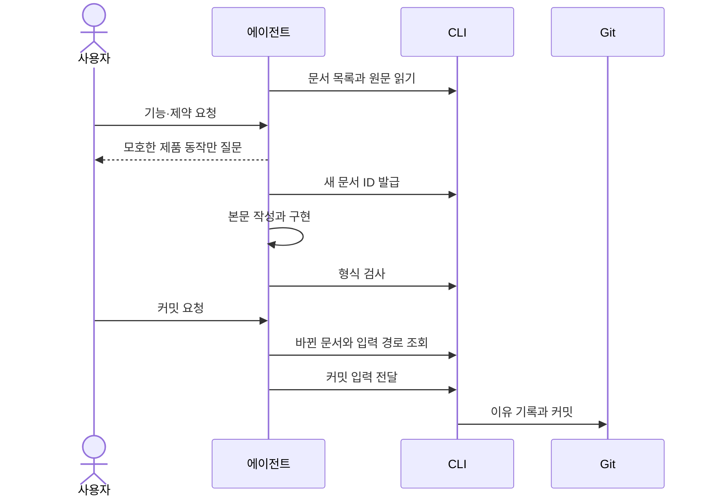

## 개요

사용자는 평소처럼 에이전트와 제품을 만들고, 에이전트가 대화의 요구사항을 문서로 정리해 CLI로 검사·커밋한다. 그 절차는 AGENTS.md 등의 GITIFACT 블록과 `gitifact guide`의 지침이 안내한다. 별도 대화 수집 서버나 에디터 감시 기능은 두지 않는다.

| 파일 | 다루는 것 |
| :--- | :--- |
| data | 커밋 입력 파일의 위치와 정리, 읽기 한도 |
| interface | 지침 주제 구성, 사용자 스토리·문체·위키 방침의 전달, 기록 보기 안내 |

## 구조와 책임

| 구성 요소 | 맡는 것 |
| :--- | :--- |
| 에이전트 | 자연어와 프로젝트 지침을 해석하고 제품 요구사항과 단순 작업 지시를 구분한다. 모든 채팅이 아니라 유지할 제품 동작과 제약만 정리한다. 문서 본문은 파일을 직접 고친다 |
| 지침 블록 | 시작할 때 확인할 환경, 요청 분류와 규칙의 요약 |
| 주제별 지침(`guide show <topic>`) | 명세 작성과 커밋 시점에 대조할 절차와 형식 |
| CLI | ID 발급과 새 문서 뼈대 생성, 형식 검사, 변경 이유 기록과 Git 커밋 |
| 요구사항 파일(`requirements/<slug>.md`) | 원하는 동작 |
| 설계 파일(`design/<축>.md`) | 구현 구조와 처리 방식 |

CLI는 사용자 의도나 구현의 적합성을 판정하지 않는다. 이력은 Git에 커밋된 최종 내용을 기준으로 한다. 초안을 고칠 때마다 승인·note·별도 사건을 만들지 않으며, 자동 기록을 커밋 권한으로 해석하지 않는다.

## 처리 흐름

에이전트는 먼저 저장소·브랜치·Git 상태, 적용되는 프로젝트 지침, 지정 CLI와 기록 형식을 확인한다. 이후 대화에서 요구사항을 정리해 커밋하기까지의 주고받기는 다음과 같다.

| 단계 | 명령 | 할 일 |
| :--- | :--- | :--- |
| 목록과 원문 읽기 | `docs list`, `docs show` | 새 프로젝트는 대상 사용자·목적·핵심 흐름·실패 조건을 대화로 파악한다 |
| ID 발급 | `docs new` | 요구사항을 기존 기능에 추가하거나 새 기능으로 묶는다. 새 기능에는 설계를 함께 쓰되 요구사항만 요청받으면 따른다. 발급받은 R- ID를 설계의 `requirements`에 적는다 |
| 형식 검사 | `docs check` | 구현하면서 영향받는 명세도 갱신한다 |
| 바뀐 문서 조회 | `changes list` | 바뀐 문서와 이유가 없는 문서를 보고 최종 diff·검증 결과와 대조한다 |
| 커밋 | `changes commit` | 입력 파일은 `changes list`가 알려 준 경로에 쓴다([data](data.md)) |

### 기존 프로젝트 도출

일반 유지보수에서는 변경하는 영역부터 기록한다. 사용자가 기존 기능 정리를 요청하면 코드·테스트·문서·Git·대화를 조사해 응집된 기능별로 정리한다. 조사한 구현과 사용자 의도를 구분하고, 조사하지 않은 영역을 완료로 표시하지 않는다. 특정 docs 폴더나 DDD 구조는 요구하지 않는다.

## 오류 처리와 검증

제품 의미가 모호하면 결정에 필요한 질문만 하고 독립적으로 가능한 작업은 계속한다. CLI 오류나 `docs check`가 보고한 문제(없는 ID 참조 등)는 원문을 확인해 해결한다.

> [!IMPORTANT]
> 검사나 커밋에 실패했다고 형식 검증을 우회하거나 기존 기록을 지우지 않는다.

> [!NOTE]
> CLI 테스트는 파일과 커밋 동작을 검증한다. 모든 에이전트가 자연어 지침을 똑같이 따르는 것까지는 보장하지 않는다.

## 결정

| 결정 | 이유 | 기각한 안 |
| :--- | :--- | :--- |
| 진입 지침은 블록 하나로 두고 상세는 주제별 지침(`guide show <topic>`)으로 나눈다 | 사용자가 기록 방법론이나 여러 스킬의 호출 순서를 배울 필요를 줄인다 | — |
| 커밋 입력 파일의 경로는 커밋 전에 이미 실행하는 `changes list`에 싣는다 | 별도 명령은 에이전트가 먼저 실행해야 한다는 것을 기억해야만 쓰이고, 기억하지 못하면 경로가 정해지지 않는다 | 경로·정리 전용 `gitifact tmp`·`tmp clean` 명령 |
| 입력 파일은 CLI가 커밋 성공 때 지우고 오래된 파일을 정리한다 | 삭제가 에이전트의 성실함에 달리지 않는다 | 외부 경로에 쓰고 작업 후 지우라고 지침에만 적기(샌드박스가 작업 폴더 밖 쓰기를 막으면 다시 프로젝트 안에 쓰고, Windows의 `~`·공백 경로 해석 문제가 있다) |
| 대체 폴더 `.gitifact/tmp/`는 자기 안의 `.gitignore`로 자신을 무시한다 | 대체 폴더가 작업 도중 처음 생겨도 새 미추적 파일이 diff에 끼지 않고, 팀에 적용하려고 커밋할 것이 없다 | 추적되는 `.gitifact/.gitignore`에 `/tmp/` 등록(CLI가 엄격히 검사하는 폴더에 예외도 늘어난다) |
| 입력 파일을 작업 단위로 나누지 않는다 | CLI에는 작업 개념이 없어 상태 파일과 잠금이 또 생긴다. 성공 시 삭제와 기간 정리로 충분하다 | 작업 단위로 나누고 실행 중인 작업을 보호 |
| 커밋 입력에 파일을 쓰는 경로를 남긴다 | 여러 줄 한국어 본문은 Windows 셸 인자에서 깨지기 쉽다 | 파일 생성을 없애고 인자·표준 입력으로만 받기 |
| 문체는 `writing` 한 topic에 두고 spec·design·wiki 지침과 블록은 한 줄로 가리킨다 | 요구사항·설계·위키 중 무엇을 쓰든 같은 규칙 한 벌을 읽는다 | 세 문서에 나눠 적기(같은 규칙이 세 벌이 되어 고칠 때 어긋난다), 위키 형식 문서(`wiki.md`)의 한 절(요구사항만 쓰는 세션이 위키 문서를 읽어야 전문을 보고, 위키 형식 문서가 전 문서의 문체까지 안는다), 기본 위키 방침(`wiki.default.md`)에 두기(README가 이미 있는 기존 프로젝트에 닿지 않고, 운영 방침은 wiki topic 출력에만 실려 요구사항·설계 작성에 닿지 않는다) |
| 프로젝트가 바꾸는 지침은 위키 운영 방침(`.gitifact/wiki/README.md`)뿐이다 | 프로젝트마다 달라야 하는 것은 위키 운영 방식뿐이다 | 모든 topic을 형식·운영 두 파일로 나누고 `.gitifact/overrides/<topic>.md`로 대체(`--eject`) |
| 운영 방침은 `guide show wiki`가 형식 뒤에 싣고, README가 없으면 내장 기본 방침을 싣는다 | 에이전트가 README 읽기를 빠뜨리지 않고, README가 없을 때도 기본이 있다 | README를 일반 페이지로 두고 에이전트가 직접 읽기 |
| 기록을 보여 달라는 요청을 블록과 workflow 지침이 문장으로 `browser` 실행에 연결한다 | 명령 목록의 한 줄만으로는 에이전트가 이 요청을 명령과 연결하지 못했다 | 명령 목록에 `browser` 한 줄만 두기 |
