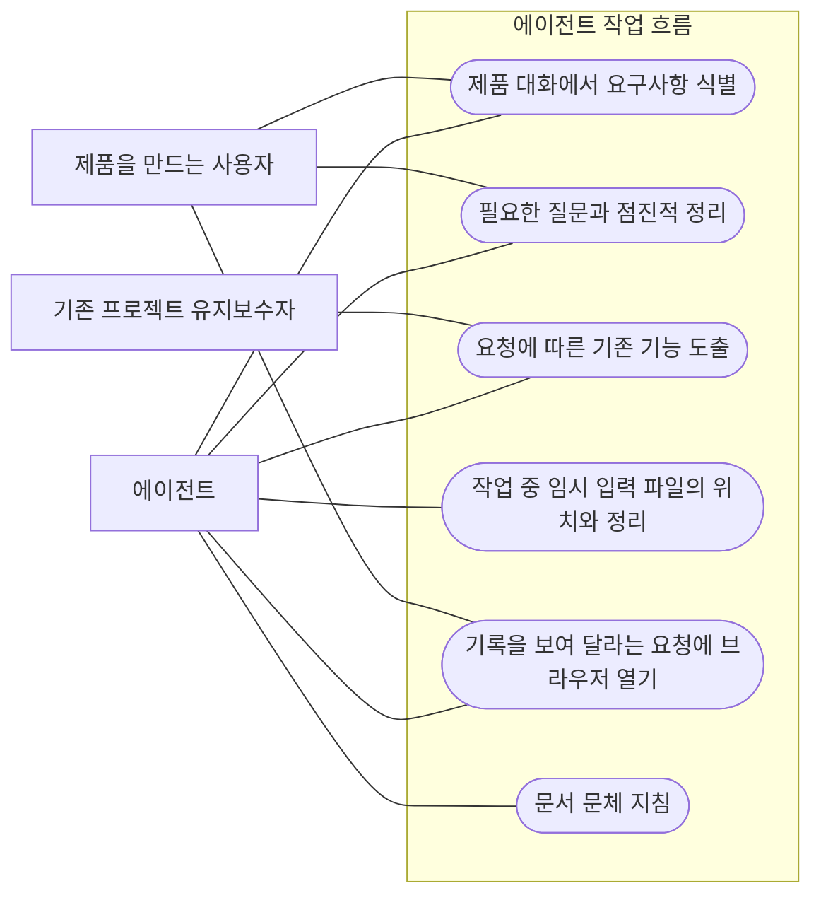

사용자는 기록 방법을 배우지 않는다. 에이전트가 대화에서 드러난 제품 동작과 제약을 요구사항으로 정리하고, 프로젝트 지침에 따라 문서와 커밋을 남긴다.

## 유즈케이스 모델

```mermaid
flowchart LR
  user[제품을 만드는 사용자]
  maintainer[기존 프로젝트 유지보수자]
  agent[에이전트]
  subgraph workflow[에이전트 작업 흐름]
    uc1([제품 대화에서 요구사항 식별])
    uc2([필요한 질문과 점진적 정리])
    uc3([요청에 따른 기존 기능 도출])
    uc4([작업 중 임시 입력 파일의 위치와 정리])
    uc5([기록을 보여 달라는 요청에 브라우저 열기])
    uc6([문서 문체 지침])
  end
  user --- uc1
  user --- uc2
  maintainer --- uc3
  user --- uc5
  agent --- uc1
  agent --- uc2
  agent --- uc3
  agent --- uc4
  agent --- uc5
  agent --- uc6
```
