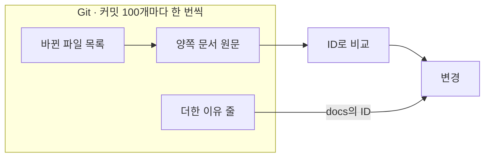
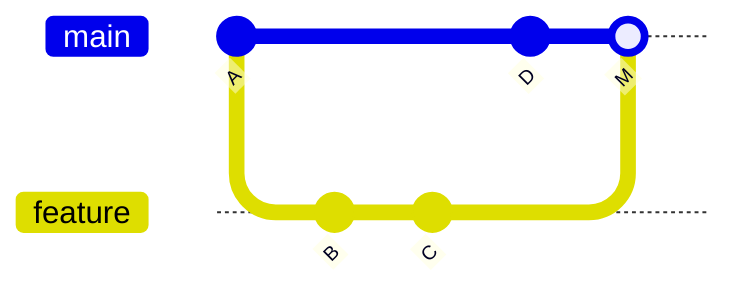
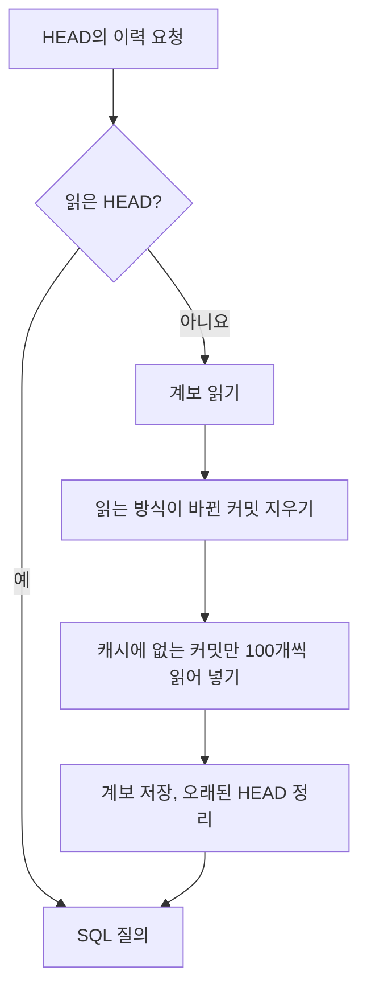
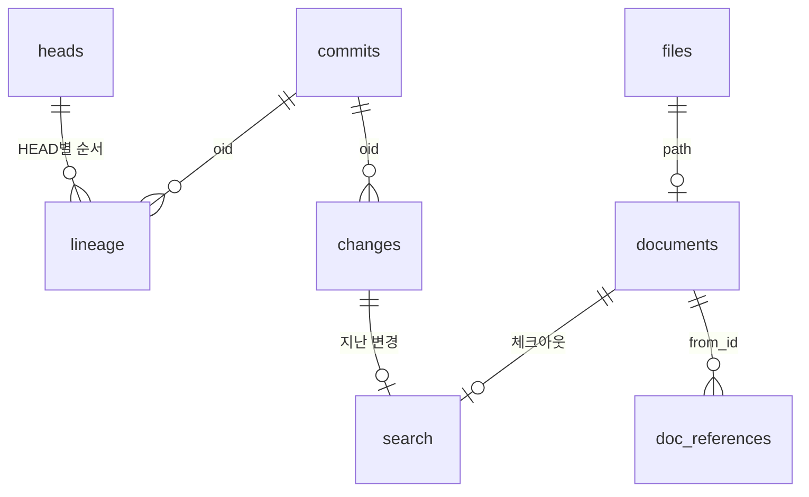

## 커밋별 변경 계산

변경은 커밋마다 바뀐 문서 파일만 읽어 계산한다(`apps/cli/src/adapters/cache/commit-changes.ts`). 문서가 파일 하나씩이므로, 커밋의 변경은 그 커밋이 바꾼 문서 파일 안의 문서다. 커밋은 100개씩 묶어 읽는다.

| 단계 | Git 호출 |
| :--- | :--- |
| 바뀐 파일 목록 | `git log --stdin --no-walk --raw`: 묶음이 바꾼 기록 파일과 blob |
| 양쪽 문서 원문 | `git cat-file --batch`: 커밋과 첫 부모 양쪽의 바뀐 문서와 그 기능의 `index.md`를 `<커밋>:<경로>`로 |
| 더한 이유 줄 | `git log -p -U0 -- .gitifact/history.jsonl`: 묶음이 이유 파일에 더한 줄 |

기록 파일은 기능 `index.md`, `requirements/*.md`, `design/*.md`, 위키 `*.md`, `.gitifact/history.jsonl`이다. 기능 `index.md`는 기능 S-ID를 알려고 함께 읽으며, 그 커밋에서 바뀌지 않았으면 변경에 넣지 않는다.

| 양쪽 비교 | 결과 |
| :--- | :--- |
| 첫 부모에만 있음 / 커밋에만 있음 | 제거 / 추가 |
| 경로가 다름 | 이동 |
| 제목·설명·본문·`order`·`requirements`·`sources` 중 하나가 다름 | 변경 |
| 그 커밋에서 파싱되지 않는 파일 | 빠짐. 이력 전체를 실패시키지 않는다 |

이유는 패치로 읽으므로 비용이 `history.jsonl` 크기와 함께 늘지 않는다. 같은 H-ID의 줄을 지우고 다시 쓴 것은 옛 이유를 고친 것이라 새 이유로 보지 않는다.

## 0.8.0 전 이력

0.8.0 마이그레이션 커밋(`Gitifact-Migration: 0.8.0` 트레일러)이 이력을 나눈다. HEAD에서 닿는 가장 새 마이그레이션 커밋이 경계다.

| 구간 | 읽는 방식 |
| :--- | :--- |
| 경계의 조상 | 0.7 파서(`legacy-changes.ts`). 양쪽 저장소 전체를 읽어 비교하고, 읽지 못하는 쪽은 빈 저장소로 본다 |
| 마이그레이션 커밋 | 이력에 보이지 않는다 |
| 경계 뒤 | 현재 형식 |

0.7 쪽을 저장소 전체로 비교해도 되는 것은 그 이력에 끝이 있고 캐시에 한 번만 읽히기 때문이다. 마이그레이션이 R-·S-·W- ID를 유지하므로 요구사항의 이력은 전환 전후로 이어진다. 0.7에서 기능마다 파일 하나(S-ID)였던 설계는 D- 문서가 되어 이력이 마이그레이션에서 새로 시작한다.

0.7 파일 경로(`requirements.md`·`design.md`·폴더별 `history.jsonl`)도 기록 경로에 넣어 둔다.

> [!NOTE]
> 0.7 파서(`legacy-changes.ts`·`store-reader.ts`)와 기록 경로의 0.7 파일 경로는 1.0.0에서 지운다.

0.7 커밋은 한 건마다 트리 둘이 필요하다. `store-reader.readBundles`가 묶음의 0.7 커밋과 그 부모의 트리 목록을 8개씩 동시에 받고, 거기 나온 blob 전체를 `cat-file --batch` 한 번으로 읽는다. 이어진 커밋은 대부분 같은 blob을 가리키므로 중복이 사라진다. 읽지 못한 트리는 빈 저장소로 본다.

## 병합과 작성자

모든 부모를 따라 읽어, 작업 브랜치의 원본 커밋이 자신의 첫 부모와 비교되며 작성자·시각·이유를 그대로 유지한다. 병합 커밋에는 병합 담당자가 실제로 손댄 문서만 남긴다.

브랜치 커밋 B·C는 각자의 첫 부모(A·B)와 비교해 브랜치 작성자의 활동으로 남는다. 병합 커밋 M은 첫 부모 D와 비교하되, 자동 병합 결과와 달라진 파일의 문서만 병합 담당자의 활동으로 남긴다.

| 경우 | 처리 |
| :--- | :--- |
| 두 부모 병합 | `git show --remerge-diff`로 자동 병합 결과와 실제 커밋이 다른 파일을 찾고, 그 파일의 문서만 첫 부모 대비 변경을 병합 활동으로 남긴다 |
| 세 부모 이상 병합 | 재병합 비교가 없어 각 부모와 비교해 모두와 다른 기록을 남긴다 |
| 0.7 파서로 읽는 병합 | 세 부모 이상과 같은 방식 |
| 스쿼시·리베이스 | 현재 계보의 커밋 작성자. 사라진 원본 작성자는 추정하지 않는다 |

병합이 손댄 문서는 첫 부모와의 차이 전체를 보이므로, 같은 문서 안의 자동 합성과 수동 수정은 구분하지 않는다. 세 부모 이상과 0.7 병합에서는 한 요구사항 안의 자동 합성이 병합 담당자의 것으로 보일 수 있다. 상세의 전후 본문은 가상 병합 결과가 아니라 실제 첫 부모와 병합 커밋에서 읽는다.

브랜치에서 가져온 변경 이유는 원본 커밋에 둔다. 병합에는 어느 부모에도 없던 이유만 잇고, 이미 되돌린 작업의 이유가 병합에 들어와도 새 변경으로 검사하지 않는다.

> [!IMPORTANT]
> 이력을 읽으며 Git 커밋과 프로젝트 문서를 바꾸지 않는다. 재병합 비교가 실패하면 그 병합을 조용히 빠뜨리지 않고 조회 오류로 돌려준다.

`apps/cli/test/merge-history.test.mjs`가 임시 저장소에서 일반 병합, 같은 요구사항의 자동 합성, 충돌 해결, 병합 중 추가·삭제·이동, 브랜치의 자체 되돌리기, 스쿼시, 세 부모 병합, 두 브랜치에서 더한 이유 줄의 합치기, SHA-256과 캐시 재생성을 검사한다.

## 체크아웃의 작성자 집계

`server/checkout/checkout-reader.ts`가 `.gitifact/spec`·`.gitifact/instructions`·AGENTS.md를 건드린 커밋을 `git log --name-only` 한 번으로 읽어 기능별 작성자·최근 커밋과 지침 폴더·AGENTS.md의 최근 커밋을 센다. 로그는 커밋 20,000개까지 읽고 기능마다 2000커밋까지 센다.

병합 커밋은 파일 목록이 없어 집계에 들지 않는다. 마이그레이션 커밋은 문서를 모두 다시 쓰지만 누구의 작업도 아니므로 뺀다. 체크아웃 읽기 안의 여러 읽기는 나란히 돌리고 실패는 모두 끝난 뒤 알린다. 실패를 먼저 돌려주면 요청이 끝난 뒤에도 git 프로세스가 프로젝트에서 돈다.

## 캐시

이력과 작업 폴더 문서는 SQLite 캐시 `.gitifact/cache/index.db`에서 거르고 세고 찾는다(`apps/cli/src/adapters/cache/`, 결정 0011). 브라우저 서버와 CLI의 조회 명령(`docs list`·`search`·`show`·`history` 등)이 같은 파일을 쓰고, 질의는 SQL이며 git을 부르지 않는다. SQLite는 Node 24에 내장된 `node:sqlite`다.

### 이력과 계보

커밋의 변경은 바뀌지 않으므로 한 번 읽어 영구히 두고, HEAD마다 그 커밋들의 순서(계보)만 더한다. 같은 HEAD를 동시에 묻는 호출은 한 번의 읽기를 함께 기다린다.

| 단계 | 내용 |
| :--- | :--- |
| 계보 읽기 | `git rev-list --full-history --date-order HEAD -- <기록 경로>`. 모든 부모를 따라 읽고, 같은 커밋은 한 번만, 자식이 부모보다 먼저 |
| 읽는 방식이 바뀐 커밋 | 현재 형식으로 읽어 둔 커밋 위에 마이그레이션 커밋이 생긴 경우. 그 커밋의 변경과 검색 행을 지우고 다시 읽는다 |
| 100개씩 | 긴 첫 읽기가 중간에 끊겨도 읽은 만큼은 남는다 |
| 오래된 HEAD 정리 | 최근 HEAD 네 개의 계보만 둔다 |

pull 뒤에는 새 커밋만 읽고, 브랜치를 오가면 대개 아무것도 읽지 않는다.

### 작업 폴더 문서

에이전트가 파일을 직접 고치므로, 읽을 때마다 `.gitifact/spec`·`.gitifact/wiki` 아래 파일의 수정 시각·크기를 캐시가 마지막에 본 값과 견주어 달라진 파일만 다시 파싱한다(`documents.ts`). 1MB를 넘는 문서 파일은 읽지 않고 문제로 알리며, 파일 2만 개에서 훑기를 멈춘다.

### 표

| 표 | 담는 것 |
| :--- | :--- |
| files | 읽은 작업 폴더 파일의 수정 시각·크기·문제 |
| documents | 작업 폴더 문서의 프론트매터와 파싱한 문서 |
| doc_references | 설계의 `requirements`·`sources` 같은 ID 참조(역조회용) |
| commits | 읽은 커밋과 읽은 방식(현재 형식·0.7·마이그레이션) |
| changes | 변경별 목록 JSON·전후 본문 JSON·필터 열 |
| lineage | HEAD별 커밋 순서 |
| heads | 계보를 둔 HEAD |
| search | 제목·위치·설명·본문의 FTS5 색인 |

### 파일과 동시 사용

CLI가 캐시 폴더 안에 내용이 `*`인 `.gitignore`를 만들어 Git에서 빼고, 프로젝트의 루트 `.gitignore`는 건드리지 않는다. `.gitifact` 폴더가 없으면 캐시 폴더를 만들지 않는다. worktree마다 캐시가 따로다. 옛 색인 `<git 공용 폴더>/gitifact/index.sqlite`는 CLI가 지우지 않고 `guide show migrate`가 지워도 된다고 안내한다.

| 상황 | 처리 |
| :--- | :--- |
| 연결 | 쓸 때마다 열고 닫는다. 서버가 요청 사이에 파일을 잡지 않는다 |
| 읽기와 쓰기 동시 | WAL 모드라 CLI와 서버가 나란히 한다 |
| 쓰기 차례 | `BEGIN IMMEDIATE`, busy_timeout 5초 |
| 같은 커밋을 둘이 씀 | 먼저 쓴 쪽이 남는다(`INSERT OR IGNORE`) |
| 형식 번호(`PRAGMA user_version`, 지금 2)가 다름 | 표를 지우고 다시 만든다 |
| 파일 손상 | 지우고 한 번 다시 만든다 |
| 그래도 열 수 없음(읽기 전용 저장소 등) | 그 프로세스 동안 메모리 DB |

## 요약

요약은 전체 이력의 종류별 건수, 최신 변경 기준 22일 안의 커밋별 날짜·건수, 최신 커밋 셋과 각각의 변경 12개까지다. 21일 막대는 브라우저가 커밋별 건수를 자기 시간대의 날짜로 나눠 센다.
