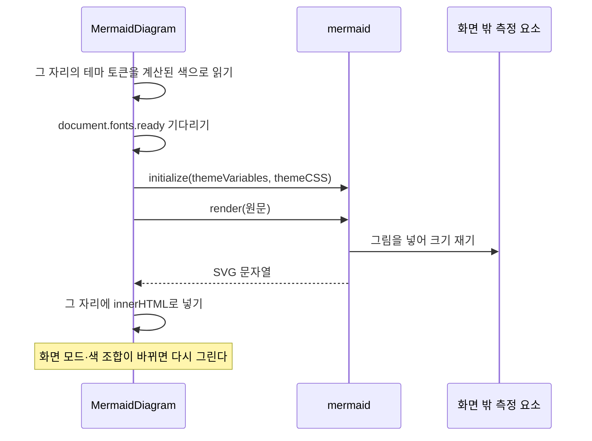
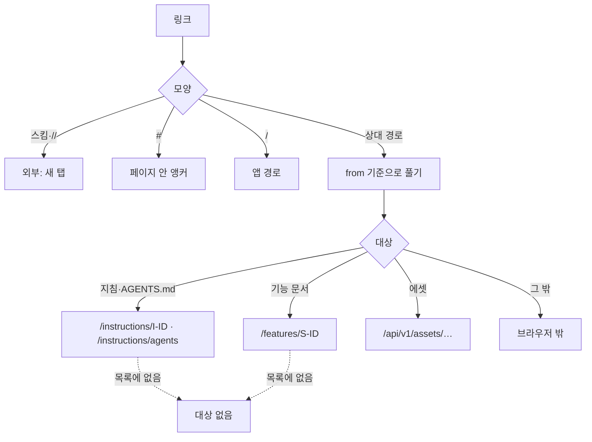

## 문서 읽기

프로젝트 지침·AGENTS.md·요구사항·설계·활동 전후 본문·소개는 `shared/ui/document`의 `DocumentBody`로 렌더링한다. 읽기 영역은 48rem 한 폭이고 Astryx Markdown의 `contentWidth`는 100%다. Astryx는 문단만 680px로 제한하고 표·코드·구분선은 전체 폭으로 그려 오른쪽 끝이 어긋나기 때문이다.

크기는 읽기 영역에서 Astryx 글자 토큰을 재정의해 맞춘다. 제목은 어느 단계에서도 본문보다 크고 위 간격이 아래보다 넓다. `density`로 compact 표시를 고를 수 있지만 지금 compact를 넘기는 화면은 없다.

| 요소 | 표시 |
| :--- | :--- |
| 본문 | 16px, 줄 간격 1.8 |
| 목록 | 15px, 줄 간격 1.65. 항목 여백 2px, 항목 사이 0 |
| 표 | 좌우 선과 둥근 모서리 없이 위아래 선·행 구분선·옅은 머리글 행. 셀 15px, 넓으면 안에서 가로 스크롤 |
| 코드 블록 | 14px |
| 인라인 코드 | 테두리·칩 여백 없이 고정폭 글꼴, 한 단계 옅은 글자색, 글자 아래쪽 절반의 회색 형광펜 띠 |
| 인용 | 옅은 바탕과 왼쪽 선 |
| 알림 | 목록과 같은 15px, 줄 간격 1.65 |
| 링크 | 테마상 글자색과 같으므로 밑줄 |

목록 항목과 표 셀의 여백·크기는 Astryx 원자 클래스가 ID 두 개 무게로 정하므로 같은 무게(`:not(#\#)` 두 번)로 덮는다. List 테마를 바꾸면 문서 이력·지침 목록까지 바뀌므로 읽기 영역 안에서만 덮는다. 인라인 코드의 띠가 회색인 것은 요구사항·설계 제목의 노란 형광펜과 구별하기 위해서다.

## 코드·다이어그램·알림

Markdown의 슬롯 셋을 우리 렌더러로 바꿔 받는다. 슬롯을 바꾸면 Astryx가 자기 감싸개까지 내주므로 블록 사이 간격은 `document.module.css`의 클래스가 준다.

| 슬롯 | 조건 | 그리는 것 |
| :--- | :--- | :--- |
| `components.code` | 언어가 `mermaid` | 다이어그램 |
| | 그 밖 | Astryx CodeBlock |
| `components.blockquote` | 첫 줄이 `[!NOTE]` 등 알림 표지 다섯 종류 | 알림 상자 |
| | 그 밖 | Astryx Blockquote |
| `components.link`·`image` | — | 아래 "문서 링크"의 해석 결과 |

stone 테마의 구문 색은 모두 회색 계열이라, GitHub 라이트·다크 값을 한 쌍으로 묶은 구문 테마(`shared/ui/document/syntax.ts`)를 앱 전체에 SyntaxTheme으로 적용한다. 일반 식별자·구두점·주석·배경은 테마 토큰을 쓴다. Astryx 토크나이저가 모르는 언어(markdown·text 등)는 색 없이 나온다.

알림은 Astryx가 인용 안의 내용을 이미 React 요소로 넘기므로, 첫 글자 뭉치에서 표지를 떼고 남은 내용을 그대로 쓴다. Astryx는 Blockquote를 인용에만 쓰라고 하므로 알림 상자는 VStack·HStack·Text와 색 토큰(blue·green·purple·yellow·red)으로 짠다. 종류 이름은 `shared/i18n`에 둔다.

### 다이어그램

mermaid 11을 `import('mermaid')`로만 불러 자기 청크에 둔다. 다이어그램이 없는 문서는 그 청크를 내려받지 않고, 파일은 패키지에 담겨 네트워크를 쓰지 않는다. `securityLevel: 'strict'`로 원문의 click 지시를 거부한다.

| 설정 | 값 | 이유 |
| :--- | :--- | :--- |
| 색 | 탐침 요소를 토큰으로 칠해 읽은 `rgb(…)` | mermaid는 색을 SVG 안에 써 넣어 `var(--color-*)`를 읽지 못하고, 토큰이 `light-dark()` 문자열일 수 있다 |
| 모양 | `look: 'neo'`, `curve: 'rounded'`, 글자 14px, 상자는 본문 바탕색에 얇은 테두리 | 그림이 회색 판이 아니라 글의 일부로 읽힌다 |
| themeCSS | 간선 라벨에 바탕색 테두리(halo), 묶음은 채우지 않은 점선, 그림자 없음 | mermaid의 라벨 바탕 상자는 글자와 어긋나 선이 글자를 지나가고, neo의 그림자는 다크 모드에서 번진다 |
| 라벨 | `htmlLabels: false`(최상위와 종류별 모두) | 열보다 넓은 그림은 축소되는데 foreignObject 안의 HTML 라벨은 축소를 따르지 않는다 |
| 측정 위치 | 화면 밖 고정 위치의 요소 하나, 숨기지 않음 | `<body>`에서 재면 스크롤바가 생겼다 사라져 화면이 흔들리고, 숨기면 폭이 0으로 잡힌다 |
| 글꼴 | `document.fonts.ready` 뒤에 그림 | 글꼴 도착 전에 재면 상자가 작게 잡힌다 |

문법이 잘못된 펜스는 그 자리에만 원문 CodeBlock과 파서 메시지를 보인다.

> [!WARNING]
> 원문 Markdown의 HTML은 실행하지 않는다. innerHTML은 mermaid가 `strict` 모드로 만든 SVG를 그 자리에 넣을 때만 쓴다.

## 문서 링크

문서 링크는 원문을 두고 렌더링 때 번역한다. `resolveDocumentLink.ts`가 문서의 저장소 경로(`from`)와 링크로 대상을 정한다. 문서 경로는 `DocumentBody`의 `path`로 받아 context에 두고, `DocumentIndexProvider`가 첫 명세 응답의 페이지·기능 목록을 준다.

| 결과 | 표시 |
| :--- | :--- |
| 기능 `index.md` | 요구사항 탭(기능 소개가 그 맨 위) |
| 요구사항·설계 파일 | 같은 기능의 해당 탭. 프래그먼트가 없으면 그 문서의 ID를 붙임 |
| 대상 없음 | 취소선 Text와 툴팁. 비활성 button은 hover가 없어 툴팁이 뜨지 않으므로 쓰지 않는다 |
| 브라우저 밖 | href 없는 Astryx Link를 흐린 색·점선 밑줄로, Tooltip과 함께. 클릭하면 저장소 경로를 복사하고 toast로 알림 |
| 이미지 | 같은 규칙으로 src를 바꾸고, 해석되지 않으면 대체 텍스트만 |

서버는 `.gitifact` 밖 파일을 제공하지 않는다.

## 관련 문서 목록

문서 사이의 관계는 종류마다 작은 제목 아래 세로 목록으로 둔다(`shared/ui/related-list`의 RelatedList, compact List). 한 줄에 제목이 링크, 그 아래 그 문서의 설명이다. 카드 대신 행으로 두는 것은 디자인 시스템의 조밀한 자료 규칙을 따른 것이다.

| 문서 | 본문 아래의 목록 |
| :--- | :--- |
| 요구사항 | 이 요구사항의 설계, 변경 이력 |
| 설계 | 관련 요구사항, 참고 문서(`sources`), 변경 이력 |

참고 문서는 제목이 링크다. ID로 가리킨 문서는 서버가 알려 준 경로를 같은 해석 규칙으로, url은 새 탭으로 연다. 설명에는 note와 호스트 또는 상대 경로를 둔다.
