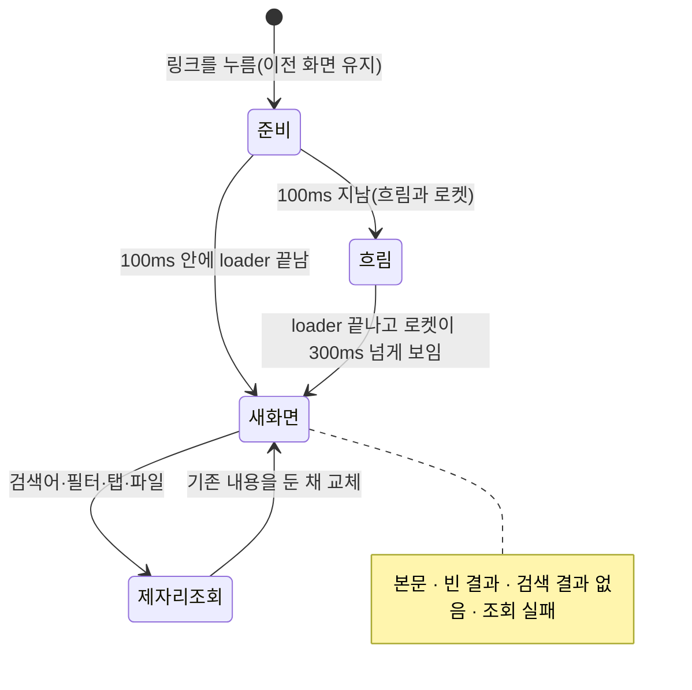
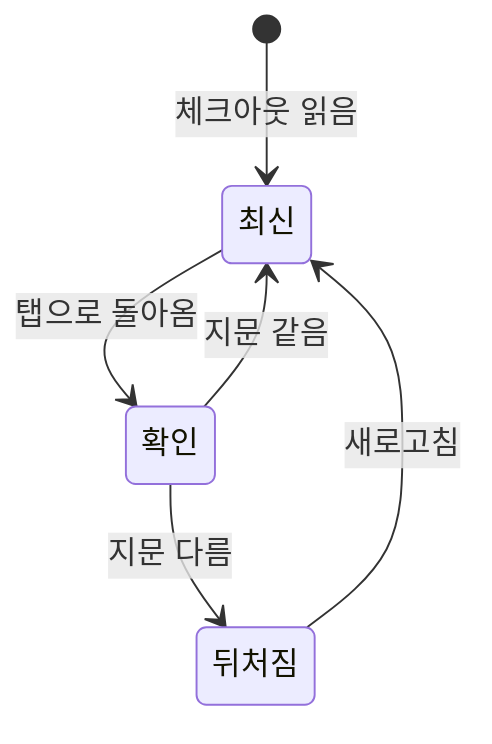

## 조회 상태

화면은 데이터가 다 준비된 뒤에만 보인다. 경로마다 `loader`(`pages/<화면>/model/load.ts`)가 그 화면이 처음 그리는 조회를 캐시에 채운다. 체크아웃 틀, 목록이나 상세, 처음 열리는 문서의 본문, 그 본문에 든 mermaid 다이어그램까지다. 부품은 같은 조회를 읽어 첫 렌더링부터 데이터를 가진다. `loader`의 실패는 캐시에 남긴다. 화면은 그 조회의 오류나 "찾을 수 없음"을 제자리에서 보이고, 다시 시도할 방법을 준다.

- **처음 접속:** 보여 줄 이전 화면이 없으므로 창 전체에 로켓을 띄운다(`app/providers`의 `InnerWrap`).
- **페이지 이동:** 라우터가 새 화면의 `loader`가 끝날 때까지 이전 화면을 그대로 둔다(`pendingComponent`를 두지 않는다). 셸은 그 위에 흐림과 로켓을 얹는다. 새 화면은 React 전환으로 한 번에 교체된다.
- **같은 화면 안의 조건 변경(검색어·필터·탭·파일):** 이동이 아니다. 경로 주소가 같으면 흐림을 띄우지 않는다. 목록은 새 답이 올 때까지 기존 행을 유지하고, 새로 읽는 부분만 제자리에 작은 로켓을 보인다.

로켓은 기다림이 100ms를 넘으면 바로 나타나고, 한 번 뜨면 최소 300ms 머문다. 이동 중의 흐림은 나타난 뒤 거의 불투명하게 짙어진다. 새 화면으로 바뀌는 순간은 흐림 뒤에서 일어나고, 흐림은 교체 뒤 두 프레임을 기다렸다가 410ms에 걸쳐 걷힌다. 새 화면을 붙이는 무거운 프레임이 흐림 아래에서 끝나야 걷히는 동안 끊기지 않기 때문이다. 흐림은 카드의 sticky 머리글·필터보다 위에 놓인다. 아래에 두면 그 부분이 흐림 밖에서 먼저 바뀐다. 새 화면은 제자리에서 투명도로만 나타난다. 마우스를 링크에 올리면 `loader`가 먼저 돌아(`defaultPreload: 'intent'`), 누를 때쯤 답이 와 있는 이동이 많다.

로켓 그림은 LottieFiles의 선 로켓 애니메이션(Rocket in Space, Lottie Simple License, 고지는 `public/licenses`)을 `lottie-web`의 `lottie_light`로 그린다. 첫 프레임부터 움직여 가장 짧은 표시(300ms)에도 움직임이 보인다. `lottie_light`는 `eval`을 쓰지 않아 CSP(`script-src 'self'`)를 바꾸지 않는다. 그림의 검정·흰색은 CSS가 테마의 글자색·카드색으로 덮어 라이트·다크에 맞추고, 움직임 줄이기에서는 한 프레임에 멈춘다. 플레이어와 그림은 첫 로켓이 뜨기 전에 받도록 모듈을 읽을 때 따로 불러온다.

HEAD나 원문이 조회 중에 바뀌거나 서버 세션이 교체되면, 다시 조회하도록 알린다.

## 화면이 뒤처질 때

체크아웃은 읽은 때의 지문(`stamp`)을 싣는다. 브라우저 탭으로 돌아오면(`visibilitychange`·`focus`) `/api/v1/stamp`를 묻고, 다르면 명세 화면들의 머리 아래에 "새 변경이 있습니다"와 새로고침을 보인다. 누르기 전에는 화면을 바꾸지 않는다. 새로 읽은 뒤에는 그 답을 기준으로 다시 비교한다. 지문을 묻다 실패하면 아무것도 보이지 않는다. 파일 감시로 자동 반영하지 않는다.

## 골격

골격은 화면마다 실제 배치를 본떠, 본문으로 바뀌는 순간 레이아웃이 움직이지 않게 한다.

| 화면 | 골격 |
| :--- | :--- |
| 활동 | 세로 선·아바타·세 줄 |
| 기능별 요구사항·참여자 | 표 행 |
| 대시보드 | 머리, 카드 두 장, 변경 이력 |

## 검사 범위

계약 fixture로 선택·탭·필터·더보기·누락 참조·모바일·오류·대시보드 집계·프로젝트 지침(목록·파일·AGENTS.md)·미커밋 표시·문서 상태·뒤처짐 알림·커밋 전 페이지를 검사한다(`apps/browser/test/working.spec.ts`). 실제 Git 저장소와 패키징된 서버로 조회를 확인하고, 성능은 실제 측정값으로 보고한다.
