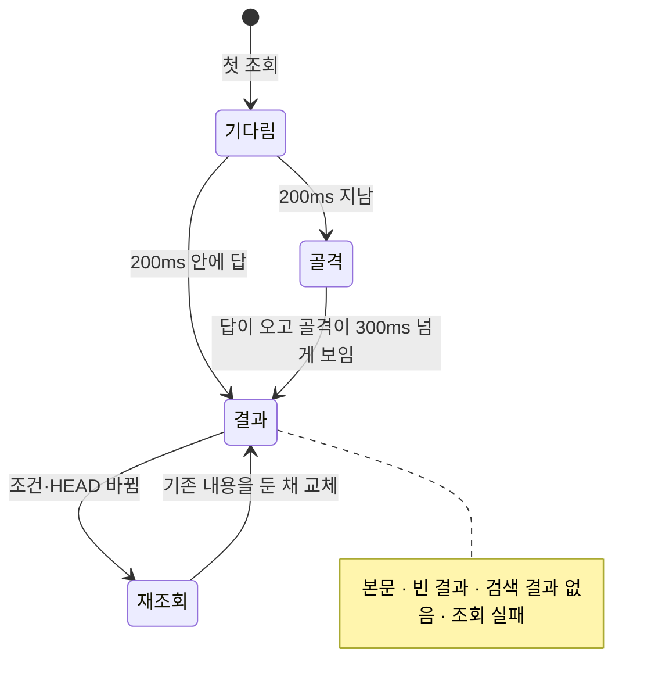

## 조회 상태

첫 조회는 짧으면 골격 없이 바로 본문을 보이고, 길어지면 골격을 보인다(`shared/ui/request-state/useLoadingHold.ts`). 골격이 한번 보이면 잠깐 번쩍이지 않도록 최소 시간을 지킨 뒤 본문이 페이드인한다.

HEAD나 원문이 조회 중에 바뀌거나 서버 세션이 교체되면, 다시 조회하도록 알린다.

## 골격

골격은 화면마다 실제 배치를 본떠, 본문으로 바뀌는 순간 레이아웃이 움직이지 않게 한다.

| 화면 | 골격 |
| :--- | :--- |
| 활동 | 세로 선·아바타·세 줄 |
| 기능별 요구사항·참여자 | 표 행 |
| 제품 개요 | 머리, 카드 두 장, 변경 이력 |
| 위키 페이지(`/wiki/$id`) | 제목, 정보 세 칸, 문단 |
| 위키 폴더(`/wiki`) | 테두리 있는 목록과 README 상자 |

위키 골격은 탐색기의 클래스를 그대로 써서 트리 폭과 경로 줄 높이가 실제와 같다. 트리 행(38px)과 폴더 목록 행(48px)도 실제 간격에 맞춘다.

## 검사 범위

계약 fixture로 선택·탭·필터·더보기·누락 참조·모바일·오류·대시보드 집계·위키 탐색기(트리·폴더 목록·페이지)·미커밋 표시를 검사한다. 실제 Git 저장소와 패키징된 서버로 조회를 확인하고, 성능은 실제 측정값으로 보고한다.
