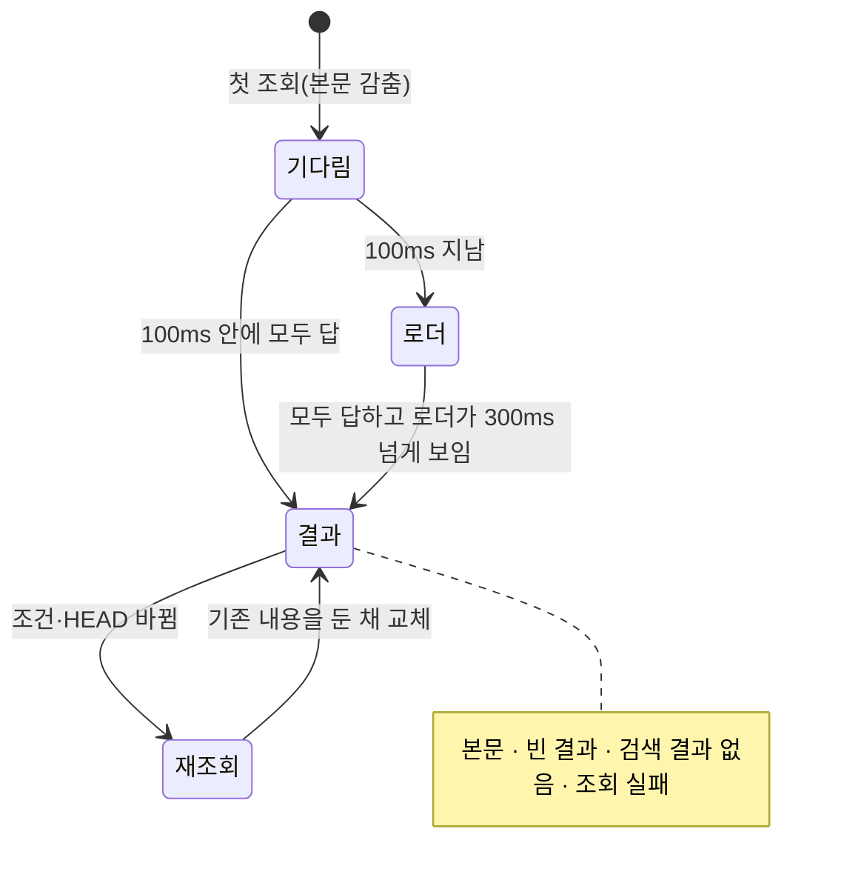
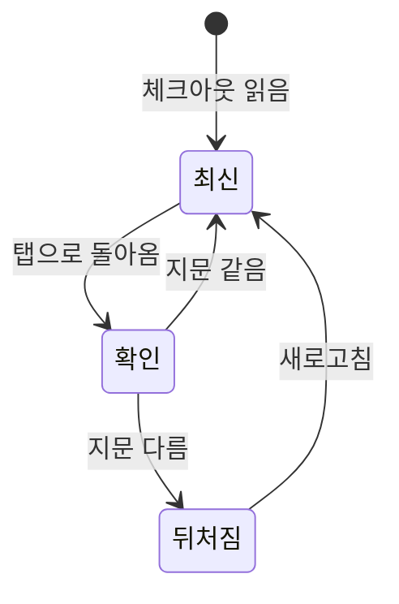

## 조회 상태

화면을 그리는 데 필요한 첫 조회(체크아웃 틀과 그 화면의 목록·상세)는 셸의 공통 로더 하나가 맡는다(`shared/ui/request-state/PageLoading.tsx`). 조회가 모두 답할 때까지 본문을 감추고, 짧으면 로더 없이 바로, 길어지면 로더를 보인 뒤 본문을 한꺼번에 페이드인한다. 로더는 콘텐츠 카드 위에 겹쳐 카드 크기와 위치가 그대로라 본문이 나타날 때 밀리지 않는다. 화면이 한 번 보인 뒤의 조회(다른 파일 열기, 코드 탭)는 그 자리에 작은 로더를 보인다. 로더 그림은 LottieFiles의 선 로켓 애니메이션(Rocket in Space, Lottie Simple License, 고지는 `public/licenses`)을 `lottie-web`의 `lottie_light`로 그린다. 첫 프레임부터 움직여 가장 짧은 표시(300ms)에도 움직임이 보인다. `lottie_light`는 `eval`을 쓰지 않아 CSP(`script-src 'self'`)를 바꾸지 않는다. 그림의 검정·흰색은 CSS가 테마의 글자색·카드색으로 덮어 라이트·다크에 맞추고, 움직임 줄이기에서는 한 프레임에 멈춘다. 플레이어와 그림은 첫 로더가 뜨기 전(100ms)에 받도록 모듈을 읽을 때 따로 불러온다.

공개가 끊기지 않도록 네 가지를 지킨다. 큰 목록은 `useDeferredValue`로 나눠 그려 로더가 계속 움직이게 한다. 마지막 답을 붙인 뒤 두 프레임을 더 기다려, 무거운 배치 프레임이 페이드가 아니라 로더 아래에 오게 한다. 감춘 본문은 불투명도 0.001로 미리 그려 두고, 대기와 페이드 동안만 `will-change: opacity`로 합성해 페이드를 GPU가 맡는다. 로더 context는 바뀌지 않는 보고 함수와 공개 여부로 나눠, 로더가 오갈 때 화면이 다시 렌더링되지 않게 한다. 기능 목록(62행) 기준으로 공개 페이드 중 가장 긴 프레임은 실제 속도에서 17ms, CPU 4배 감속에서 200ms에서 67ms로 줄었다. 로더는 라우터가 실제로 그린 경로를 화면으로 보므로, 다음 화면의 코드를 받는 동안에도 새로고침과 같은 순서로 나타난다.

HEAD나 원문이 조회 중에 바뀌거나 서버 세션이 교체되면, 다시 조회하도록 알린다.

## 화면이 뒤처질 때

체크아웃은 읽은 때의 지문(`stamp`)을 싣는다. 브라우저 탭으로 돌아오면(`visibilitychange`·`focus`) `/api/v1/stamp`를 묻고, 다르면 명세 화면들의 머리 아래에 "새 변경이 있습니다"와 새로고침을 보인다. 누르기 전에는 화면을 바꾸지 않는다. 새로 읽은 뒤에는 그 답을 기준으로 다시 비교한다. 지문을 묻다 실패하면 아무것도 보이지 않는다. 파일 감시로 자동 반영하지 않는다.

## 골격

골격은 화면마다 실제 배치를 본떠, 본문으로 바뀌는 순간 레이아웃이 움직이지 않게 한다.

| 화면 | 골격 |
| :--- | :--- |
| 활동 | 세로 선·아바타·세 줄 |
| 기능별 요구사항·참여자 | 표 행 |
| 대시보드 | 머리, 카드 두 장, 변경 이력 |

## 검사 범위

계약 fixture로 선택·탭·필터·더보기·누락 참조·모바일·오류·대시보드 집계·프로젝트 지침(목록·파일·AGENTS.md)·미커밋 표시·문서 상태·뒤처짐 알림·커밋 전 페이지를 검사한다(`apps/browser/test/working.spec.ts`). 실제 Git 저장소와 패키징된 서버로 조회를 확인하고, 성능은 실제 측정값으로 보고한다.
