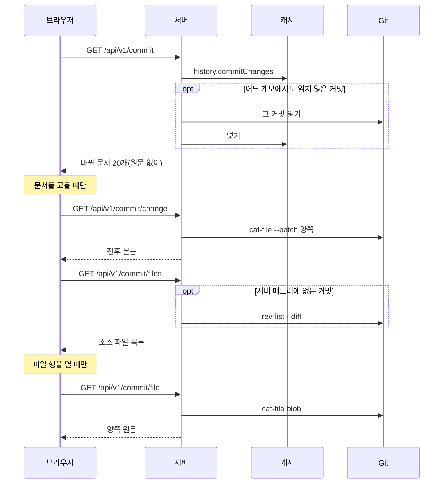

## 서버 구조

로컬 서버는 `apps/cli/src/server/`에 역할별로 나뉘며 HTTP 프레임워크 없이 Node의 `http`로 동작한다. 모든 요청은 아래 순서로 검사하고 처음 어긋난 단계에서 답한다. `/api/v1/` 밖의 경로는 공통 검사 뒤 앱 파일로 간다.

| 순서 | 검사 | 어긋나면 |
| :--- | :--- | :--- |
| 1 | 공통 검사(`guard.ts`): Host, Origin, API의 교차 사이트 요청 | 403 |
| 2 | 공통 검사: 경로 형식·탈출, 요청 본문 | 400 |
| 3 | 경로 표에 경로가 있는가 | 404 |
| 4 | 메서드 | 405와 `Allow` |
| 5 | 쿼리: 중복 키, 계약의 쿼리 스키마 | 400 |
| 6 | 세션 헤더 | 409 |
| 7 | 처리 함수 | 던진 `HttpError`의 상태. 그 밖의 오류는 503과 이유 |

| 파일·폴더 | 맡는 것 |
| :--- | :--- |
| `browser-server.ts` | 시작·종료와 연결 |
| `http/guard.ts` | 모든 요청의 공통 검사와 보안 헤더 |
| `http/router.ts` | 경로 표 디스패치 |
| `http/respond.ts` | JSON·오류 응답 |
| `http/static-files.ts` | 앱 파일 |
| `routes/` | 경로 표 셋: project(세션·상태·패치노트), record(체크아웃·이력·요약·변경·커밋·결정기록·검색), asset(저장소 에셋) |
| `checkout/` | 작업 폴더 체크아웃과 작성자 집계 |
| `commit/commit-files.ts` | 커밋의 소스 변경 읽기 |

경로 표의 한 줄은 메서드·경로·세션 필요 여부·쿼리 스키마·처리 함수다. 문서 상태(`document-states.ts`)와 커밋 전 변경(`working-changes.ts`)은 CLI 명령과 서버가 같이 부르는 `apps/cli/src/queries/`에 있다. 쿼리 스키마는 계약 패키지에 있어 서버와 브라우저가 같은 규칙을 쓴다. 커밋별 변경 계산(commit-changes), 0.7 이력 읽기(legacy-changes), SQLite 파일(database), 작업 폴더 문서(documents), 이력 질의(history), 검색 글 다듬기(search-text)는 CLI 명령과 함께 쓰는 `apps/cli/src/adapters/cache/`에 있다.

## 경로와 계약

에셋과 세션을 뺀 모든 경로는 세션 헤더가 필요하다. 브라우저는 응답을 계약 형식과 세션으로 검증한다.

| 경로 | 계약 | 내용 |
| :--- | :--- | :--- |
| `GET /api/v1/session` | browser-session v3 | 서버 세션과 시작 때 한 번 확인한 버전 상태. 세션 헤더 불필요 |
| `GET /api/v1/status` | repository-status v1 | 마지막으로 관측한 Git 상태. 실패는 503 |
| `POST /api/v1/status/refresh` | repository-status v1 | Git 상태를 다시 관측. 허용된 Origin만(아니면 403) |
| `GET /api/v1/changelog?lang` | changelog v1 | 패치노트. 그 언어가 없으면 기본 언어로 답하고 `fallback`으로 알림 |
| `GET /api/v1/specs` | browser-specs v7 | 체크아웃 전체: 현재 기능과 그 요구사항·설계, 프로젝트 지침(폴더 파일 목록 포함)과 AGENTS.md, 문서마다 상태(`state`·`previousPath`, 지운 문서 포함), 참여자, 미커밋 여부, 읽은 때의 지문(`stamp`), 읽지 못한 파일 |
| `GET /api/v1/stamp` | browser-stamp v1 | 지금의 지문. HEAD와 `.gitifact`·AGENTS.md의 `git status`, 그 경로들의 수정 시각·크기의 해시 |
| `GET /api/v1/history?head&after&limit&kind&document&feature&author&q` | browser-history v6 | 조건에 맞는 변경을 커밋 단위로 한 페이지(기본 20커밋, 최대 50). 전체 변경 수(`total`)·커밋 수(`commits`)와 다음 커서(`next`, 이 페이지 마지막 커밋) |
| `GET /api/v1/history/summary?head` | browser-history-summary v4 | 종류별 건수, 최근 3주 커밋별 건수, 최신 커밋 셋 |
| `GET /api/v1/commit?commit&after&limit` | browser-commit v4 | 커밋 하나의 작성자·시각·메시지와 바꾼 문서의 목록 한 페이지(기본 20, 최대 500). 원문 없이 `total`·`next`(마지막 변경의 key) |
| `GET /api/v1/commit/change?commit&id` | browser-commit-change v1 | 그 커밋이 바꾼 문서 하나의 전후 본문. Git에서 읽는다 |
| `GET /api/v1/working` | browser-working v1 | 커밋 전 작업: 커밋 전 결정기록(섹션 포함), HEAD 대비 바뀐 문서, 결정기록 없는 변경. 요청마다 계산한다 |
| `GET /api/v1/working/change?id` | browser-working-change v1 | 커밋 전 변경 하나의 HEAD 쪽과 지금 파일 쪽 |
| `GET /api/v1/record?head&id` | browser-record v1 | `head` 이력에서 그 결정기록(`DR-…`, 기록 도입 전 이유는 `H-…`)을 더한 커밋. 캐시의 이력 행에서 찾고, 그 이력에 기록이 없으면 404, 쿼리가 형식에 어긋나면 400 |
| `GET /api/v1/commit/files?commit&after&limit` | browser-commit-files v2 | 첫 부모 대비 바뀐 소스 파일(`.gitifact` 밖)의 경로·상태·줄 수를 Git 순서로 한 페이지(기본 20, 최대 100). 전체 수(`total`)와 다음 커서(`next`, 이 페이지 마지막 파일의 경로). `after`가 목록에 없으면 404 |
| `GET /api/v1/commit/file?commit&path` | browser-commit-file v1 | 그 목록의 파일 하나의 양쪽 원문. 이진 파일과 512KB 넘는 쪽은 원문 없이 표시만 |
| `GET /api/v1/search?q&head` | browser-search v2 | 체크아웃과 지난 변경의 검색 결과 |
| `GET /api/v1/instructions/file?id&path` | browser-instruction-file v1 | 작업 폴더의 지침 파일 하나. 링크는 따라가지 않고, 이진 파일과 512KB 넘는 파일은 원문 없이 표시만 |
| `GET /api/v1/assets/*` | — | `.gitifact/assets` 아래 파일. 세션 헤더 불필요 |

> [!WARNING]
> 에셋 경로는 `` 요청이 세션 헤더를 싣지 못해 세션 없이 열려 있다. 에셋 경로 규칙에 맞는 일반 파일만, 링크 없이 20MB까지 주는 범위를 넓히지 않는다.

이미지(png·jpg·jpeg·gif·webp·svg)는 inline, 그 밖은 첨부로 내려보내며 `Content-Security-Policy: default-src 'none'; sandbox`를 붙인다.

## 체크아웃과 이력

체크아웃과 이력은 따로 조회한다. 체크아웃은 현재 문서뿐이라(문서 파일 하나 1MB, 파일 2만 개까지 읽는다) 통째로 보내고 화면이 거른다. 이력은 끝이 없으므로 서버가 전체 이력에 조건을 걸어 세고 커밋 20개씩 준다. 커밋은 페이지 사이에서 쪼개지지 않고, 다음 페이지는 `after`에 받은 커밋 다음부터다. `after`가 그 조건의 이력에 없으면 404다. 상세는 본문과 딸린 목록의 첫 20개, 커서를 주고, 원문처럼 무거운 것은 고를 때 따로 받는다.

목록 이벤트의 before·after는 id·title·specId·path만 담고 본문은 커밋 조회로 받는다. 이벤트의 `records`는 그 문서를 설명하는 결정기록 `{id, title, sections: [{key, body}]}`(`key`는 `context`·`decision`·`alternatives`)의 목록이다. 이력 쿼리는 HEAD를 받으므로 같은 HEAD의 답은 바뀌지 않는다.

## 커밋과 소스 변경

커밋 조회는 캐시의 `history.commitChanges`가 그 커밋의 변경 행을 순서대로 한 페이지 돌려준다. 문서 하나의 원문은 `history.commitChange`가 캐시에 적힌 커밋·경로로 `cat-file --batch` 한 번에 양쪽을 읽는다. 어느 계보에서도 읽지 않은 커밋이면 단건 조회와 같은 방식으로 한 번 읽어 넣는다. 문서를 하나도 바꾸지 않은 커밋은 `git log -1`로 작성자와 메시지만 읽어, 페이지가 소스 변경을 보일 수 있게 한다.

소스 변경은 `commit/commit-files.ts`가 Git에서 바로 읽는다. 목록은 `rev-list --parents`로 첫 부모를 찾아 `diff --name-status`와 `diff --numstat`를 한 번씩 부르고(루트 커밋은 `diff-tree --root`), 이름 변경은 `-M`으로 옛 경로를 함께 싣는다. 커밋은 바뀌지 않으므로 목록을 서버 메모리에 200커밋까지 둔다.

파일 하나는 목록에 있는 경로만 받고 `cat-file blob`으로 양쪽을 읽는다. Git이 줄 수를 세지 않은 파일, NUL이 있거나 UTF-8이 아닌 파일은 이진으로 보고 원문을 보내지 않는다. 없는 커밋과 그 커밋이 바꾸지 않은 경로는 404다.

## 브라우저의 조회 캐시

TanStack Query 키에는 origin·서버 세션·worktree를 넣는다. 명세 조회의 staleTime은 무한이고, 다시 읽는 것은 헤더의 새로고침 버튼뿐이다. 새로고침은 커밋 전 작업의 조회도 버린다. 이력은 HEAD·조건별로, 기록을 더한 커밋은 HEAD·기록 ID별로, 커밋은 커밋·페이지 크기별로, 문서 하나의 원문은 커밋·문서별로 세션 동안 보관한다. 기록 상세는 그 기록의 문서를 찾으려고 커밋의 변경을 500개까지 한 번에 받는다. 탭으로 돌아오면 `/api/v1/stamp`를 묻고, 체크아웃의 `stamp`와 다르면 새 변경 알림을 띄운다(errors 참고).

FSD의 entities는 조회를, 화면별 pages 슬라이스는 화면 구성을, `widgets/records-page`는 명세 화면이 함께 쓰는 틀과 검색 상태를 맡는다.
