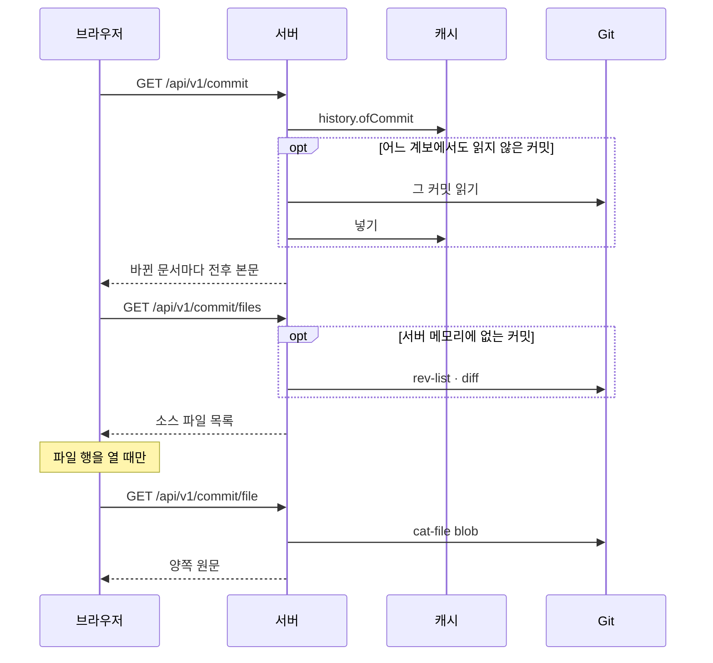

## 서버 구조

로컬 서버는 `apps/cli/src/server/`에 역할별로 나뉘며 HTTP 프레임워크 없이 Node의 `http`로 동작한다. 모든 요청은 아래 순서로 검사하고 처음 어긋난 단계에서 답한다. `/api/v1/` 밖의 경로는 공통 검사 뒤 앱 파일로 간다.

| 순서 | 검사 | 어긋나면 |
| :--- | :--- | :--- |
| 1 | 공통 검사(`guard.ts`): Host, Origin, API의 교차 사이트 요청 | 403 |
| 2 | 공통 검사: 경로 형식·탈출, 요청 본문 | 400 |
| 3 | 경로 표에 경로가 있는가 | 404 |
| 4 | 메서드 | 405와 `Allow` |
| 5 | 쿼리: 중복 키, 계약의 쿼리 스키마 | 400 |
| 6 | 세션 헤더 | 409 |
| 7 | 처리 함수 | 던진 `HttpError`의 상태. 그 밖의 오류는 503과 이유 |

| 파일·폴더 | 맡는 것 |
| :--- | :--- |
| `browser-server.ts` | 시작·종료와 연결 |
| `http/guard.ts` | 모든 요청의 공통 검사와 보안 헤더 |
| `http/router.ts` | 경로 표 디스패치 |
| `http/respond.ts` | JSON·오류 응답 |
| `http/static-files.ts` | 앱 파일 |
| `routes/` | 경로 표 셋: project(세션·상태·패치노트), record(체크아웃·이력·요약·변경·커밋·검색), asset(저장소 에셋) |
| `checkout/` | 작업 폴더 체크아웃과 작성자 집계 |
| `commit/commit-files.ts` | 커밋의 소스 변경 읽기 |

경로 표의 한 줄은 메서드·경로·세션 필요 여부·쿼리 스키마·처리 함수다. 쿼리 스키마는 계약 패키지에 있어 서버와 브라우저가 같은 규칙을 쓴다. 커밋별 변경 계산(commit-changes), 0.7 이력 읽기(legacy-changes), SQLite 파일(database), 작업 폴더 문서(documents), 이력 질의(history), 검색 글 다듬기(search-text)는 CLI 명령과 함께 쓰는 `apps/cli/src/adapters/cache/`에 있다.

## 경로와 계약

에셋과 세션을 뺀 모든 경로는 세션 헤더가 필요하다. 브라우저는 응답을 계약 형식과 세션으로 검증한다.

| 경로 | 계약 | 내용 |
| :--- | :--- | :--- |
| `GET /api/v1/session` | browser-session v3 | 서버 세션과 시작 때 한 번 확인한 버전 상태. 세션 헤더 불필요 |
| `GET /api/v1/status` | repository-status v1 | 마지막으로 관측한 Git 상태. 실패는 503 |
| `POST /api/v1/status/refresh` | repository-status v1 | Git 상태를 다시 관측. 허용된 Origin만(아니면 403) |
| `GET /api/v1/changelog?lang` | changelog v1 | 패치노트. 그 언어가 없으면 기본 언어로 답하고 `fallback`으로 알림 |
| `GET /api/v1/specs` | browser-specs v5 | 체크아웃 전체: 현재 기능과 그 요구사항·설계, 위키, 참여자, 미커밋 여부, 읽지 못한 파일 |
| `GET /api/v1/history?head&offset&limit&kind&document&feature&author&q` | browser-history v3 | 조건에 맞는 변경 한 페이지와 전체 건수 |
| `GET /api/v1/history/summary?head` | browser-history-summary v2 | 종류별 건수, 최근 3주 커밋별 건수, 최신 커밋 셋 |
| `GET /api/v1/commit?commit` | browser-commit v1 | 커밋 하나의 작성자·시각·메시지와, 바꾼 문서마다 목록 정보와 전후 본문 |
| `GET /api/v1/commit/files?commit` | browser-commit-files v1 | 첫 부모 대비 바뀐 소스 파일(`.gitifact` 밖)의 경로·상태·줄 수. 500개까지와 전체 수 |
| `GET /api/v1/commit/file?commit&path` | browser-commit-file v1 | 그 목록의 파일 하나의 양쪽 원문. 이진 파일과 512KB 넘는 쪽은 원문 없이 표시만 |
| `GET /api/v1/search?q&head` | browser-search v1 | 체크아웃과 지난 변경의 검색 결과 |
| `GET /api/v1/assets/*` | — | `.gitifact/assets` 아래 파일. 세션 헤더 불필요 |

> [!WARNING]
> 에셋 경로는 `` 요청이 세션 헤더를 싣지 못해 세션 없이 열려 있다. 에셋 경로 규칙에 맞는 일반 파일만, 링크 없이 20MB까지 주는 범위를 넓히지 않는다.

이미지(png·jpg·jpeg·gif·webp·svg)는 inline, 그 밖은 첨부로 내려보내며 `Content-Security-Policy: default-src 'none'; sandbox`를 붙인다.

## 체크아웃과 이력

체크아웃과 이력은 따로 조회한다. 체크아웃은 현재 문서뿐이라(문서 파일 하나 1MB, 파일 2만 개까지 읽는다) 통째로 보내고 화면이 거른다. 이력은 끝이 없으므로 서버가 전체 이력에 조건을 걸어 세고 50건씩 준다.

목록 이벤트의 before·after는 id·title·specId·path만 담고 본문은 커밋 조회로 받는다. 이력 쿼리는 HEAD를 받으므로 같은 HEAD의 답은 바뀌지 않는다.

## 커밋과 소스 변경

커밋 조회는 캐시의 `history.ofCommit`이 그 커밋의 변경 행을 순서대로 돌려준다. 어느 계보에서도 읽지 않은 커밋이면 단건 조회와 같은 방식으로 한 번 읽어 넣는다. 문서를 하나도 바꾸지 않은 커밋은 `git log -1`로 작성자와 메시지만 읽어, 페이지가 소스 변경을 보일 수 있게 한다.

소스 변경은 `commit/commit-files.ts`가 Git에서 바로 읽는다. 목록은 `rev-list --parents`로 첫 부모를 찾아 `diff --name-status`와 `diff --numstat`를 한 번씩 부르고(루트 커밋은 `diff-tree --root`), 이름 변경은 `-M`으로 옛 경로를 함께 싣는다. 커밋은 바뀌지 않으므로 목록을 서버 메모리에 200커밋까지 둔다.

파일 하나는 목록에 있는 경로만 받고 `cat-file blob`으로 양쪽을 읽는다. Git이 줄 수를 세지 않은 파일, NUL이 있거나 UTF-8이 아닌 파일은 이진으로 보고 원문을 보내지 않는다. 없는 커밋과 그 커밋이 바꾸지 않은 경로는 404다.

## 브라우저의 조회 캐시

TanStack Query 키에는 origin·서버 세션·worktree를 넣는다. 명세 조회의 staleTime은 무한이고, 다시 읽는 것은 헤더의 새로고침 버튼뿐이다. 이력은 HEAD·조건별로, 커밋은 커밋별로 세션 동안 보관한다.

FSD의 entities는 조회를, 화면별 pages 슬라이스는 화면 구성을, `widgets/records-page`는 명세 화면이 함께 쓰는 틀과 검색 상태를 맡는다.
