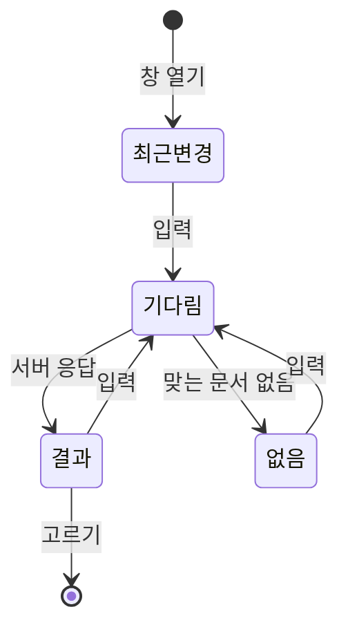
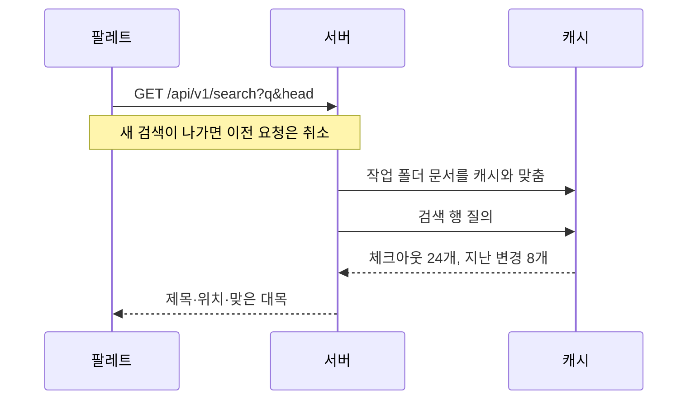

## 창과 상태

`mod+K`와 머리의 검색 버튼이 같은 창을 연다. 창은 Astryx CommandPalette다. 열림 여부는 `shared/lib/search`의 작은 저장소가 들고, 팔레트는 셸이 한 번 그리며 버튼은 헤더가 그린다. 두 위젯이 서로를 참조하지 않도록 상태만 shared에 둔다.

결과 영역은 22rem 고정이라 결과 수에 따라 창 크기가 바뀌지 않는다. 목록은 다음 상태를 오간다.

| 상태 | 보이는 것 |
| :--- | :--- |
| 최근변경 | 체크아웃의 최근 변경일로 브라우저가 만든 목록 |
| 기다림 | 결과 줄과 같은 규격의 골격 |
| 결과 | 줄마다 제목·위치·맞은 대목(서버가 자름), 맞은 글자 표시 |
| 없음 | PageState의 검색 일러스트 |

"기다림"은 입력칸의 change 이벤트에서 세운다. 팔레트는 결과가 오기 전에 이미 보이는 목록을 제목으로 먼저 좁히고, 남는 게 없으면 빈 상태를 그린다. 그 자리를 골격으로 덮어 결과가 오기 전 빈 상태 그림이 번쩍이지 않게 한다. 팔레트가 검색을 transition 안에서 부르므로 거기서 세운 상태는 결과가 온 뒤에야 보여서, change 이벤트를 쓴다.

## 서버 검색

입력한 뒤의 결과는 서버(`/api/v1/search`)가 캐시의 검색 행에서 찾는다. CLI의 `docs search`도 같은 검색 행을 쓴다.

| 검색 행 | 채우는 때 | 담는 것 |
| :--- | :--- | :--- |
| 체크아웃 | 검색할 때, 수정 시각·크기가 바뀐 기능·요구사항·설계·위키 파일만 | 제목·위치·설명·본문 |
| 지난 변경 | 이력을 캐시에 읽어 넣을 때 | 변경마다 제목과 이유·커밋 메시지 |

검색 행은 FTS5 trigram 표에 소문자로 둔다. `LIKE '%…%'`가 세 글자부터 색인을 쓰고, 두 글자 이하나 `%`·`_`가 든 검색어는 훑어서 찾는다. 체크아웃은 제목 앞부분 → 제목 → 위치 → 본문 순으로 24개, 지난 변경은 HEAD의 계보에서 최신순으로 8개를 준다. 과거 시점의 본문 전문은 찾지 않는다.

고르면 위키는 `/wiki/$documentId`, 요구사항과 설계는 기능 상세의 해당 탭, 지난 변경은 그 커밋의 페이지 `/activity/<커밋>#<문서 ID>`로 간다.

## 팔레트와 맞추기

Astryx CommandPalette의 동작에 맞춰 둔 규칙이다.

| 규칙 | 지키지 않으면 |
| :--- | :--- |
| `searchSource`는 한 번만 만든다 | 매 렌더 새로 만들면 선택 강조가 풀려 Enter가 아무것도 열지 못한다 |
| 강조가 없을 때 Enter는 첫 결과를 연다(입력의 keydown) | 강조가 없으면 Enter가 죽어 있다 |
| 검색은 자료가 도착할 때까지 기다렸다 답한다 | 팔레트는 열릴 때와 타자마다만 검색하므로, 문서를 읽기 전에 친 낱말이 빈 결과로 굳는다 |
| 디바운스로 밀린 약속은 마지막 결과로 함께 끝낸다 | 버리면 그 transition이 끝나지 않아 대기 표시가 계속 돈다 |
| 여는 목록과 검색은 큐를 나눈다 | 타자가 여는 목록의 약속을 대신 답해 두 목록이 한꺼번에 보인다 |
