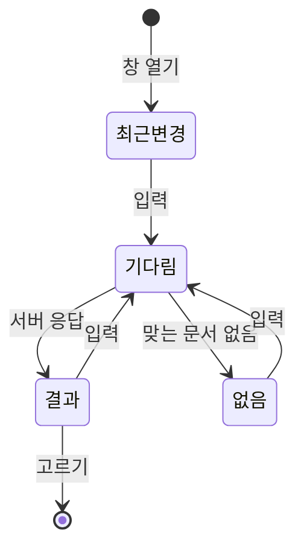
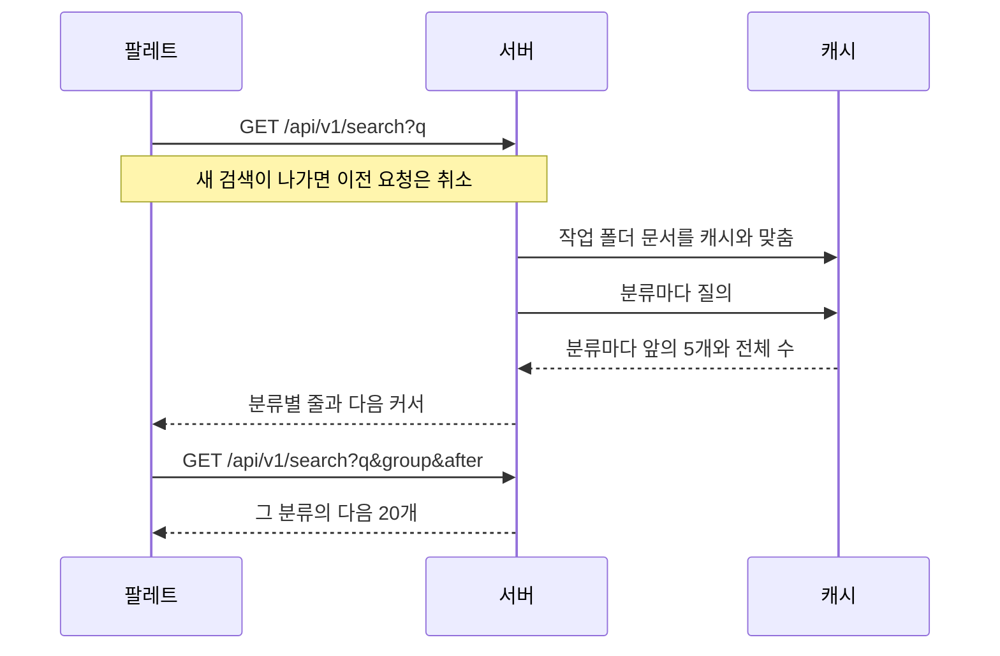

## 창과 상태

`mod+K`와 머리의 검색 버튼이 같은 창을 연다. 창은 Astryx CommandPalette다. 팔레트와 버튼은 `features/search-palette` 슬라이스이고, 팔레트는 셸(`widgets/app-shell`)이 한 번 그리며 버튼은 머리 막대(`widgets/page-header`)가 그린다. 열림 여부는 둘이 함께 쓰도록 `shared/lib/search`의 작은 저장소가 든다.

결과 영역은 22rem 고정이라 결과 수에 따라 창 크기가 바뀌지 않는다. 목록은 다음 상태를 오간다.

| 상태 | 보이는 것 |
| :--- | :--- |
| 최근변경 | 서버가 커밋 기록의 폴더별 최근 커밋으로 고른 기능·지침 6개 |
| 기다림 | 결과 줄과 같은 규격의 골격 |
| 결과 | 분류마다 줄(제목·위치·맞은 대목, 서버가 자름)과 맞은 글자 표시. 더 있는 분류는 끝에 "N개 더 보기" 줄 |
| 없음 | PageState의 검색 일러스트 |

"기다림"은 입력칸의 change 이벤트에서 세운다. 팔레트는 결과가 오기 전에 이미 보이는 목록을 제목으로 먼저 좁히고, 남는 게 없으면 빈 상태를 그린다. 그 자리를 골격으로 덮어 결과가 오기 전 빈 상태 그림이 번쩍이지 않게 한다. 팔레트가 검색을 transition 안에서 부르므로 거기서 세운 상태는 결과가 온 뒤에야 보여서, change 이벤트를 쓴다.

## 서버 검색

묶기·정렬·자르기는 서버의 조회(`queries/search.ts`)가 하고 팔레트는 받은 순서대로 그린다. 입력 전의 최근 변경도 서버가 준다.

| 분류 | 찾는 곳 | 순서 |
| :--- | :--- | :--- |
| 기능·요구사항·설계·지침 | 검색 행(작업 폴더 문서, 수정 시각·크기가 바뀐 파일만 다시 채움)의 제목·위치·설명·본문 | 제목 앞부분 → 제목 → 위치 → 본문, 같은 순위는 제목 |
| 결정기록 | 캐시의 기록 표. HEAD 계보에서 기록 파일마다 한 번, 제목·ID·섹션 | 제목 앞부분 → 제목 → ID → 섹션, 같은 순위는 최신순 |
| 커밋 | 캐시의 커밋 기록. 검색어가 7~64자의 16진수일 때만 그 앞부분으로 시작하는 HEAD의 커밋 | 최신순 |

검색 행은 FTS5 trigram 표에 소문자로 둔다. `LIKE '%…%'`가 세 글자부터 색인을 쓰고, 두 글자 이하나 `%`·`_`가 든 검색어는 훑어서 찾는다. 문서 변경 단위의 이력 검색 행은 두지 않는다(결정기록 본문을 문서 수만큼 되풀이했다). 과거 시점의 본문 전문은 찾지 않는다. `group`을 주면 그 분류만 `after`(앞 페이지 마지막 줄의 ID, 커밋은 해시) 다음 20개를 주고, 목록에 없는 커서는 404다. `head`를 주지 않으면 서버의 HEAD를 쓴다.

고르면 지침은 `/instructions/<I-ID>`, 요구사항과 설계는 기능 상세의 해당 탭과 그 절, 결정기록은 `/records/<기록 ID>`, 커밋은 `/records/commits/<커밋>`으로 간다.

## 팔레트와 맞추기

Astryx CommandPalette의 동작에 맞춰 둔 규칙이다.

| 규칙 | 지키지 않으면 |
| :--- | :--- |
| `searchSource`는 한 번만 만든다 | 매 렌더 새로 만들면 선택 강조가 풀려 Enter가 아무것도 열지 못한다 |
| 강조가 없을 때 Enter는 첫 결과를 연다(입력의 keydown) | 강조가 없으면 Enter가 죽어 있다 |
| 디바운스로 밀린 약속은 마지막 결과로 함께 끝낸다 | 버리면 그 transition이 끝나지 않아 대기 표시가 계속 돈다 |
| 여는 목록과 검색은 큐를 나눈다 | 타자가 여는 목록의 약속을 대신 답해 두 목록이 한꺼번에 보인다 |
| "더 보기" 줄을 고르면 닫힘을 막고, 다음 페이지를 붙인 뒤 같은 낱말을 입력칸에 다시 넣는다(네이티브 setter와 input 이벤트) | 팔레트는 줄을 고르면 닫히고, 타자 말고는 다시 그리게 할 방법이 없다 |
| 이미 답을 가진 낱말은 디바운스 없이 바로 답한다 | "더 보기" 뒤 다시 그리기가 타자 대기만큼 늦는다 |
