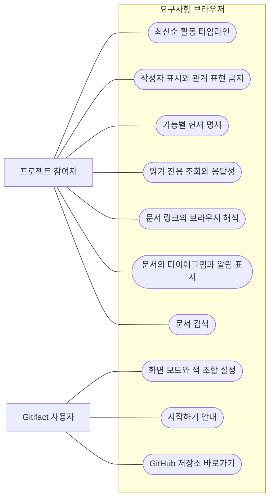

CLI가 띄우는 로컬 서버에서 현재 명세, 프로젝트 지침, 변경 활동, 참여자를 읽기 전용으로 보여 준다. 원본 파일과 Git은 바꾸지 않는다.

## 유즈케이스 모델

```mermaid
flowchart LR
  member[프로젝트 참여자]
  user[Gitifact 사용자]
  subgraph browser[요구사항 브라우저]
    uc1([최신순 활동 타임라인])
    uc2([작성자 표시와 관계 표현 금지])
    uc3([기능별 현재 명세])
    uc4([읽기 전용 조회와 응답성])
    uc5([화면 모드와 색 조합 설정])
    uc6([문서 링크의 브라우저 해석])
    uc7([문서의 다이어그램과 알림 표시])
    uc8([문서 검색])
    uc9([시작하기 안내])
    uc10([GitHub 저장소 바로가기])
  end
  member --- uc1
  member --- uc2
  member --- uc3
  member --- uc4
  member --- uc6
  member --- uc7
  member --- uc8
  user --- uc5
  user --- uc9
  user --- uc10
```
