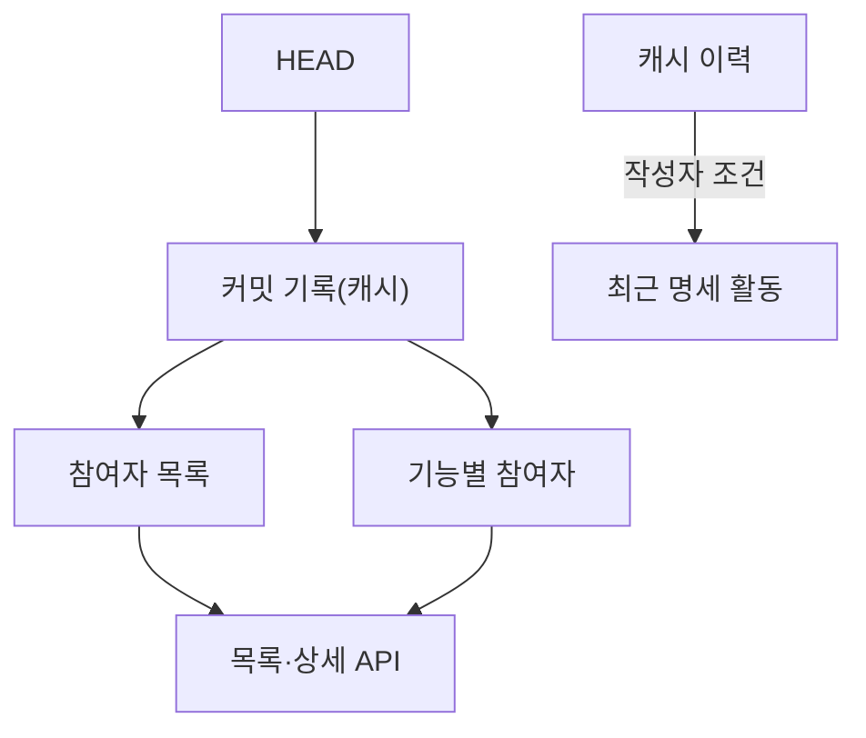

## 개요

Git author를 참여자로 보고 그 사람이 참여한 기능과 명세 활동을 보인다. 커밋 작성자를 요구사항 요청자나 승인자로 추정하지 않고, 커밋 수를 구현 완료나 기여 품질로 해석하지 않는다. 화면 이름은 참여자이고, 경로 `/contributors`와 계약 필드 `contributors`는 그 이름을 쓴다.

## 집계

참여자와 기능별 참여자는 캐시의 커밋 기록(`apps/cli/src/adapters/cache/commit-log.ts`)에서 센다. 커밋 기록은 HEAD의 모든 커밋을 한 번 읽어 두고 새 커밋만 더한다. 이름과 이메일은 mailmap이 반영된 값(`%aN`·`%aE`)이며, `.mailmap`이 바뀌면 이름을 새로 읽으려고 기록을 다시 읽는다. 목록·상세의 모양은 서버의 조회(`queries/checkout.ts`)가 만든다.

| 집계 | 읽는 범위 | 결과 |
| :--- | :--- | :--- |
| 참여자 목록 | HEAD의 모든 커밋 | 이메일별 커밋 수·최근 활동 시각. 커밋 수 순으로 20명씩 |
| 기능별 참여자 | HEAD의 커밋 중 기능 폴더를 건드린 것 | 기능 폴더마다 `contributors`(이메일별 커밋 수)와 `updatedAt` |
| 최근 명세 활동 | 캐시의 전체 이력 | 작성자 조건을 건 이력 질의의 첫 10건 |

마이그레이션 커밋(`Gitifact-Migration` 트레일러)은 뺀다. 형식 전환이 모든 문서를 다시 쓰지만 누구의 작업도 아니기 때문이다. 참여자 목록은 모든 커밋을 세고 기능별 참여자는 기능 폴더의 커밋만 세므로, 코드 커밋만 한 사람은 목록에 있어도 참여한 기능이 없다.

## 화면

목록(`/contributors`)은 카드 격자(최소 220px 열)다. 카드마다 48px 원형 아바타·이름·이메일·커밋 수·참여 기능 수·최근 활동을 두고 카드 전체가 상세 링크다. 서버(`/api/v1/contributors`)가 이름이나 이메일로 걸러 커밋 수 순으로 20명씩 주고, 격자 아래 "참여자 더 보기"가 다음 20명을 더한다. 검색어는 `q` 검색 인자다.

상세는 `/contributors/<이메일>`(percent 인코딩)이며 목록 대신 같은 폭의 페이지로 열린다. 이전의 `?author=` 진입은 리다이렉트하지 않고 목록으로 취급한다. 서버(`/api/v1/contributor`)가 HEAD에 그 이메일로 커밋한 사람이 없다고 답하면 찾을 수 없음 상태와 목록 링크를 보인다. 상단 이동 경로는 참여자 / 이름이다.

| 상세의 절 | 내용 |
| :--- | :--- |
| 머리 | 72px 아바타, 이름, 이메일, Git 커밋 수, 최근 활동, 작성자 필터를 건 결정기록 링크(`/records?author=`) |
| 참여한 기능 | 서버가 고른, 기능별 `contributors`에 이 이메일이 있는 기능 카드. 이 사람의 명세 커밋 수와 요구사항 수를 보이고 `/features/<S-ID>`로 간다 |
| 최근 명세 활동 | 최대 10개. 변경 종류·문서 종류·제목·시각이며 제목은 그 커밋 페이지의 그 문서 절(`/records/commits/<커밋>#<문서 ID>`)로 간다 |

절 사이에는 아래 여백을 두어 카드가 다음 절의 구분선에 붙지 않게 한다. 이력 개수와 이전 이력 더 보기 줄은 결정기록 페이지에만 있고 참여자 화면에는 두지 않는다.

모든 화면의 아바타와 이름은 해당 참여자 상세로 가는 링크다(`entities/contributor`의 `Person`, `contributorHref`). Astryx의 href 링크는 LinkProvider에 등록한 RouterLink가 받아 전체 새로고침 없이 라우터로 이동한다. 표 행의 클릭은 행 안의 링크 클릭과 겹치지 않게 대상이 링크나 버튼이면 무시한다.

## 아바타

아바타는 손으로 그린 얼굴 세 가지와 배경색 여섯 가지 중에서, 소문자로 바꾼 이메일의 해시(FNV-1a)로 하나씩 골라 SVG data URL로 만든다(`avatarSource`). 같은 이메일은 어느 화면에서나 같은 아바타가 된다. 외부 아바타 서비스에 이메일을 보내지 않는다.

> [!NOTE]
> 조합이 18가지뿐이라 여러 사람이 같은 아바타를 가질 수 있다. 신원 확인에는 이름·이메일을 쓴다.

## 오류 처리와 검증

Git 조회와 계약 검증 실패는 오류로 표시하며 참여자가 없다고 바꾸지 않는다. 작성자 줄을 읽지 못해도 오류다. 해당 이메일의 명세 활동이 없으면 최근 이력에 활동이 없다고 안내하고, 코드 커밋만 한 참여자를 누락된 요구사항 작성자로 취급하지 않는다.

서버의 Git author 집계와 브라우저의 선택·검색·관련 이력 이동을 검사한다. 저장소 밖 사용자 계정이나 PR 플랫폼의 구성원 목록은 조회하지 않는다.

같은 사람이 여러 이메일을 쓰면 mailmap으로 정리된 경우 외에는 다른 항목으로 나타난다. 실제 조직 구성원 식별과 요청·승인자 인증은 지원하지 않는다.
