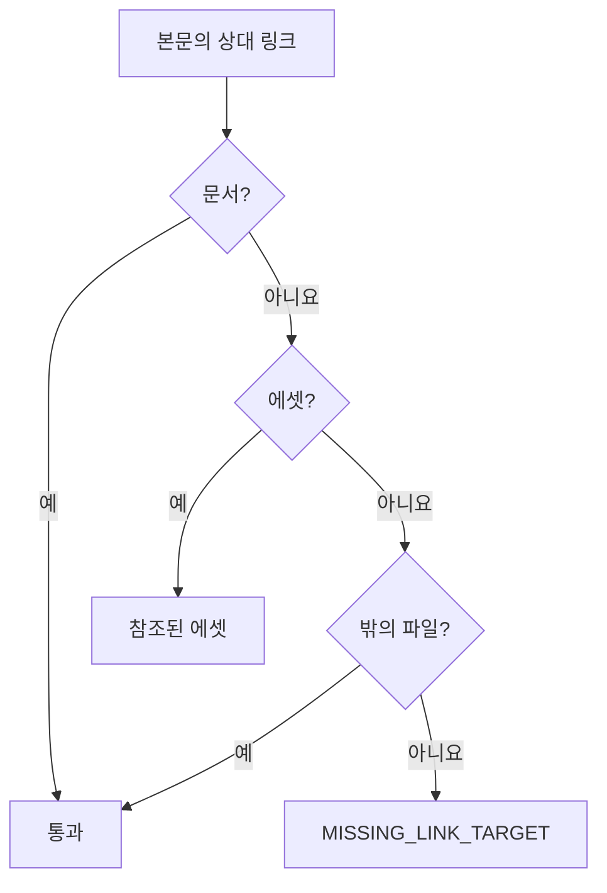

## 개요

제품 소개·구조·규칙을 기능 명세와 같은 저장소 안에서 하나의 위키로 관리한다. 기능 명세(spec)가 "무엇을 만드는가"라면 위키는 "누구를 위해 왜, 어떻게 만드는가"를 담는다. 위키 페이지와 명세는 같은 이유 파일과 같은 커밋 흐름을 쓰고, 그림과 첨부 파일은 에셋 폴더에 두어 본문에서 상대 링크로 가리킨다.

## 위키 페이지

`.gitifact/wiki/**/*.md`가 위키 페이지다. 페이지는 frontmatter(`id: W-…`, `title`, `description`)와 본문이며 core `parseDocumentFile`이 검증한다. 본문에는 `#` 제목을 쓰지 않는다. 진입 페이지는 `README.md`다.

| 규칙 | 값 (core `classifyDocPath`) |
| :--- | :--- |
| 파일·폴더 이름 | 소문자·숫자·하이픈. 폴더 이름은 80자까지 |
| 대문자 이름 | 위키 루트에서만(`README.md`, `ARCHITECTURE.md` 등) |
| 폴더 깊이 | 7단계까지, 위키 폴더 기준 경로는 200자까지 |
| Markdown이 아닌 파일 | 문서로 읽지 않고 무시한다 |

## 작성 흐름

`docs list --kind wiki`와 `docs show <W-ID>`로 읽는다. 새 페이지는 `docs new wiki <경로>`로 만들고(위키 폴더 안 상대 경로, `.md`는 생략 가능), 수정·이동·삭제는 파일을 직접 고친 뒤 `docs check`로 확인한다.

지침 블록은 요구사항·설계·코드를 바꾸기 전에 `gitifact guide show wiki`를 확인하도록 안내한다. `guide show wiki`는 형식 뒤에 `README.md` 본문을 운영 방침으로 싣고, README가 없으면 내장 기본 방침(`wiki.default.md`)을 싣는다(`commands/guide.ts`, 에이전트 작업 흐름 설계의 위키 운영 방침 절). `init`은 처음 도입할 때 기본 방침 README 한 페이지만 만든다. 기본 방침은 결정 기록을 쌓는 것 하나다.

## 에셋과 링크

에셋은 `.gitifact/assets/**`이며 core `isAssetPath`(`formats/links.ts`)가 경로를 판정한다. 에셋 폴더 아래 경로는 파일 이름을 포함해 8단계, 전체 경로는 300자까지이고 `..`·역슬래시·콜론은 쓰지 못한다. 에셋은 파싱하지 않으며, `changes commit`의 선택 검사와 브라우저 서버의 제공이 같은 판정을 쓴다.

본문 링크는 그 파일 기준 상대 경로다. 문서 사이의 관계는 링크가 아니라 frontmatter로 나타내므로 CLI는 링크를 참조로 읽지 않고, 대상이 없는 링크를 경고할 때만 본다. 브라우저가 링크를 그리는 방식은 [브라우저 문서 설계](../../browser/design/document.md)를 따른다.

core `documentWarnings`(`use-cases/document-warnings.ts`)가 모든 문서 본문에서 `extractLinks`·`resolveLink`로 링크를 찾는다. 외부·절대 경로·앵커·메일 링크와 코드 펜스 안은 보지 않는다. "밖의 파일"은 `.gitifact` 밖에 있는 일반 파일이고, `.gitifact` 안의 문서도 에셋도 아닌 대상은 경고한다. 파일 존재 확인과 에셋 목록은 CLI 어댑터(`adapters/filesystem/document-warnings.ts`)가 맡으며, 심볼릭 링크는 목록에서 뺀다.

| 경고 | 조건 |
| :--- | :--- |
| `MISSING_LINK_TARGET` | 링크 대상이 위 판정을 통과하지 못함 |
| `ASSET_SIZE` | 에셋 하나가 1MB 초과 |
| `ASSET_EXTENSION` | 확장자가 png·jpg·jpeg·gif·webp·svg·pdf가 아님 |
| `ASSETS_TOTAL_SIZE` | 에셋 전체가 50MB 초과 |
| `UNREFERENCED_ASSET` | 어떤 본문도 가리키지 않는 에셋 |

`docs check`는 문제 목록 뒤에 경고를 따로 보이고, `changes list`는 경고 수를 알린다.

> [!IMPORTANT]
> 경고는 종료 코드를 바꾸지 않고 `changes commit`도 막지 않는다. 한도는 core 상수(`ASSET_SIZE_LIMIT`, `ASSETS_TOTAL_LIMIT`, `RECOMMENDED_ASSET_EXTENSIONS`)다.

## 이력

커밋 전후 비교는 페이지 ID 단위다. 경로가 바뀌면 이동, 파일 내용이 바뀌면 변경이다. 변경 이유는 명세와 같은 `.gitifact/history.jsonl`에 `{docs: [W-…], reason}`으로 받아 H-ID를 붙여 더하고, 커밋 메시지 트레일러는 `Gitifact-Doc: <ID>`다. 커밋 흐름은 Git 기록 연결 설계를 따른다. 문서 이력은 `docs history <W-ID>`와 브라우저 활동으로 본다.

## 화면

왼쪽 메뉴의 첫 항목은 제품 개요(`/product`)이며 위키와 연결하지 않는다. 대시보드는 위키 README를 싣거나 링크하지 않는다. 메뉴 전체는 [브라우저 화면 설계](../../browser/design/ui.md)에 있다.

위키 메뉴는 `/wiki`(폴더는 `folder` 검색 인자)와 `/wiki/$documentId`이며, 왼쪽 트리와 오른쪽 폴더 내용 또는 페이지로 된 탐색기 하나가 둘을 함께 그린다. 페이지를 옮겨도 탐색기가 다시 마운트되지 않아 펼쳐 둔 트리가 남는다. 폴더 내용은 하위 폴더를 먼저 보이고, 그 폴더에 `README.md`가 있으면 목록 아래에 보인다. 위키에 README 하나만 있으면 `/wiki`가 목록 대신 README를 바로 연다.

브라우저 서버는 `/api/v1/assets/<경로>`로 에셋을 제공한다(`server/routes/asset-routes.ts`). 이미지는 inline, 그 밖은 attachment로 보낸다.

> [!WARNING]
> 에셋 응답에는 `Content-Security-Policy: default-src 'none'; sandbox`를 붙인다. 직접 연 SVG의 스크립트가 실행되지 않게 하는 장치이므로 빼지 않는다.

## 결정

| 결정 | 이유 | 기각한 안 |
| :--- | :--- | :--- |
| 경로가 아니라 파일 안의 ID로 페이지를 식별한다 | 이름 변경과 폴더 이동에도 이력과 이유가 이어진다 | 위키 페이지 ID 없애기 |
| 제품 소개와 지침을 위키 하나(`W-`)로 둔다 | 사용자마다 필요한 문서 구성이 달라 고정된 product·guides 두 폴더가 맞지 않았고, 브라우저 메뉴와 지침도 하나로 단순해진다 | `P-`·`G-` ID 이어 받기(접두어 세 종류가 남음), 전환 도구(정식 버전 전) |
| 에셋에 ID를 두지 않는다 | ID 참조는 에디터·GitHub에서 이미지로 보이지 않아 상대 링크 방식과 충돌한다. 대신 깨진 링크를 경고한다 | ID로 에셋 참조 |
| 에셋 크기·확장자 제한은 경고로만 한다 | Git 저장소에 큰 파일을 두는 것은 사용자의 선택이며 커밋을 막으면 우회하게 된다 | 한도 초과 시 커밋 거부 |
| `init`은 기본 방침 README 한 페이지만 만든다 | 프로젝트마다 구성이 달라 미리 만든 페이지는 대부분 고치게 된다 | 목적별 페이지 세트 생성 |
| 위키 화면은 트리와 본문의 탐색기 하나다 | 폴더가 깊어지면 열이 본문 자리를 밀어내고, 읽기까지 미리보기·상세 두 단계를 거쳐야 했다 | Finder식 열 보기와 미리보기 |
| 제품 개요는 위키 README를 싣거나 링크하지 않는다 | README는 위키 운영 방침이지 제품 소개가 아니다 | 대시보드의 "제품 문서 보기" 링크 |
