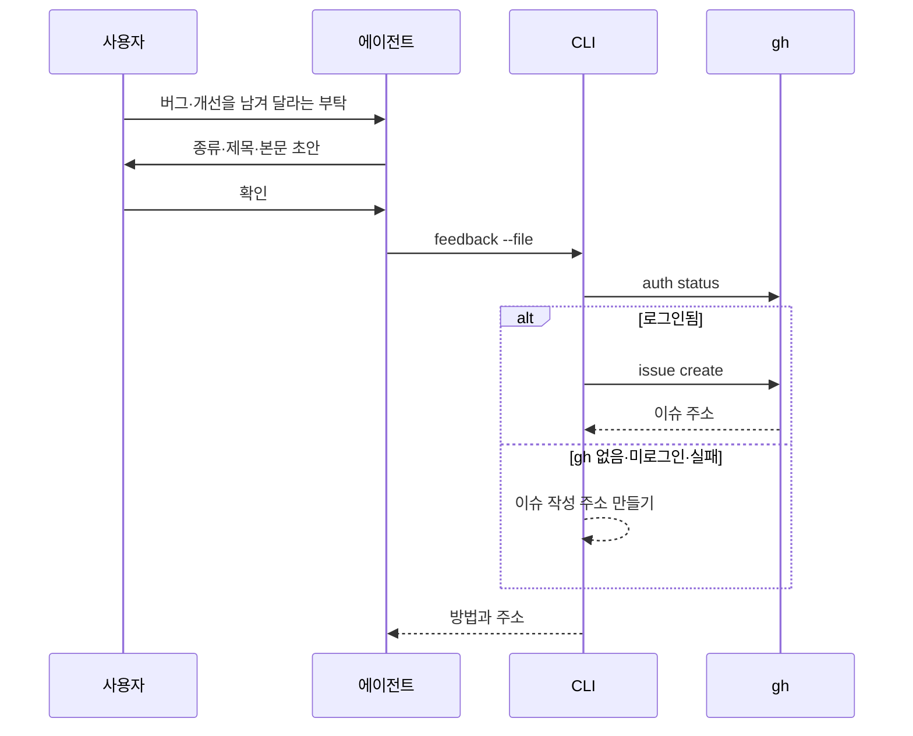

## 흐름

`gitifact feedback --file <json|-> [--dry-run]`은 에이전트가 쓴 이슈 초안을 받아 Gitifact 저장소(`dev-goraebap/gitifact`)에 보낸다. 명령은 `apps/cli/src/commands/feedback.ts`, `gh` 실행과 이슈 작성 주소는 `apps/cli/src/adapters/github/issue.ts`에 둔다. 초기화하지 않은 폴더나 Git 저장소 밖에서도 동작한다.

> [!IMPORTANT]
> 이슈는 외부로 나가는 글이다. 에이전트는 사용자 확인 없이 `feedback`을 실행하지 않고, 확인 전에 보여 줄 때는 `--dry-run`을 쓴다.

## 입력과 본문

입력은 `changes commit`과 같은 방식으로 파일 경로나 `-`(표준 입력)로 받는 UTF-8 JSON이며 1MB까지 읽는다. 키는 셋뿐이고 다른 키가 있으면 `INVALID_INPUT`이다.

| 키 | 값 |
| :--- | :--- |
| `type` | `bug` 또는 `idea` |
| `title` | 한 줄, 1~200자 |
| `body` | 비지 않은 글, 20,000자까지 |

CLI는 본문 끝에 구분선과 환경 정보를 영어로 덧붙인다: 종류, Gitifact 버전, 운영체제와 버전, Node 버전, 현재 폴더에서 위로 찾은 `.gitifact/config.json`의 `schemaVersion`(없으면 `none`). 프로젝트 경로, 파일, 문서 내용, Git 정보는 넣지 않는다. 제목은 입력 그대로 쓰고 라벨은 붙이지 않는다.

## 전송

| 조건 | 방법 |
| :--- | :--- |
| `gh auth status`가 성공 | `gh issue create --repo dev-goraebap/gitifact --title … --body-file -`로 본문을 표준 입력에 넘긴다. 출력의 이슈 주소를 결과로 보인다 |
| `gh`가 없거나 로그인 실패, 이슈 생성 실패 | `https://github.com/dev-goraebap/gitifact/issues/new?title=…&body=…` 주소를 만든다. 사용자가 브라우저에서 제출한다 |

작성 주소가 8,000자를 넘으면 본문을 잘라 주소에 맞추고 `truncated: true`로 알린다. 텍스트 출력은 잘린 사실과 함께 전체 본문을 보여 사용자가 붙여 넣게 한다. `gh`는 인자 배열로 실행하고 셸을 거치지 않으며, 로그인 확인은 10초, 생성은 60초 안에 끝나지 않으면 실패로 본다. CLI는 GitHub API를 직접 부르지 않고 토큰을 읽지 않는다.

`--dry-run`은 로그인 확인만 하고 보내지 않는다. 결과는 쓸 방법, 제목, 환경 정보를 붙인 본문, URL 방법이면 작성 주소다.

## 출력

계약 이름은 `feedback`, 버전 1이다. JSON은 `dryRun`, `method`(`gh`·`url`), `title`, `body`(환경 정보를 붙인 전체 본문), `url`(만든 이슈나 작성 페이지), `truncated`를 싣는다. 입력 오류는 `INVALID_INPUT`이다. 테스트는 `gh` 실행 함수를 주입하거나 `gh`가 없는 PATH로 실행해 네트워크 없이 돈다.
