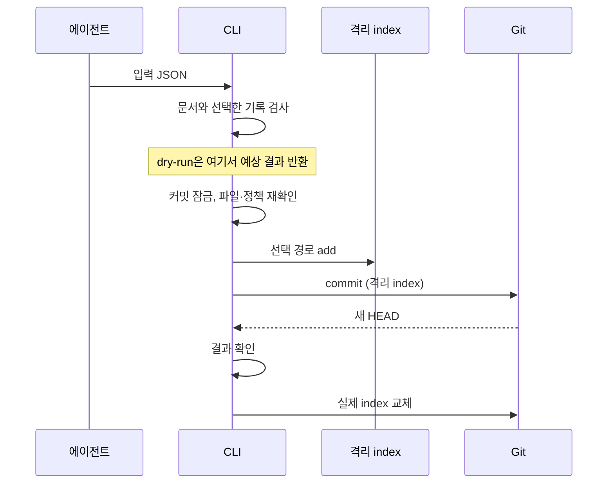
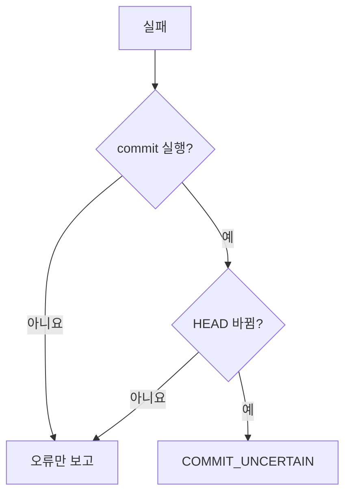

## 개요

작업 중 명세는 초안으로 편집하고, 커밋 시점의 최종 명세와 그것을 설명하는 결정기록을 Git 커밋에 잇는다. 관련 소스·테스트와 명세를 같은 커밋에 담는 것이 기본이며, 프로젝트의 분리 커밋 정책과 기존 staging은 존중한다. 이 흐름은 `changes list`로 다음 커밋이 설명할 것을 보고, `changes commit`으로 검사와 커밋을 한 번에 하는 두 명령이다(`apps/cli/src/commands/changes.ts`).

## 문서와 결정기록

문서는 파일 하나가 변경 단위이며 파일 안의 ID로 식별한다.

| 문서 | ID | 트레일러 |
| :--- | :--- | :--- |
| 기능 개요(`index.md`) | `S-` | `Gitifact-Doc` |
| 요구사항(파일마다) | `R-` | `Gitifact-Req` |
| 설계(축 파일마다) | `D-` | `Gitifact-Design` |
| 지침(`index.md`) | `I-` | `Gitifact-Doc` |
| 위키 페이지(0.8.0 이전 커밋) | `W-` | `Gitifact-Doc` |

결정기록 하나는 `.gitifact/records/<yyyymmdd>/<DR-ID>.md` 파일 하나다. 프론트매터는 `id`(DR-)·`title`·`docs`와 선택 키 `draft`이고, 본문은 맥락·결정(필수)과 검토한 대안(선택) `##` 섹션뿐이다. 기록에는 종류가 없다(형식은 `gitifact guide show records`). 작성자·시각은 파일에 두지 않고 기록을 더한 커밋에서 읽는다. 기록은 결정한 때 `records new`가 초안(`draft: true`)으로 만들고 에이전트가 채운다. 기록이 파일마다 따로 있어 두 브랜치가 함께 기록을 더해도 병합 규칙 없이 합쳐진다.

CLI는 HEAD와 작업 폴더의 문서를 파싱해 ID로 비교한다(core `compareDocumentSets`). 경로가 바뀌면 이동, 내용이 바뀌면 변경이며, 파일을 옮겨도 ID가 같으면 같은 문서다. 내용 비교는 CRLF를 LF로 맞춘 원문으로 한다. 아직 커밋하지 않은 기록은 모든 기록 파일을 읽지 않고 `.gitifact/records/`의 `git status`로 찾는다(`adapters/git/pending-records.ts`). 추적하지 않거나 새로 더한 파일이 새 기록이고, 커밋된 기록이 바뀌거나 사라졌으면 `RECORD_ALTERED`다. `check`는 이것을 문제로 알리고 `changes commit`은 거부한다.

> [!IMPORTANT]
> 커밋한 기록은 고치거나 지우지 않는다. 결정이 바뀌면 새 기록을 쓴다.

## 커밋 입력

`changes list`는 바뀐 문서, 아직 커밋하지 않은 기록과 각 기록이 설명하는 문서, 결정기록 없이 수정·이동·삭제된 문서(`withoutRecord`), 두 기록이 함께 설명하는 문서(`sharedDocuments`), 문서 검사 결과와 경고 수, 커밋 입력 파일 경로를 보인다. 에이전트는 실제 diff와 관련 테스트, 프로젝트 정책을 확인한 뒤 그 경로에 입력 JSON을 쓰고 `changes commit --file`에 넘긴다.

| 필드 | 형식과 한도 |
| :--- | :--- |
| `paths` | 커밋할 문서·결정기록·코드 파일의 저장소 상대 경로 128개까지(`migration`이면 5,000개). Git에는 표준 입력으로 넘겨 명령줄 길이에 걸리지 않는다. `..`·`.git`·역슬래시·콜론·제어 문자 불가 |
| `message` | 4000자까지. `Gitifact-`로 시작하는 줄 불가(트레일러는 CLI가 붙인다) |
| `authorization` | `{basis, evidence}`. `basis`는 `user-request` 또는 `project-policy`, `evidence`는 2000자까지 |
| `migration` (선택) | `true`면 `Gitifact-Migration: 0.8.0` 트레일러를 붙인다. 커밋 메시지도 표준 입력으로 넘긴다 |

`paths`는 바뀐 문서를 모두 담지 않아도 된다. 담지 않은 문서와 기록은 작업 폴더에 남아 다음 커밋을 기다리며, 남은 기록이 초안이어도 커밋을 막지 않는다. 옮긴 문서는 옛 경로와 새 경로를 함께 담는다. 커밋 하나에 결정 하나를 권하지만 강제하지 않고, 한 문서를 함께 설명하는 기록들은 한 커밋에 담는다. `withoutRecord`는 알림일 뿐 커밋을 막지 않는다. CLI는 `evidence`의 자연어 근거가 사실인지 판정하지 않는다. 커밋이 확실히 성공했을 때만 입력 파일을 지우고, 실패와 dry-run은 재시도를 위해 남긴다.

## 커밋 단계

| 단계 | 내용 |
| :--- | :--- |
| 문서 검사 | 커밋될 파일에 `check`와 같은 검사를 돌린다. 문서와 선택한 기록에 남은 `draft: true`도 실패다. 기록이 가리키는 문서는 작업 폴더나 HEAD에 있어야 한다(이번 커밋이 지우는 문서는 가리킬 수 있다) |
| 선택 확인 | 옮긴 문서는 옛 경로와 새 경로가 함께 `paths`에 있어야 한다. `.gitifact` 안에서는 문서·결정기록·`config.json`·에셋(core `isAssetPath`)만 커밋한다 |
| 커밋 잠금 | `.git/gitifact-changes-commit.lock` 폴더를 만들고 `.git/index.lock`을 잡는다. `recovery.json`에 실행 전 HEAD·index·선택 경로·메시지를 적는다 |
| 재확인 | 실제 index가 처음 읽은 것과 같고 staging이 비었는지, 선택 경로와 정책 파일(`AGENTS.md`·`CLAUDE.md`·`.gitignore`·`.gitattributes`와 각 상위 폴더의 같은 이름, `.gitifact/config.json`)이 입력을 받은 뒤 바뀌지 않았는지 본다 |
| 격리 index | `.git/gitifact-commit-index-<UUID>`에 실제 index를 복사하고 선택 경로만 add한다. staging된 문서·기록 파일의 원문이 작업 파일과 같거나 줄바꿈만 다른지 `git cat-file --batch`로 확인한다 |
| commit 직전 | 파일을 다시 확인하고, 병합·체리픽·되돌리기·리베이스가 진행 중이거나 HEAD가 바뀌었으면 거부한다 |
| 결과 확인 | 새 커밋의 트리·부모·브랜치·트레일러가 예상과 같고, 실제 index가 그대로이며, 훅이 격리 index를 바꾸지 않았는지 본다 |
| index 교체 | 잡아 둔 `index.lock`에 격리 index를 써서 실제 index로 바꾼다 |

트레일러는 바뀐 문서와 기록이 가리킨 문서를 종류별로 모두 적고, 담은 기록마다 `Gitifact-Record`를 붙인다. 설계만 바뀌면 요구사항 변경을 만들지 않는다. 코드만 커밋하면 트레일러가 없다. 파일 경로는 심볼릭 링크·하드 링크·16MB 초과 파일·중첩 저장소를 거부한다(`commands/commit-files.ts`).

## 실패와 복구

커밋 전에 거부하는 경우는 실행 전 staging이 있거나(intent-to-add 포함), 문서 검사 실패, 커밋된 기록의 수정·삭제, 존재한 적 없는 문서를 가리키는 기록, 옛 경로나 새 경로 하나만 고른 이동, `.gitifact` 안의 허용되지 않은 파일, 실행 중 바뀐 파일·정책·HEAD, 문서 원문을 줄바꿈 밖으로 바꾸는 Git 필터다. 이미 다른 커밋이 잠금 폴더를 쥐고 있어도 거부한다.

| 결과 | 남는 것 |
| :--- | :--- |
| 오류만 보고 | 잠금 폴더와 격리 index를 지운다. 작업 폴더의 파일은 그대로다 |
| `COMMIT_UNCERTAIN` | 잠금 폴더, `recovery.json`, 격리 index를 모두 남긴다. 결과 확인에서 트리·부모·트레일러가 달라진 경우도 여기에 해당한다 |

> [!IMPORTANT]
> 실제 index는 커밋 결과를 확인한 뒤에만 바꾸므로 어떤 실패에서도 실행 전 상태로 남는다. 결과가 불확실하면 커밋을 reset하거나 잠금을 지우지 않고 복구 자료를 남긴 채 멈춘다.

## 이력 읽기

`records list`와 브라우저 결정기록 화면은 커밋별 문서 변경을 캐시(`.gitifact/cache/index.db`)에 한 번 계산해 둔 것을 읽는다. 커밋 100개 단위로 `git log --raw`와 `git cat-file --batch`로 읽고, 결정기록은 그 커밋이 더한 기록 파일만 읽는다. 읽는 방식은 [브라우저 데이터 설계](../../browser/design/data.md)에 있다.

마이그레이션 커밋 이전 커밋은 0.7 파서로 읽고 0.7 이유를 그 커밋의 기록으로 보인다. 마이그레이션 커밋 자체는 결정기록 화면에 보이지 않는다. 기록 도입 전 이 저장소의 커밋이 `history.jsonl`에 더한 줄도 읽어, 첫 문장을 제목으로 하고 맥락 섹션만 있는 기록으로 보인다. 남은 0.7 코드는 읽기뿐이다. core `formats/store.ts`의 파서와 CLI `adapters/git/store-reader.ts`·`adapters/cache/legacy-changes.ts`다.

> [!NOTE]
> 0.7 파서와 읽기 코드, `history.jsonl` 줄 읽기는 1.0.0에서 지운다.

## 검증

독립 저장소에서 SHA-1·SHA-256, dry-run 무변경, 기록 연결과 일부 선택, 기록 누락 표시, 커밋된 기록 수정 거부, 검사 실패·입력 거부, 에셋 커밋, 훅 거부 후 복구, 훅이 커밋을 바꾼 경우, CRLF checkout, 필터 거부, 마이그레이션 커밋을 검증한다(`apps/cli/test/changes-commit.test.mjs`). 현재 프로젝트를 실패 시험 대상으로 사용하지 않는다.

## 미결 사항

- `init`이 새 프로젝트에 `.gitattributes`의 `eol=lf` 규칙을 제안하거나 생성할지는 정하지 않았다. 지금 `init`은 `.gitattributes`를 건드리지 않는다.
