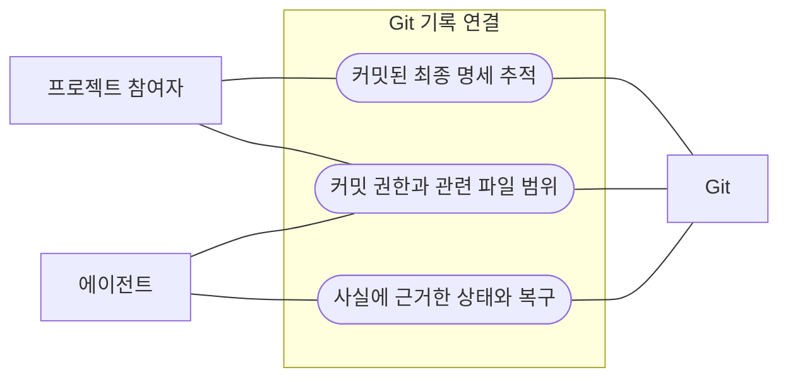

반복 편집 중의 초안이 아니라 Git에 커밋된 최종 명세를 기록으로 삼고, 커밋할 때 그 변경을 설명하는 결정기록과 관련 파일을 함께 남긴다.

## 유즈케이스 모델

```mermaid
flowchart LR
  member[프로젝트 참여자]
  agent[에이전트]
  git[Git]
  subgraph history[Git 기록 연결]
    uc1([커밋된 최종 명세 추적])
    uc2([커밋 권한과 관련 파일 범위])
    uc3([사실에 근거한 상태와 복구])
  end
  member --- uc1
  member --- uc2
  agent --- uc2
  agent --- uc3
  uc1 --- git
  uc2 --- git
  uc3 --- git
```
