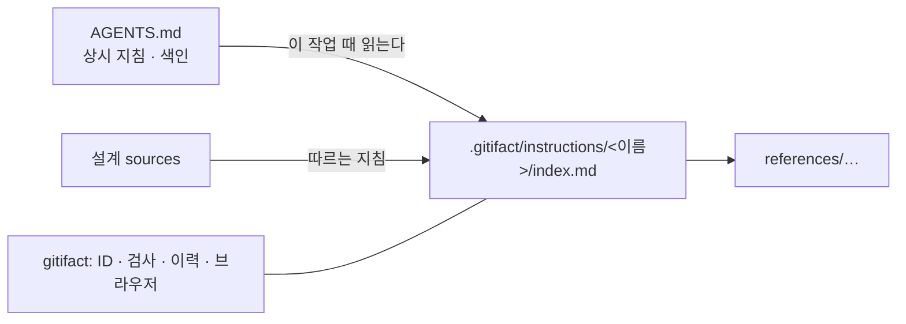

## 개요

프로젝트 지침은 이 프로젝트에서 어떻게 일하는지를 담는 문서다. 지침 하나는 `.gitifact/instructions/<이름>/` 폴더이고 본문은 `index.md`, 긴 내용은 `references/` 아래 파일로 나눈다. AGENTS.md는 모든 세션이 읽는 상시 지침으로, 어떤 작업 때 어느 지침을 읽을지 짧게 알린다. gitifact는 지침의 ID·검사·이력·브라우저를 맡고, 지침을 읽고 따르는 일은 에이전트가 한다.

| 파일 | 다루는 것 |
| :--- | :--- |
| data | 폴더와 파일, 검사, 이력, 관계 |
| interface | `docs` 명령, 체크아웃과 파일 API |
| ui | 프로젝트 지침 화면 |

## 위키에서의 전환

지침은 위키를 대신한다. 이 저장소의 위키는 지침 4개로 옮겼다. 브라우저는 위키를 보이지 않는다(메뉴·화면·검색·체크아웃에서 뺐다). CLI 쪽 위키 제거(`init`의 위키 README, `guide show wiki`, `docs new wiki`)는 계획이다. 과거 커밋의 위키 페이지(`W-`)는 이력에서 계속 읽는다.

| 위키에 있던 것 | 옮길 곳 |
| :--- | :--- |
| 영역별 규칙 페이지 | 그 영역의 지침(예: `cli-architecture`) |
| 여러 기능에 걸친 결정 기록(ADR) | 해당 지침의 `references/decisions.md` 결정 표 |
| 한 기능 안의 결정 | 그 기능 설계의 결정 표 |
| 매 세션 필요한 짧은 사실과 지침 색인 | AGENTS.md(블록 밖, 프로젝트가 씀) |
| 대체된 결정 기록 | 옮기지 않음(Git 이력) |

## 결정

| 결정 | 이유 | 기각한 안 |
| :--- | :--- | :--- |
| 에이전트 스킬이 아니라 gitifact 문서 종류로 다룬다 | 언제 읽을지는 AGENTS.md의 짧은 규칙이 가장 확실히 전하고, 그러면 에이전트의 스킬 발견 기능이 필요 없다. 에이전트 스킬 배포는 `npx skills` 같은 다른 도구의 몫이고, 에이전트마다 다른 폴더·링크를 맞추는 복잡도를 지지 않는다(사용자 결정) | SKILL.md 표준 형식과 에이전트 폴더 링크(`skills sync`, Junction, exclude 관리) |
| 이름은 instructions, 화면에서는 "프로젝트 지침"이다 | 에이전트를 향한 지시라는 뜻이 정확하고, GitHub Copilot이 같은 개념을 같은 말로 부른다. 약어 없이 전체 단어를 쓴다(사용자 결정) | rules(항상 로드로 읽힘), guidelines(기존 `guide` 명령과 헷갈림), conventions(절차에 어색), playbooks, skills |
| 본문 파일은 `index.md`다 | 기능 폴더의 `index.md`와 같은 모양이라 규칙이 하나다 | `SKILL.md`, `README.md` |
| 프론트매터는 다른 문서와 같다(`id`·`title`·`description`) | 한 검사·한 렌더러로 다룬다 | 표준 스킬 형식과 `metadata`의 `gitifact-*` 키 |
| 지침은 명세를 가리키지 않는다. 설계가 `sources`로 지침을 가리키는 한 방향만 둔다 | 지침은 여러 기능에 걸친 지식이라, 한 기능의 명세에 묶이면 명세가 바뀔 때 함께 낡는다(사용자 결정). `docs check`가 문제로 막는다 | 지침 → 문서 링크 허용, 경고로만 알리기 |
| 결정 기록은 지침의 결정 표로 옮긴다 | 에이전트에게 필요한 것은 지금 지키는 결정과 이유이고, 경위는 Git 이력에 있다 | ADR 원문을 references로 옮기기 |
