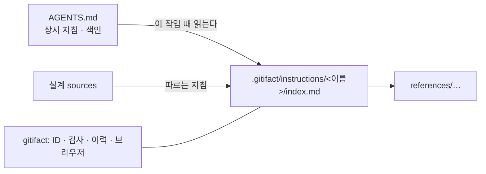

## 개요

프로젝트 지침은 이 프로젝트에서 어떻게 일하는지를 담는 문서다. 지침 하나는 `.gitifact/instructions/<이름>/` 폴더이고 본문은 `index.md`, 긴 내용은 `references/` 아래 파일로 나눈다. AGENTS.md는 모든 세션이 읽는 상시 지침으로, 어떤 작업 때 어느 지침을 읽을지 짧게 알린다. gitifact는 지침의 ID·검사·이력·브라우저를 맡고, 지침을 읽고 따르는 일은 에이전트가 한다.

에이전트가 지침을 읽게 하는 장치는 GITIFACT 블록의 규칙 한 줄, AGENTS.md 블록 밖 색인, `instructions list`(AGENTS.md와 지침마다 딸린 파일 수), 설계의 `sources`다. CLI는 작업 경로로 읽을 지침을 고르지 않고, 에이전트 훅으로 지침을 주입하지 않는다. 지침에는 경로 조건 같은 적용 조건 필드를 두지 않는다.

| 파일 | 다루는 것 |
| :--- | :--- |
| data | 폴더와 파일, 검사, 이력, 관계 |
| interface | `instructions` 명령, 체크아웃과 파일 API |
| ui | 프로젝트 지침 화면 |

## 위키에서의 전환

지침은 위키를 대신한다. 이 저장소의 위키는 지침 4개로 옮겼다. 브라우저는 위키를 보이지 않고(메뉴·화면·검색·체크아웃), CLI에는 위키를 만들거나 안내하는 명령이 없다(위키를 만드는 명령과 목록, `guide show wiki`, `init`의 위키 README가 없다). 작업 트리의 `.gitifact/wiki/` 아래 Markdown은 문서로 읽지 않고 `check`가 `WIKI_REMOVED` 문제로 알린다. 과거 커밋의 위키 페이지(`W-`)는 이력에서 계속 읽는다.

0.7 프로젝트는 `guide show migrate`의 전환 커밋에서 위키를 지침으로 옮긴다. 최상위 폴더 하나 또는 루트 페이지 하나가 지침 하나가 되고, 폴더의 `README.md`가 `index.md`, 나머지 페이지가 `references/`가 된다. 프로젝트가 고쳐 쓴 위키 루트 README는 지침 `overview`가 되고, `init`의 기본 방침 그대로인 README는 지운다. 본문은 그대로 옮기고 명세로 가는 링크만 글자로 바꾸며, 설계 `sources`의 W-는 옮겨 간 지침의 I-로 바꾼다. 지침 본문의 규칙과 결정기록으로 나눠 다시 쓰는 일은 전환 뒤 별도 커밋이다. 아래 표는 그 뒤 정리할 때의 기준이다.

| 위키에 있던 것 | 옮길 곳 |
| :--- | :--- |
| 영역별 규칙 페이지 | 그 영역의 지침(예: `cli-architecture`) |
| 여러 기능에 걸친 결정 기록(ADR) | 지킬 규칙은 해당 지침 본문에, 결정의 맥락과 검토한 대안은 그 지침을 가리키는 결정기록에 |
| 한 기능 안의 결정 | 지킬 규칙은 그 기능 설계 본문에, 결정의 맥락과 검토한 대안은 그 설계를 가리키는 결정기록에 |
| 매 세션 필요한 짧은 사실과 지침 색인 | AGENTS.md(블록 밖, 프로젝트가 씀) |
| 대체된 결정 기록 | 옮기지 않음(Git 이력) |
