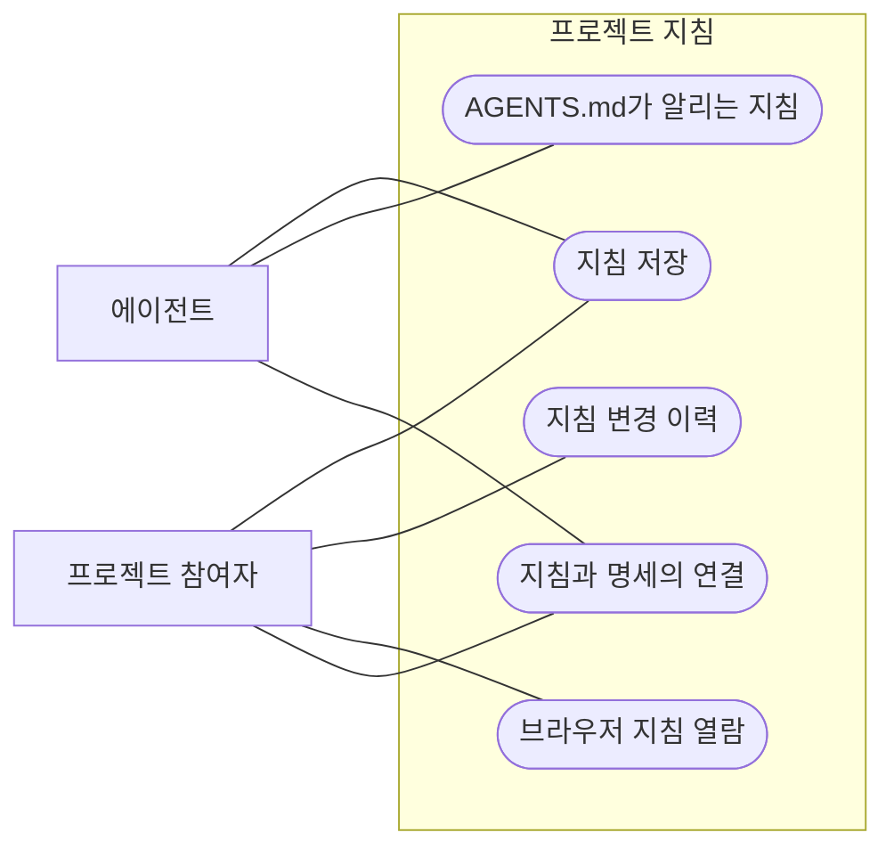

이 프로젝트에서 어떻게 일하는지를 담는다. 아키텍처 규칙, 여러 기능에 걸친 결정, 문체, 검증 절차처럼 사람 머릿속과 위키에 있던 지식을 `.gitifact/instructions/<이름>/`의 지침 문서로 두고, 모든 세션이 읽는 AGENTS.md가 어떤 작업 때 어느 지침을 읽을지 알린다. 에이전트는 필요한 순간에 그 지침만 읽는다. 요구사항이 무엇을 만들지, 설계가 이 기능을 어떻게 만들지를 말한다면, 지침은 이 프로젝트에서 어떻게 일하는지를 말한다.

## 유즈케이스 모델

