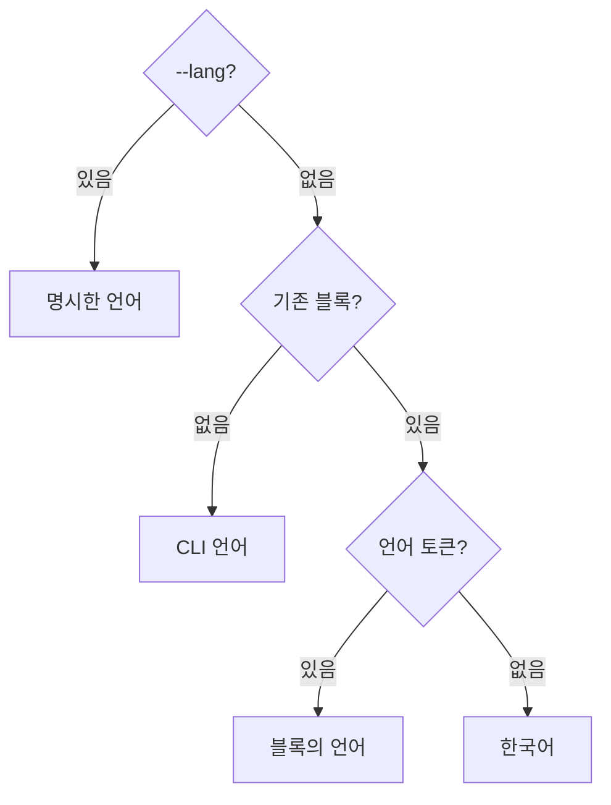

## 개요

표시 언어는 사용자 환경의 선택이며 한국어(ko)와 영어(en)를 지원한다. 프로젝트의 문서 언어나 저장 규약과 분리해, 언어를 바꿔도 기록 파일과 JSON 계약은 그대로다. 번역은 패키지마다 번들한 카탈로그로만 하고, 공용 번역 패키지나 런타임 번역 서비스는 두지 않는다.

| 위치 | 담는 것 |
| :--- | :--- |
| `apps/cli/src/shared/i18n/<lang>/` | CLI 메시지, 지침 블록(`block.md`), 패치노트(`changelog.md`), 지침 원문(`docs/`) |
| `apps/browser/src/shared/i18n/<lang>/` | 화면 문구 |
| `packages/core/src/shared/i18n/<lang>/` | 검사·설정 오류 메시지 |
| `packages/intro/<lang>/` | 소개(`intro.md`)와 시작하기(`getting-started.md`) 원문 |

카탈로그는 `messages.json`이며 ko·en의 키와 치환 이름(`{name}`)을 맞춘다. 각 패키지는 카탈로그를 `Record<MessageKey, string>`으로 선언해 한 언어에 키가 빠지면 컴파일 오류가 난다. 값이 없는 치환 자리는 빈 문자열이 아니라 그대로 남겨 누락이 보이게 한다.

> [!IMPORTANT]
> 표시 언어는 명령어·옵션·JSON 키·오류 코드·ID와 사용자가 쓴 문서를 바꾸지 않는다. 언어를 바꿔도 기존 문서를 번역하지 않는다.

## 언어 결정

언어는 실행 환경마다 따로 정한다.

| 대상 | 결정 방식 |
| :--- | :--- |
| CLI | 명령을 구성하기 전에 아래 순서로 정한다 |
| HTTP 요청 | `Accept-Language`의 첫 언어. 없으면 CLI 언어 |
| core | CLI가 주입한 resolver(`configureCoreLanguage`)가 돌려주는 언어 |
| 브라우저 | 설정의 선택값. `system`이면 `navigator.language` |

CLI는 도움말 문구를 만들기 전에 언어를 정한다.

1. `--lang ko|en`
2. `GITIFACT_LANG`
3. `LC_ALL`
4. `LC_MESSAGES`
5. `LANG`
6. 운영체제 언어(`Intl` 로캘)

값이 `ko`로 시작하면(`ko_KR.UTF-8`, `ko-KR` 등) 한국어, 그 밖의 미지원 언어는 영어다. `--lang`에 ko·en 밖의 값을 주면 명령 오류다.

서버는 요청마다 언어를 `AsyncLocalStorage` 범위(`withLanguage`)에 넣어, 서로 다른 언어의 요청이 동시에 와도 섞이지 않는다. core는 환경변수나 Node API를 읽지 않고 주입받은 resolver로 같은 요청 언어를 쓴다.

## 브라우저

브라우저의 `shared/i18n/language`는 선택값(`system`·`ko`·`en`)을 localStorage의 `gitifact-language`에 저장하고, `useSyncExternalStore`로 현재 언어와 선택값을 구독하게 한다. `storage` 이벤트로 같은 출처의 다른 탭에, `languagechange` 이벤트로 브라우저 언어 변경에 따르며, `<html lang>`도 함께 바꾼다. 저장소 접근이 막혀도 현재 탭에서는 선택이 적용된다.

문구를 표시하는 컴포넌트는 변경을 구독하고 모듈을 불러올 때 번역한 값을 고정하지 않는다. Astryx `InternationalizationProvider`의 locale도 같은 언어(`ko-KR`·`en-US`)로 바꾼다. 언어를 바꿔도 앱을 재마운트하거나 프로젝트 Query 캐시를 비우지 않고, 오류 상태인 조회만 다시 읽어 새 언어로 오류를 보인다.

| 내용 | 언어별 제공 방식 |
| :--- | :--- |
| 소개·시작하기 | `packages/intro/<lang>` 원문을 번들 |
| 패치노트 | 언어가 든 Query 키와 `lang` 인자로 요청. 그 언어의 패치노트가 없으면 서버가 기본 언어(영어)로 대신하고 응답에 `fallback`을 표시 |

서버의 체크아웃 읽기는 동시 요청이 한 번의 읽기를 오류까지 함께 쓰되 언어별로 나눈다. 이력 캐시(`.gitifact/cache/index.db`)는 언어와 무관하게 재사용한다. 저장소 상태 오류는 오류 코드로 저장해 두고 응답할 때 요청 언어로 다시 표시한다.

## 지침 블록과 배포 문서

기존 블록을 갱신할 때는 기록된 언어를 유지한다.

새 블록과 처음 만드는 기본 위키 README만 CLI 언어로 만든다. 이미 있는 위키 README는 `guide show wiki`의 안내 부분과 언어가 달라도 원문을 유지한다. 블록 갱신은 마커 밖 내용을 보존한다.

| 배포 문서 | 원본 |
| :--- | :--- |
| `README.md` | `packages/intro/en/intro.md` (한국어 문서 링크 포함) |
| `README.ko.md` | `packages/intro/ko/intro.md` |
| npm README(`apps/cli/README.md`) | `packages/intro/en/getting-started.md` (한국어 링크 포함) |

세 파일이 원본과 같은지는 `packages/intro/test/readme.test.mjs`가 확인한다.

## 검증

키·치환 값·번들 문서 누락, 동시 HTTP 요청의 언어 분리, 블록 갱신과 원문 보존, 화면 전환·새로고침·탭 동기화를 검증한다(`apps/cli/test/i18n.test.mjs`, `apps/cli/test/localization.test.mjs`, `apps/browser/test/i18n.spec.ts`). 실제 사용 프로젝트의 호환성 검사는 원본을 읽고 임시 복사본에서 실행한다.

## 결정

| 결정 | 이유 | 기각한 안 |
| :--- | :--- | :--- |
| 표시 언어를 프로젝트 설정에 저장하지 않는다. CLI는 환경과 `--lang`, 브라우저는 자체 설정을 쓴다 | 사용자가 사용자별·브라우저별 설정을 요청했다 | `config.language` |
| 기존 블록은 `--lang`이 없으면 기록된 언어를 유지한다 | 환경마다 CLI 언어가 달라도 반복 업데이트 때 블록 언어가 오가지 않는다 | 실행한 CLI의 언어로 다시 쓰기 |
| 번역은 번들한 카탈로그로만 한다 | 오프라인으로 설치해도 두 언어의 안내가 함께 제공된다 | 런타임 번역 서비스 |
| 언어 선택으로 `schemaVersion`을 올리지 않는다 | 기록 파일이나 JSON 계약을 바꾸지 않는다 | 형식 번호 올리기 |
