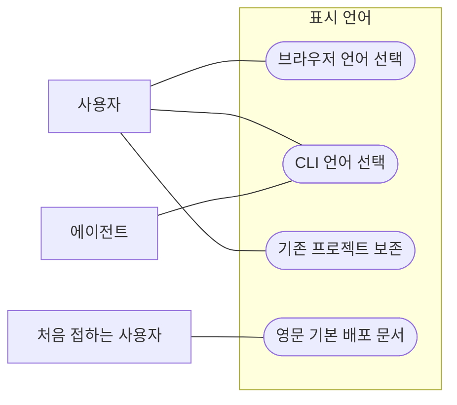

CLI 안내와 오류, 브라우저 화면, 배포 문서를 한국어와 영어로 제공한다. 표시 언어를 바꿔도 사용자가 쓴 기록은 바뀌지 않는다.

## 유즈케이스 모델

```mermaid
flowchart LR
  user[사용자]
  agent[에이전트]
  newcomer[처음 접하는 사용자]
  subgraph l10n[표시 언어]
    uc1([브라우저 언어 선택])
    uc2([CLI 언어 선택])
    uc3([기존 프로젝트 보존])
    uc4([영문 기본 배포 문서])
  end
  user --- uc1
  user --- uc2
  agent --- uc2
  user --- uc3
  newcomer --- uc4
```
