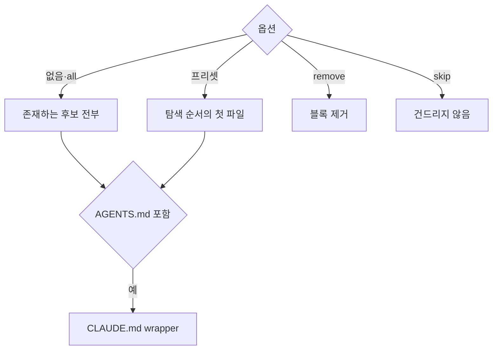

## 대상 파일

후보 파일은 AGENTS.md, CLAUDE.md, .claude/CLAUDE.md, .cursorrules, .hermes.md, HERMES.md다(`apps/cli/src/commands/agent-block.ts`). CLI는 실행 중인 에이전트를 감지하지 않고, 어느 파일에 쓸지는 기존 파일과 옵션으로 정한다. 구조는 Astryx CLI(MIT)의 agent-docs를 따랐다.

| 옵션 | 처리 |
| :--- | :--- |
| 없음, `--agent all` | 존재하는 후보 전부에 쓴다. `@AGENTS.md`처럼 다른 후보만 가져오는 파일은 건너뛴다. 하나도 없으면 AGENTS.md를 보일러플레이트 헤더와 함께 만든다 |
| `--agent claude\|cursor\|codex\|hermes` | 아래 탐색 순서에서 처음 존재하는 파일에 쓰고, 없으면 마지막 후보를 만든다 |
| `--remove-agents` | 블록을 지우고 헤더만 남은 파일은 삭제한다. `--agent`와 함께 쓰면 그 프리셋의 후보만 본다 |
| `--skip-agents` | 지침 파일을 건드리지 않는다 |

| 프리셋 | 탐색 순서 |
| :--- | :--- |
| `claude` | CLAUDE.md → .claude/CLAUDE.md |
| `cursor` | .cursorrules → AGENTS.md |
| `codex` | AGENTS.md |
| `hermes` | .hermes.md → HERMES.md → AGENTS.md |

보일러플레이트 헤더는 `# <파일 이름>`과 `Project-specific guidance for AI coding agents.` 두 줄이다. 다른 후보만 가져오는 파일에 이전 실행이 펼친 블록이 있으면 설치 때 걷어낸다.

## CLAUDE.md wrapper

쓰는 대상에 AGENTS.md가 들어가고 CLAUDE.md와 .claude/CLAUDE.md가 모두 없으면 루트 CLAUDE.md를 `@AGENTS.md` 한 줄로 만든다. 줄바꿈은 AGENTS.md를 따르고, 결과의 `agentDocs.paths`에 CLAUDE.md도 담는다. 이 파일은 wrapper라 이후 init·update가 블록을 넣지 않는다. `claude` 프리셋은 AGENTS.md를 쓰지 않으므로 wrapper도 만들지 않는다.

`--remove-agents`는 AGENTS.md를 삭제할 때 CLAUDE.md의 내용이 앞뒤 공백을 빼고 정확히 `@AGENTS.md`면 함께 삭제한다. AGENTS.md에 사용자 내용이 남거나 사용자가 CLAUDE.md를 고쳤으면 남긴다.

## 블록 형식

블록 본문은 `apps/cli/src/shared/i18n/<lang>/block.md`다. `renderAgentBlock`이 `{version}`·`{language}`·`{topics}` 자리를 채우고 `<!-- GITIFACT:START -->`·`<!-- GITIFACT:END -->` 마커로 감싼다. 본문은 `## Gitifact Guide` 제목으로 시작하고, 빈 줄 뒤에 버전·언어·저장 규약 줄(`gitifact vX · ko · 저장 규약 schemaVersion 3`)을 한 문단으로 둔다.

이 줄은 stale 판정과 언어 유지에 쓴다. 파서(`parseAgentBlock`)는 줄의 위치가 아니라 줄 전체 일치로 찾는다. 언어 토큰이 없는 블록도 읽고 한국어로 간주한다. 다시 쓸 때는 `--lang`으로 지정한 언어, 기존 블록의 언어, 현재 표시 언어 순으로 고른다.

내용은 `###` 절로 나눈 시작할 때 확인할 것(전역 설치 없이 블록 버전의 npx로 실행하고, 권한이 막히면 필요한 승인을 요청), 요구사항 분류 표, 규칙, 명령 목록이다. 마커를 포함해 50줄 이내다.

> [!IMPORTANT]
> Markdown은 연속한 일반 줄을 한 문단으로 합친다. 블록의 모든 줄은 제목·목록·표·독립 문단으로 쓰고, 끝은 빈 줄과 `---`로 마커 바깥 내용과 구분한다. 빈 줄 없이 `---`를 두면 앞 줄이 제목이 된다.

## 블록 쓰기와 마커

블록은 기존 파일의 줄바꿈(CRLF 포함)을 따르고, 결과가 기존 내용과 같으면 쓰지 않는다. 마커 상태별 처리는 `injectBlock`·`findBlock`이 정한다.

| 대상 파일 | 처리 |
| :--- | :--- |
| 없음 | 보일러플레이트 헤더, 빈 줄, 블록 순으로 만든다 |
| START·END 한 쌍 | 마커 사이만 교체한다 |
| 마커 없음 | 끝 공백을 정리하고 빈 줄 뒤에 블록을 덧붙인다 |
| START만, END만, START 중복 | `AGENT_DOCS_MALFORMED`로 거부한다 |

`update`는 이미 블록이 있는 파일만 다시 쓰고 새 파일을 만들지 않는다. init이라면 만들 파일(예: wrapper)은 결과의 `agentDocs.missing`으로 알린다. 0.2.0의 스킬 설치본은 1.0.0 이전이라 호환을 다루지 않는다.

## 지침 문서

상세 규칙은 `apps/cli/src/shared/i18n/<lang>/docs/`의 Markdown이다. workflow·spec·design·wiki·writing·commit·migrate 지침과 기본 위키 방침 `wiki.default.md`가 있다. 빌드가 `dist/i18n/<lang>/docs`로 복사하고 `gitifact guide show <topic>`이 그대로 출력한다. `guide list`는 각 파일의 `title`·`description` 프론트매터로 목록을 만든다.

지침 텍스트의 편집 원본은 이 한 곳이다. 스킬 파일, 매니페스트, 복사본 검사는 두지 않는다.

## 실행 방법

기본 실행 명령은 `npx --yes gitifact@{version} <cmd>`이며 블록을 쓴 CLI 버전으로 고정한다. 같은 버전의 프로젝트 의존성이 있으면 npm이 그것을 쓰고, 없으면 npm 캐시에 설치해 실행한다. 프로젝트가 별도 실행 방법을 지정하면 그것이 우선하고, 블록 안의 `gitifact`는 그 실행 방법의 약칭이다. CLI는 실행 환경을 감지하거나 프로젝트 의존성을 자동으로 추가하지 않는다.

한국어·영어 소개, 시작하기, 블록, workflow 지침이 같은 절차를 안내한다. 사용자용 README·시작하기 예시는 `npx gitifact`로 짧게 적고, `--yes`와 정확한 버전은 블록에 둔다. 시작하기는 Node.js 프로젝트에서 개발 의존성으로 버전을 고정하는 방법(`npm install --save-dev --save-exact gitifact@latest`)도 안내한다. 전역 명령과 프로젝트별 실행 지침도 계속 지원한다.

| 설치 방식 | 블록 갱신 |
| :--- | :--- |
| npx | 새 버전으로 `update`를 실행한다 |
| 프로젝트 의존성 | 패키지 관리자로 버전을 올리고 그 설치본으로 `update`를 실행한다 |

init·update 응답은 `install.npx`와 `install.npmGlobal`을 제공한다. 텍스트 출력은 npx 명령을 보이고, 전역 설치 명령은 선택지로 남긴다. 계약은 project-init v7·update v5이며 이전 버전 스키마는 두지 않는다.

`--yes`가 생략하는 것은 npm 설치 확인뿐이다. 네트워크나 실행 권한이 막히면 에이전트는 승인을 요청하고 원인을 알린다. 명세 기록을 수동으로 대체하거나 성공으로 보고하지 않는다.

세션을 시작할 때는 블록의 지정 버전으로 `update --check`를 한 번 실행하도록 안내한다. 새 버전이 있을 때만 동의를 묻고, 동의 뒤 갱신된 블록을 다시 읽는다. 확인 실패·비활성화·거절이면 지정 버전으로 계속한다. 업데이트 동의는 커밋·푸시 권한을 포함하지 않는다.

패키지 검사(`scripts/test-package.mjs`)는 별도 임시 프로젝트에서 같은 버전의 로컬 패키지를 npx로 오프라인 실행해 초기화·조회와 생성 블록의 버전 고정을 확인한다.

> [!NOTE]
> 권한이 막혔을 때 실제 에이전트가 승인을 요청하는지는 자연어 지침만으로 보장하지 않는다.
