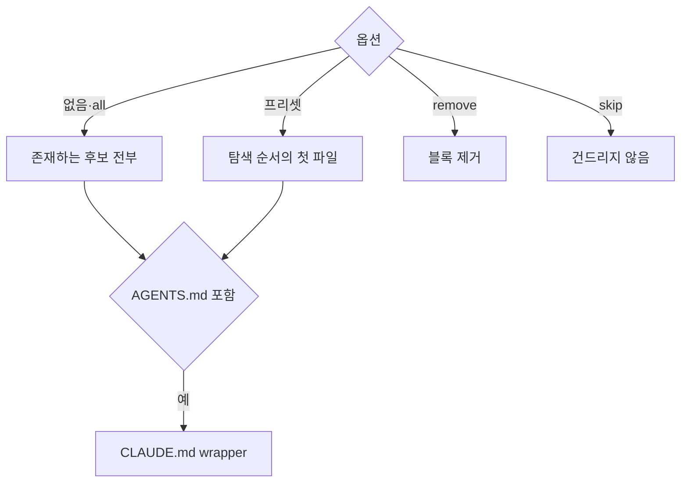

## 대상 파일

후보 파일은 AGENTS.md, CLAUDE.md, .claude/CLAUDE.md, .cursorrules, .hermes.md, HERMES.md다(`apps/cli/src/commands/agent-block.ts`). CLI는 실행 중인 에이전트를 감지하지 않고, 어느 파일에 쓸지는 기존 파일과 옵션으로 정한다. 구조는 Astryx CLI(MIT)의 agent-docs를 따랐다.

| 옵션 | 처리 |
| :--- | :--- |
| 없음, `--agent all` | 존재하는 후보 전부에 쓴다. `@AGENTS.md`처럼 다른 후보만 가져오는 파일은 건너뛴다. 하나도 없으면 AGENTS.md를 보일러플레이트 헤더와 함께 만든다 |
| `--agent claude\|cursor\|codex\|hermes` | 아래 탐색 순서에서 처음 존재하는 파일에 쓰고, 없으면 마지막 후보를 만든다 |
| `--remove-agents` | 블록을 지우고 헤더만 남은 파일은 삭제한다. `--agent`와 함께 쓰면 그 프리셋의 후보만 본다 |
| `--skip-agents` | 지침 파일을 건드리지 않는다 |

| 프리셋 | 탐색 순서 |
| :--- | :--- |
| `claude` | CLAUDE.md → .claude/CLAUDE.md |
| `cursor` | .cursorrules → AGENTS.md |
| `codex` | AGENTS.md |
| `hermes` | .hermes.md → HERMES.md → AGENTS.md |

보일러플레이트 헤더는 `# <파일 이름>`과 `Project-specific guidance for AI coding agents.` 두 줄이다. 다른 후보만 가져오는 파일에 이전 실행이 펼친 블록이 있으면 설치 때 걷어낸다.

## CLAUDE.md wrapper

쓰는 대상에 AGENTS.md가 들어가고 CLAUDE.md와 .claude/CLAUDE.md가 모두 없으면 루트 CLAUDE.md를 `@AGENTS.md` 한 줄로 만든다. 줄바꿈은 AGENTS.md를 따르고, 결과의 `agentDocs.paths`에 CLAUDE.md도 담는다. 이 파일은 wrapper라 이후 init·update가 블록을 넣지 않는다. `claude` 프리셋은 AGENTS.md를 쓰지 않으므로 wrapper도 만들지 않는다.

`--remove-agents`는 AGENTS.md를 삭제할 때 CLAUDE.md의 내용이 앞뒤 공백을 빼고 정확히 `@AGENTS.md`면 함께 삭제한다. AGENTS.md에 사용자 내용이 남거나 사용자가 CLAUDE.md를 고쳤으면 남긴다.

## 블록 형식

블록 본문은 `apps/cli/src/shared/i18n/<lang>/block.md`다. `renderAgentBlock`이 `{topics}` 자리를 채우고 `<!-- GITIFACT:START -->`·`<!-- GITIFACT:END -->` 마커로 감싼다. 본문은 `## Gitifact Guide` 제목으로 시작하며 버전·언어·저장 규약을 적지 않는다. 버전은 설정의 `cli`, 저장 규약은 `schemaVersion`에 있다. 그래서 블록 문구가 바뀌지 않는 배포에서는 블록도 바뀌지 않는다.

블록 언어는 설정의 `language`다. 한 번의 실행에서 모든 블록을 한 언어로 쓰며 `--lang`으로 지정한 언어, 설정의 `language`, 0.8.2 이하가 쓴 블록 첫 줄(`gitifact vX · ko · … schemaVersion N`)의 언어, 현재 표시 언어 순으로 고른다. 첫 줄은 `legacyBlockLanguage`가 줄 전체 일치로 찾고, 언어 토큰이 없으면 한국어로 본다. 고른 언어는 init·update가 설정의 `language`에 쓰므로, 표시 언어가 다른 팀원이 실행해도 블록이 번역본으로 바뀌지 않는다. CLI 메시지의 표시 언어는 설정에 저장하지 않는다.

제목 다음에 `.gitifact`와 `gitifact`가 무엇인지 한 문단으로 알리고, `###` 절 다섯이 이어진다. 세션을 시작할 때(명령이 없을 때 설정 버전의 전역 설치 제안, `instructions list --all`로 지침 읽기)는 순서 목록, 무엇을 요구사항으로 남기는가는 요청 분류 표, 작업할 때는 상황마다 먼저 할 일(읽을 명세·지침·결정 흐름과 `guide show` 주제, 결정기록, 커밋, 브라우저, 피드백)의 표, 지킬 것은 버전 안내에 대한 질문·커밋 권한·CLI 대신 하지 않기·SELF-CHECK 같은 규칙, 명령은 이름과 목록 페이지다. 상세는 주제별 지침에 두고 블록은 언제 무엇을 읽을지만 알린다. 마커를 포함해 50줄 이내다.

> [!IMPORTANT]
> Markdown은 연속한 일반 줄을 한 문단으로 합친다. 블록의 모든 줄은 제목·목록·표·독립 문단으로 쓰고, 끝은 빈 줄과 `---`로 마커 바깥 내용과 구분한다. 빈 줄 없이 `---`를 두면 앞 줄이 제목이 된다.

## 블록 쓰기와 마커

블록은 기존 파일의 줄바꿈(CRLF 포함)을 따르고, 결과가 기존 내용과 같으면 쓰지 않는다. 마커 상태별 처리는 `injectBlock`·`findBlock`이 정한다.

| 대상 파일 | 처리 |
| :--- | :--- |
| 없음 | 보일러플레이트 헤더, 빈 줄, 블록 순으로 만든다 |
| START·END 한 쌍 | 마커 사이만 교체한다 |
| 마커 없음 | 끝 공백을 정리하고 빈 줄 뒤에 블록을 덧붙인다 |
| START만, END만, START 중복 | `AGENT_DOCS_MALFORMED`로 거부한다 |

`update`는 이미 블록이 있는 파일만 다시 쓰고 새 파일을 만들지 않는다. init이라면 만들 파일(예: wrapper)은 결과의 `agentDocs.missing`으로 알린다. 0.2.0의 스킬 설치본은 1.0.0 이전이라 호환을 다루지 않는다.

## 지침 문서

상세 규칙은 `apps/cli/src/shared/i18n/<lang>/docs/`의 Markdown이다. workflow·spec·design·instructions·writing·commit·migrate 지침이 있다. 빌드가 `dist/i18n/<lang>/docs`로 복사하고 `gitifact guide show <topic>`이 그대로 출력한다. `guide list`는 각 파일의 `title`·`description` 프론트매터로 목록을 만든다.

지침 텍스트의 편집 원본은 이 한 곳이다. 스킬 파일, 매니페스트, 복사본 검사는 두지 않는다.

## 실행 방법

기본 실행 명령은 전역 `gitifact`다. 프로젝트가 기준으로 삼는 버전은 설정의 `cli`이고 블록에는 버전이 없다. 블록은 명령이 없을 때 그 버전의 전역 설치 명령(`npm i -g gitifact@<버전>`)을, 버전 안내가 보이면 안내의 설치 명령을 그대로 보여 주며 사용자에게 허용을 묻게 하고(업데이트는 지금과 나중에(`gitifact update --later`) 중 하나), 허용받으면 에이전트가 직접 실행하게 한다. 사용자에게 설치를 떠넘기지 않는다. Claude Code 자동 모드의 검사기는 사용자 메시지가 실행할 동작을 구체적으로 가리킬 때만 약한 차단을 풀기 때문에, 질문에 정확한 명령을 넣어 사용자의 짧은 허용이 그 명령을 가리키게 한다. 도구가 그래도 막으면 에이전트는 그 도구의 승인 창(샌드박스 밖 실행 요청 등)이나 권한 설정으로 승인을 받는다. Windows PowerShell에서 스크립트 실행이 막혀 있으면 `npm.cmd`·`gitifact.cmd`로 실행한다. 설치된 버전이 기준과 다른지는 명령마다의 안내가 알린다(D-yrow77r5pf). 프로젝트가 별도 실행 방법을 지정하면 그것이 우선하고, 블록 안의 `gitifact`는 그 실행 방법의 약칭이다. CLI는 실행 환경을 감지하거나 설치·프로젝트 의존성 추가를 대신 하지 않는다.

한국어·영어 소개, 시작하기, 블록, workflow 지침이 같은 절차를 안내한다. 도입 프롬프트와 시작하기는 `npm install -g gitifact` 뒤 `gitifact init`을 안내하고, npx 실행은 시작하기에만 호출마다 느려지는 대안으로 적는다. 시작하기는 Node.js 프로젝트에서 개발 의존성으로 버전을 고정하는 방법(`npm install --save-dev --save-exact gitifact@latest`)도 안내한다.

| 설치 방식 | 업데이트 |
| :--- | :--- |
| 전역 설치 | `npm install -g gitifact@<새 버전>`으로 올린 뒤 `gitifact update`를 실행한다 |
| 프로젝트 의존성 | 패키지 관리자로 버전을 올리고 그 설치본으로 `update`를 실행한다 |

init·update의 텍스트 출력은 전역 설치 명령을 보인다. 계약은 project-init v8(`install.npx`·`install.npmGlobal`)·update v6(`install.npmGlobal`)이며 이전 버전 스키마는 두지 않는다. 설치나 실행 권한이 막히면 에이전트는 승인을 요청하고 원인을 알린다. 명세 기록을 수동으로 대체하거나 성공으로 보고하지 않는다. 업데이트 동의는 커밋·푸시 권한을 포함하지 않는다.

패키지 검사(`scripts/test-package.mjs`)는 별도 임시 프로젝트에서 같은 버전의 로컬 패키지를 오프라인으로 실행해 초기화·조회와, 설정의 `cli`·`language`, 버전 없는 블록을 확인한다.

> [!NOTE]
> 권한이 막혔을 때 실제 에이전트가 승인을 요청하는지는 자연어 지침만으로 보장하지 않는다.
