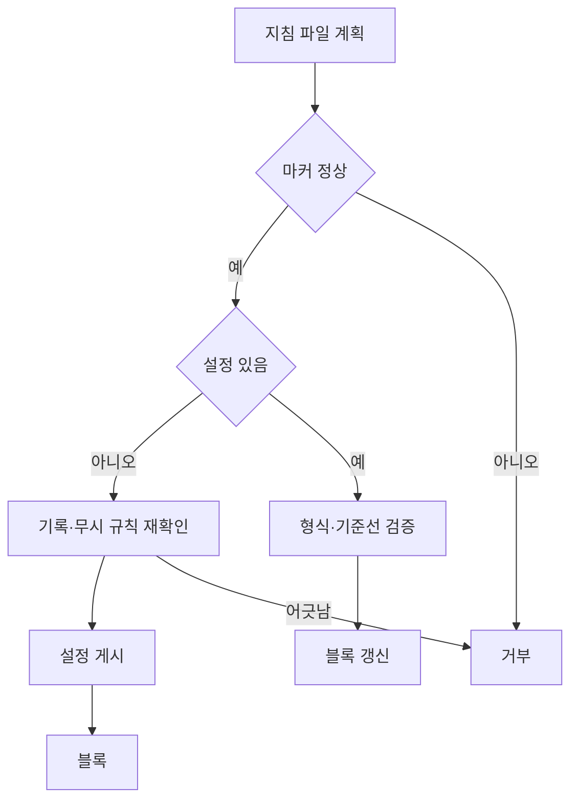

## 개요

`init`은 하나의 Git 저장소에 설정(`.gitifact/config.json`)과 도입 기준선을 만들고 에이전트 지침 파일에 GITIFACT 블록을 설치한다. `.gitattributes`는 건드리지 않는다. 결정기록은 파일마다 따로 있어 병합 규칙이 필요 없다. init은 커밋하지 않고, 명세 작성은 별도 작업이다.

init은 작은 명시적 작업이다. 기존 프로젝트를 추정해 일괄 전환하지 않고, CLI에는 구형 기록을 변환하는 코드가 없다. 멀티 레포 통합과 전역 설정 관리는 지원하지 않는다. 설치된 블록을 실행 중인 버전으로 갱신하는 일은 `update`가 맡는다(D-yrow77r5pf).

| 파일 | 다루는 것 |
| :--- | :--- |
| interface | 지침 파일 후보와 블록 설치·갱신, 지침 문서, npx 실행 |

## 설정과 기준선

`config.json`은 `schemaVersion`과 `baseline` 두 필드만 둔다. 모드·승인 묶음은 저장하지 않는다. HEAD가 있으면 기준 커밋과 Git 객체 형식(`sha1`·`sha256`)을, 첫 커밋 전이면 `{ "kind": "empty" }`를 기록한다. 기존 설정을 다시 읽을 때는 객체 형식이 같고 기준 커밋이 HEAD의 조상인지 확인한다(`BASELINE_UNAVAILABLE`).

현재 `schemaVersion`은 3이다. 문서 하나가 파일 하나이고 구조 정보를 프론트매터에 두는 0.8.0 문서 형식을 뜻한다. 다른 값은 전환하지 않고 거부한다(`packages/core/src/formats/spec-project.ts`).

| 설정 | 처리 | 코드·메시지 |
| :--- | :--- | :--- |
| `schemaVersion` 3 | 읽는다 | — |
| `schemaVersion` 2(0.7 형식) | `guide show migrate`의 절차로 옮기라고 안내한다 | `UNSUPPORTED_SCHEMA`, `config.migrationRequired` |
| 그보다 낮은 값 | 이전 규약이라 읽지 않는다고 밝힌다 | `UNSUPPORTED_SCHEMA`, `config.unsupportedSchema` |
| 3보다 큰 값 | CLI를 최신으로 올리라고 안내한다 | `UNSUPPORTED_SCHEMA`, `config.newerSchema` |
| `schemaVersion` 없음(Tryce 설정) | 이유를 밝히며 거부한다 | `UNSUPPORTED_FORMAT` |

## 구성 요소

| 구성 요소 | 위치 | 맡는 것 |
| :--- | :--- | :--- |
| 초기화 | `apps/cli/src/commands/spec-init.ts`(`initializeSpecProject`) | 도입 조건 확인과 쓰기 순서 |
| 저장소 관측 | `adapters/git/init-repository.ts` | 저장소·현재 checkout·HEAD·index 관측, 무시 규칙·진행 중인 Git 작업·기준선 검사 |
| 설정 파일 | `adapters/filesystem/config-file.ts` | `.gitifact/.init-<uuid>.tmp`에 쓰고 하드 링크로 게시해 기존 파일을 덮어쓰지 않는다 |
| 관리 파일 | `adapters/filesystem/managed-file.ts` | 지침 파일을 임시 파일, 조회 중 변경 감지, 링크 또는 교체로 쓴다 |
| 지침 블록 | `commands/agent-docs.ts`, `agent-block.ts` | 대상 파일 계획과 블록 쓰기(interface) |

## 초기화 흐름

에이전트는 init 전에 다음을 확인한다.

1. Git 저장소, 설치 제한과 커밋 정책을 확인한다. Git이 없으면 생성 권한을 확인한다. CLI는 임의로 `git init`을 실행하지 않는다.
2. `init --dry-run`으로 대상 경로·기준선·블록을 쓸 지침 파일을 확인한 뒤 `init`을 실행한다.

CLI는 지침 파일 후보를 먼저 읽어 쓰기를 계획한다. 마커 오류는 이 단계에서 거부하므로 설정이 만들어지기 전에 실패한다.

| 결과(`outcome`) | 경로 |
| :--- | :--- |
| `planned` | 새 설정의 `--dry-run`. 재확인까지 하고 쓰지 않는다 |
| `created` | 새 설정을 게시하고 나머지를 썼다 |
| `already-initialized` | 기존 설정을 유지하고 블록만 갱신했다. `--dry-run`이면 검증만 한다 |

- **기존 설정:** 형식·기준선을 검증하고 HEAD·index·설정이 조회 중에 바뀌지 않았는지 대조한 뒤 쓴다(`INPUT_CHANGED`). 설정 없는 기존 기록이나 구형 형식은 자동 채택하지 않는다.
- **새 설정:** 추적 중인 설정이 삭제된 상태면 거부한다(`CONFIG_DELETED`). `.gitifact`에 임시 파일 말고 다른 항목이 있으면 거부한다(`EXISTING_RECORDS`). 게시 직전에 기록·무시 규칙·HEAD·index·설정 부재를 다시 대조한다.
- **게시 뒤:** 관측 상태가 게시 때와 같은지 확인하고(`INPUT_CHANGED_AFTER_WRITE`) 블록을 쓴다. 문서는 만들지 않는다. 게시가 동시 init과 겹치면 먼저 생긴 설정을 기존 설정으로 다룬다.

## 새 버전 확인

init은 `update`·`update --check`와 같은 레지스트리 확인(`resolveUpdate`)을 초기화와 나란히 실행해 결과의 `update`·`install`에 담는다. 확인은 3초 제한이고 실패·시간 초과는 `unavailable`이다. 초기화가 실패하면 확인을 취소한다. 새 버전이 있으면 `install.npx`·`install.npmGlobal`에 설치 명령을 준다.

`GITIFACT_NO_UPDATE_CHECK`가 빈 값이나 `0`이 아니면 확인을 끈다. 테스트와 패키지 검사는 이 값으로 레지스트리에 접속하지 않는다. 도입 프롬프트는 `npx gitifact@latest init`으로 최신 CLI를 실행한다.

## 오류 처리와 검증

삭제된 추적 설정, 구형 자료, 잘못된 기준선, 진행 중인 Git 작업(`GIT_OPERATION_IN_PROGRESS`), 링크(`PATH_CONFLICT`), 무시 규칙 충돌(`CONFIG_IGNORED`)은 원인을 알리고 파일을 보존한다. 동시 초기화는 기존 파일을 덮어쓰지 않는다.

> [!IMPORTANT]
> 초기화 실패를 설정 삭제와 재시도로 우회하지 않는다. 거부 사유가 가리키는 상태를 먼저 해소한다.

| 검사 | 위치 | 확인하는 것 |
| :--- | :--- | :--- |
| 초기화 | `apps/cli/test/init.test.mjs` | 독립 저장소에서 첫 커밋 전후, SHA-1·SHA-256, 반복·동시 실행, 중단, linked worktree, clone·submodule, 기존 staging 보존 |
| 블록 | `apps/cli/test/agent-docs.test.mjs` | 블록의 생성·갱신·제거, wrapper 건너뛰기, CLAUDE.md wrapper의 생성·보존·제거 조건, 프리셋별 대상, 잘못된 마커 거부, CRLF 유지 |
| 블록 문안 | 같은 파일 | 요청 분류 예시가 workflow 원문에 있는지, 블록이 제목으로 시작해 `---`로 끝나고 일반 줄이 이어 붙지 않는지, 설치 안내가 블록 버전을 쓰는지 |
| 패키지 | `scripts/test-package.mjs` | 설치된 CLI의 init이 AGENTS.md에 버전을 고정한 블록을 쓰고 `@AGENTS.md`만 담은 CLAUDE.md를 만들며, 제거 때 사용자 문단을 보존하고, `guide show` 출력이 자산 원본과 같은지 |

## 미결

- 명세 파일만 바뀌고 결정기록이 없는 커밋을 막는 훅은 두지 않았다. 지침이 로드된 뒤에도 같은 문제가 반복되는지 보고 판단한다.
