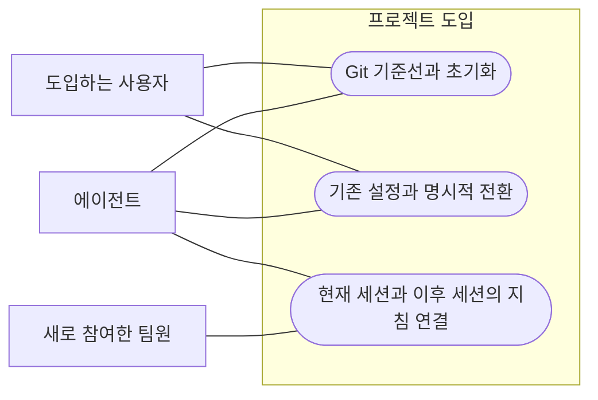

Git 저장소에 도입 기준선을 두고 설정과 에이전트 지침 블록을 만들어 Gitifact 사용을 시작한다. 기존 작업과 기록을 보존한다.

## 유즈케이스 모델

```mermaid
flowchart LR
  user[도입하는 사용자]
  teammate[새로 참여한 팀원]
  agent[에이전트]
  subgraph onboarding[프로젝트 도입]
    uc1([Git 기준선과 초기화])
    uc2([기존 설정과 명시적 전환])
    uc3([현재 세션과 이후 세션의 지침 연결])
  end
  user --- uc1
  user --- uc2
  agent --- uc1
  agent --- uc2
  agent --- uc3
  teammate --- uc3
```
