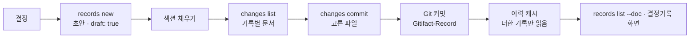

## 개요

결정기록은 문서가 아니라 문서를 설명하는 파일이다. 에이전트가 결정한 순간 `records new`로 오늘 날짜 폴더에 초안을 쓰고, 섹션을 채워 초안 표시를 지운 뒤, 설명하는 문서와 함께 커밋한다. 커밋된 기록은 바뀌지 않으므로 이력 캐시는 커밋이 더한 기록 파일만 한 번 읽고, 커밋 전 기록은 Git의 상태로 찾는다.

| 파일 | 다루는 것 |
| :--- | :--- |
| data | 기록 파일 형식과 검사, 커밋 전 기록 찾기, 이력 캐시가 기록을 읽는 방식 |
| interface | `records`·`changes`·`docs` 명령, 브라우저 계약과 결정기록 화면 |

## 구성 요소

| 구성 요소 | 맡는 것 |
| :--- | :--- |
| core `formats/record-file.ts` | 경로 규칙, 파싱·렌더링, 섹션과 길이 검사 |
| core `domain/record.ts` | 종류, 섹션 키와 두 언어의 제목, 섹션 한도 |
| core `use-cases/check-documents.ts` | 넘겨받은 기록의 검사, 초안 표시, ID 중복, 작업 폴더의 이유 파일 |
| CLI `adapters/git/pending-records.ts` | `git status`로 새 기록과 바뀐·지워진 커밋된 기록 찾기 |
| CLI `commands/records.ts` | `records list`·`show`·`new` |
| CLI `commands/changes.ts` | 기록별 문서 보이기, 고른 파일 커밋, 트레일러 |
| CLI `adapters/cache/commit-changes.ts`·`record-events.ts` | 커밋이 더한 기록 읽기, 과거 이유를 기록으로 읽기 |
| 브라우저 `widgets/activity-timeline` | 목록의 기록 단위 묶음, 기록 제목과 결정의 첫 줄 |
| 브라우저 `pages/commit` | 기록 상세와 커밋 페이지 |

## 기록이 필요한 때

기록은 문서 본문이 스스로 설명하지 못하는 것을 남긴다. 기존 내용을 바꾸거나 지우면 옛 내용과 그 맥락이 본문에서 사라지고, 여러 안 중 하나를 고르면 검토한 대안을 남길 곳이 없으므로 이때 기록을 쓴다. 기록에는 종류가 없고 맥락과 결정을 쓰며, 검토한 대안은 실제로 검토했을 때만 더한다. 새 문서의 추가, 다른 결정에 딸린 수정, 오타는 따로 쓰지 않는다. CLI가 보는 것은 이 가운데 수정·이동·삭제뿐이다. 그런 변경에 기록이 없으면 `withoutRecord`로 알리고 커밋은 막지 않는다. "고른 안이 있었는가"는 에이전트의 판단이며 지침이 안내한다.

## 커밋 묶음

기본은 결정 하나를 커밋 하나에 담는 것이다. CLI는 이것을 강제하지 않고 쉽게 만든다. 바뀐 문서를 모두 한 커밋에 담으라는 규칙을 두지 않아 기록별로 나눠 커밋할 수 있고, `changes list`가 기록마다 설명하는 문서와 두 기록이 함께 설명하는 문서를 알려 준다. 한 파일의 변경은 둘로 나눌 수 없으므로 두 기록이 한 문서를 설명하면 한 커밋에 담는다. 코드 파일은 기록에 속하지 않아 브라우저의 기록 상세에서는 커밋 전체의 파일로 보인다.
