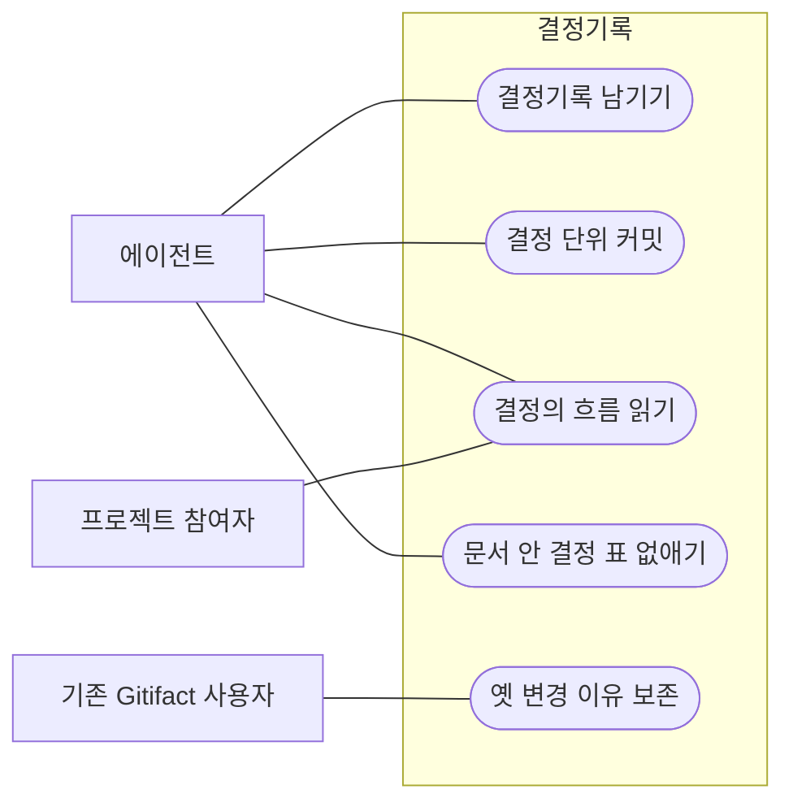

요구사항·설계·지침이 왜 지금 모양이 됐는지를 남긴다. 문서 본문은 지금 유효한 내용만 담고, 바뀐 이유와 여러 안 중 고른 결정은 제목과 섹션이 있는 결정기록 파일에 둔다. 기록은 한 번 커밋하면 고치지 않으며, 한 문서의 기록을 시간순으로 읽으면 결정의 흐름이 보인다. 결정 하나를 그 기록·문서·코드와 함께 커밋하는 것을 기본으로 안내하지만 커밋 묶음은 프로젝트가 정한다.

## 유즈케이스 모델

