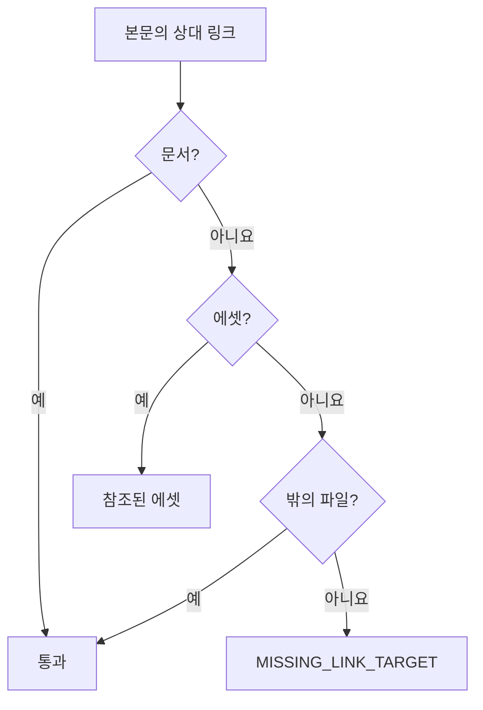

## 검사

`check`는 작업 폴더의 문서 전체와 아직 커밋하지 않은 결정기록을 읽고, 첫 오류에서 멈추지 않고 모든 문제를 보인 뒤 문제가 있으면 종료 코드 1로 끝난다. 읽지 못한 파일은 문제로 보고하고 나머지끼리 계속 대조한다.

| 범위 | 문제 코드 | 조건 |
| :--- | :--- | :--- |
| 파일 | `PATH_UNSUPPORTED` | 경로 규칙 밖, 링크 파일 |
| 파일 | `FILE_TOO_LARGE` | 문서·결정기록 1MB 초과 |
| 파일 | `INVALID_CHARACTERS` | NUL·단독 CR·BOM, UTF-8이 아님 |
| 파일 | `FRONTMATTER_*`, `ID_FORMAT`, `SOURCE_INVALID` | 프론트매터 형식·모르는 키·필수 키 누락·값, ID 형식, `sources` 형식 |
| 파일 | `BODY_REQUIRED`·`BODY_HEADING`·`BODY_MARKER`·`BODY_UNCLOSED_FENCE` | 빈 본문, `#` 제목, gitifact 주석, 닫히지 않은 펜스 |
| 파일 | `RECORD_PATH`·`RECORD_SECTION_*` | 결정기록의 경로와 ID 불일치, 모르거나 중복된 섹션·빠진 필수 섹션·500자를 넘는 섹션 |
| 파일 | `RECORD_ALTERED` | 커밋된 결정기록의 수정·삭제 |
| 파일 | `REASONS_FILE_REMOVED` | 작업 폴더에 남은 `.gitifact/history.jsonl` |
| 전체 | `DOC_DRAFT` | 남은 `draft: true` |
| 전체 | `DUPLICATE_ID`·`DUPLICATE_RECORD_ID`·`DUPLICATE_ORDER` | 문서 ID, 결정기록 ID, 같은 폴더의 `order` 중복 |
| 전체 | `MISSING_REFERENCE` | `requirements`가 요구사항이 아닌 ID를, `sources`가 없는 문서나 자기 자신을 가리킴 |
| 전체 | `FEATURE_INDEX_REQUIRED`·`DESIGN_OVERVIEW_REQUIRED` | `index.md`·`design/overview.md` 누락 |

깨진 상대 링크와 권장 범위 밖의 에셋은 문제 뒤에 경고로 보이며 종료 코드와 커밋을 막지 않는다. `specs list`는 읽지 못한 파일 수와 `index.md`가 없는 기능 폴더를 함께 알려, 손상을 빈 정상 결과로 보이지 않게 한다. 설정의 `schemaVersion`이 2면 0.7 형식으로 보고 변환하지 않은 채 `guide show migrate`를 안내하며 거부한다.

형식 고정 자료와 독립 저장소로 파싱·렌더링·검사와 명령 동작을 시험한다(`packages/core/test/documents.test.mjs`, `apps/cli/test/docs-commands.test.mjs`). 명세 구조가 유효하다는 결과를 제품 의미나 코드 구현의 검증으로 해석하지 않는다.

## 에셋과 링크

에셋은 `.gitifact/assets/**`이며 core `isAssetPath`(`formats/links.ts`)가 경로를 판정한다. 에셋 폴더 아래 경로는 파일 이름을 포함해 8단계, 전체 경로는 300자까지이고 `..`·역슬래시·콜론은 쓰지 못한다. 에셋은 파싱하지 않으며, `changes commit`의 선택 검사와 브라우저 서버의 제공이 같은 판정을 쓴다.

본문 링크는 그 파일 기준 상대 경로다. CLI는 원문을 바꾸지 않고, 대상이 없는 링크를 경고하며 지침 사이의 관계를 읽을 때 본다. 브라우저가 링크를 그리는 방식은 [브라우저 문서 설계](../../browser/design/document.md)를 따른다.

core `documentWarnings`(`use-cases/document-warnings.ts`)가 모든 문서 본문에서 `extractLinks`·`resolveLink`로 링크를 찾는다. 외부·절대 경로·앵커·메일 링크와 코드 펜스 안은 보지 않는다. "밖의 파일"은 `.gitifact` 밖에 있는 일반 파일이고, `.gitifact` 안의 문서도 에셋도 지침 파일도 아닌 대상은 경고한다. 파일 존재 확인과 에셋 목록은 CLI 어댑터(`adapters/filesystem/document-warnings.ts`)가 맡으며, 심볼릭 링크는 목록에서 뺀다.

| 경고 | 조건 |
| :--- | :--- |
| `MISSING_LINK_TARGET` | 링크 대상이 위 판정을 통과하지 못함 |
| `ASSET_SIZE` | 에셋 하나가 1MB 초과 |
| `ASSET_EXTENSION` | 확장자가 png·jpg·jpeg·gif·webp·svg·pdf가 아님 |
| `ASSETS_TOTAL_SIZE` | 에셋 전체가 50MB 초과 |
| `UNREFERENCED_ASSET` | 어떤 본문도 가리키지 않는 에셋 |
| `DESIGN_OVERVIEW_LARGE` | 설계 `overview.md`의 `##` 절이 7개 이상(`OVERVIEW_SECTION_LIMIT`). 덧붙이기 전에 축 파일로 나눌지 묻게 한다 |

`check`는 문제 목록 뒤에 경고를 따로 보이고, `changes list`는 경고 수를 알린다.

요구사항의 형식 경고는 core `requirementFormatWarnings`가 본문의 절 제목(`### 범위와 제약`·`### 수용 조건`, 영어 `Scope and constraints`·`Acceptance criteria`)으로 판정한다. `changes list`와 `changes commit`이 이번에 바뀐 요구사항에만 내고 줄마다 보인다. `check`는 내지 않는다. 기존 요구사항은 고칠 때 하나씩 새 형식으로 맞춘다. `style: usecase` 요구사항은 두 경고에 더해 유즈케이스 절(`사전 조건`·`기본 흐름`·`대체 흐름`·`사후 조건`, 영어 `Preconditions`·`Basic flow`·`Alternative flows`·`Postconditions`)과 수용 조건의 `경로:`(`Path:`)를 본다. 대체 흐름은 그 절에서 `- **A1.`처럼 시작하는 항목이고, 경로는 쉼표로 나눈 흐름 이름이다. 설정의 `requirementStyle`이 `usecase`면 `style`이 없는 요구사항도 알린다.

| 경고 | 조건 |
| :--- | :--- |
| `REQUIREMENT_SCOPE_FORMAT` | 범위와 제약이 수용 조건 뒤에 있거나, `-` 항목과 그 아래 들여쓴 줄 밖의 문단이 있음 |
| `REQUIREMENT_CRITERIA_FORMAT` | 수용 조건 아래에 번호 항목과 그 아래 들여쓴 줄 밖의 문단이나 다른 절이 있음 |
| `REQUIREMENT_FLOW_FORMAT` | 유즈케이스 요구사항에 기본 흐름이 없거나, 범위와 제약·사전 조건·기본 흐름·대체 흐름·사후 조건·수용 조건의 순서가 다름 |
| `REQUIREMENT_PATH_FORMAT` | 유즈케이스 요구사항의 수용 조건 항목에 `경로:` 줄이 없거나, 경로가 기본 흐름과 그 요구사항의 대체 흐름 밖을 가리킴 |
| `REQUIREMENT_STYLE_MISSING` | 설정의 `requirementStyle`이 `usecase`인데 요구사항에 `style`이 없음 | 브라우저 서버는 `/api/v1/assets/<경로>`로 에셋을 제공한다. 이미지는 inline, 그 밖은 attachment다.

> [!IMPORTANT]
> 경고는 종료 코드를 바꾸지 않고 `changes commit`도 막지 않는다. 한도는 core 상수(`ASSET_SIZE_LIMIT`, `ASSETS_TOTAL_LIMIT`, `RECOMMENDED_ASSET_EXTENSIONS`)다.
