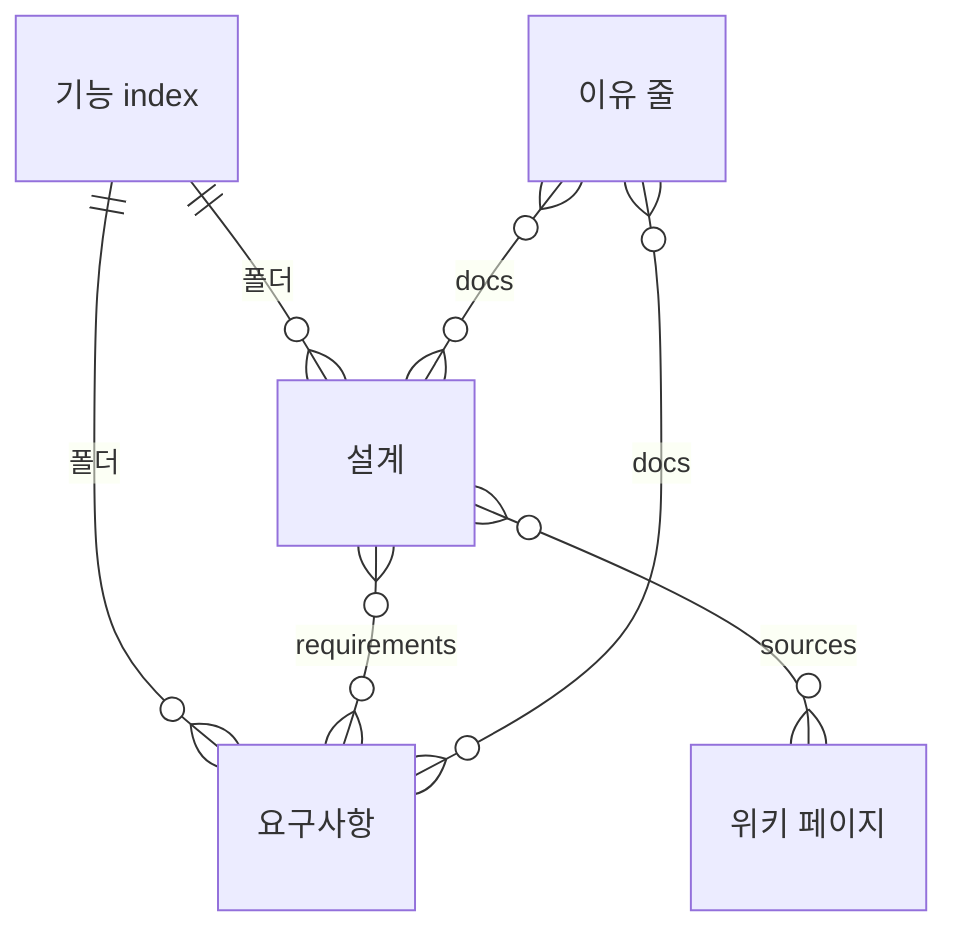
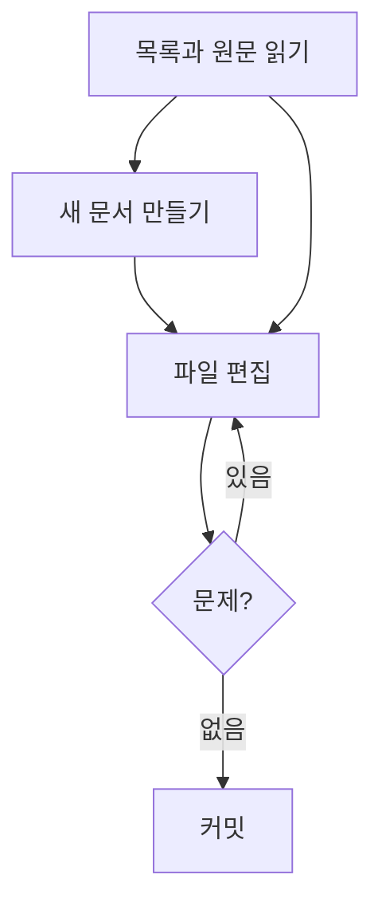

## 개요

기능별 현재 요구사항과 구현 설계를 문서 하나가 파일 하나인 Markdown으로 관리한다(결정 0010). 경로 판정·파싱·렌더링·전체 검사 같은 순수 형식 규칙은 packages/core에, 파일 읽기·쓰기와 캐시·ID 발급은 CLI 어댑터에 둔다. 변경 이유를 커밋에 잇는 방식은 Git 기록 연결 설계에서 다룬다.

| 위치 | 맡는 일 |
| :--- | :--- |
| `packages/core/src/formats/document-file.ts` | 경로 판정(`classifyDocPath`), 문서 파싱·렌더링, 이유 줄 파싱 |
| `packages/core/src/formats/frontmatter.ts` | 프론트매터 부분집합의 파싱과 렌더링(`quoteScalar`) |
| `packages/core/src/use-cases/check-documents.ts` | 문서 전체 검사(`checkDocuments`) |
| `apps/cli/src/adapters/filesystem/document-file.ts` | ID 발급(`generateId`), 새 문서 파일 쓰기 |
| `apps/cli/src/adapters/cache/documents.ts` | 작업 폴더 문서 읽기와 캐시, 크기·링크 파일 판정 |
| `apps/cli/src/commands/docs.ts` | `docs list`·`search`·`show`·`new`·`check`·`history` |

기능 응집은 사용자의 제품 맥락으로 정하고 코드 모듈이나 DDD 계층을 강제하지 않는다. 설계는 기본 작성 대상으로 안내하되 빈 설계 파일을 만들게 하지 않는다. 별도 요구사항 목록, docs/specs 복사본, tasks.md는 두지 않는다.

## 문서와 관계

기능 폴더 `.gitifact/spec/<기능>/` 하나가 기능 하나다. 소속 기능은 폴더 위치로만 정하고, 문서 사이의 관계는 설계 프론트매터의 `requirements`·`sources`에만 둔다. 본문은 사람과 에이전트가 읽는 산문이며 CLI가 데이터를 뽑으려고 파싱하지 않는다. 그래서 본문의 링크나 코드 블록 예시는 참조로 해석하지 않는다.

| 문서 | 경로 | ID | 필수 키 | 선택 키 |
| :--- | :--- | :--- | :--- | :--- |
| 기능 소개 | `<기능>/index.md` | S- | `id`·`title`·`description` | `draft` |
| 요구사항 | `<기능>/requirements/<slug>.md` | R- | 위 셋과 `order` | `draft` |
| 설계 | `<기능>/design/<slug>.md` | D- | 위 셋과 `order` | `requirements`·`sources`·`draft` |
| 이유 | `.gitifact/history.jsonl` | 줄마다 H- | 줄마다 `id`·`docs`·`reason` | — |

`sources`는 위키 페이지뿐 아니라 자기 자신이 아닌 모든 문서를 ID로 가리킬 수 있고, 외부 자료를 가리킬 수도 있다. 이유 줄의 `docs`도 모든 종류의 문서 ID를 담는다. 위키 페이지의 경로 규칙은 프로젝트 위키 기능이 다룬다.

기능 폴더와 slug 이름은 소문자·숫자·하이픈 80자 이하다. 설계가 하나라도 있으면 `design/overview.md`가 있어야 한다. 기능 폴더에 이 밖의 파일(0.7의 `requirements.md`·`design.md`·폴더별 `history.jsonl` 포함)이 있으면 검사가 문제로 알린다. 설계는 파일 하나 전체가 비교 단위이며 파일 안의 문단에는 ID가 없다. 그래서 설계와 요구사항도 절이 아니라 파일 단위(`requirements` 목록)로 이어진다.

## 프론트매터와 본문

프론트매터 파서는 `key: value` 스칼라, 스칼라 목록, 평평한 맵 목록만 읽는 YAML의 엄격한 부분집합이다. 그 밖의 줄은 거부해, 손으로 고친 줄이 다른 뜻으로 읽히지 않게 한다. 렌더러는 키를 `id`·`title`·`description`·`order`·`requirements`·`sources`·`draft` 순으로 쓰고, `quoteScalar`가 그대로 두면 다르게 읽힐 값만 큰따옴표로 감싼다.

| 키 | 값 |
| :--- | :--- |
| `title`·`description` | 한 줄, 각각 200자·300자 이하 |
| `order` | 0~999999 정수. 같은 기능·종류 폴더 안에서 겹치지 않는다 |
| `requirements` | 이 설계가 설명하는 R-ID 목록. 중복 불가 |
| `sources` | 저장소 안 문서 `{id, note?}` 또는 외부 자료 `{title, url, note?}`(http·https). 값마다 500자 이하 |
| `draft` | `true`만 쓴다 |

본문은 비어 있으면 안 되고 `#` 제목과 gitifact HTML 주석을 쓰지 않는다. 코드 펜스 안의 줄은 이 검사에서 빼며, 닫히지 않은 펜스는 문제다. 요구사항 본문은 사용자 역할·목표·이유를 담은 사용자 스토리로 시작하고, 확정 제약은 범위와 제약 절에, 조건과 기대 동작은 수용 조건 절에 둔다. 작성 방식은 `gitifact guide show spec`, 설계의 축과 파일 나누기는 `gitifact guide show design`이 안내하며, CLI는 사용자 스토리의 문형이나 의미를 검사하지 않는다.

## ID

ID는 종류 접두어(S·R·D·W, 이유 줄은 H)와 소문자 base32 10자다. `generateId`만 발급하며 `docs new`는 이미 쓰인 ID와 겹치지 않을 때까지 다시 뽑는다. ID는 이름·폴더와 독립적이어서 제목 변경, 파일 이동, 다른 기능 폴더로의 이동에도 유지한다. 이름 변경을 다른 요구사항 생성으로 처리하지 않으며, 설계의 `requirements`는 현재 전체 문서에서 찾으므로 다른 기능으로 옮긴 요구사항도 계속 가리킨다.

## 작성 흐름

문서 작성은 커밋이나 완료 선언을 만들지 않는다. 에이전트가 파일을 직접 고치고, 커밋은 `changes commit`이 맡는다.

| 단계 | 명령 | 하는 일 |
| :--- | :--- | :--- |
| 목록과 원문 읽기 | `docs list [--feature <기능>]`, `docs show <ID…>` | 목록은 프론트매터만, `show`는 파일 원문과 가리키는·가리켜지는 문서 |
| 새 문서 만들기 | `docs new <종류> <경로> --title … --description …` | ID 발급, 프론트매터와 종류별 본문 뼈대, `order`는 같은 폴더의 최댓값+10, `draft: true` |
| 파일 편집 | (직접 편집) | 본문을 채우고 `draft: true` 줄을 지운다 |
| 검사 | `docs check` | 아래 "검사" |
| 커밋 | `changes commit` | 커밋 직전에 같은 검사를 다시 돌려 문제가 있으면 커밋하지 않는다 |

`docs new`는 같은 경로에 파일이 있으면 거부하고, 링크를 거쳐 폴더를 만들지 않아 문서가 프로젝트 밖에 생기지 않는다. 설계의 `requirements`에는 `docs new`가 발급한 실제 R-ID만 적고 아직 없는 ID를 지어내지 않는다. 요구사항 이동·삭제와 기능 폴더 개명은 파일을 직접 옮기거나 지워서 하며, ID가 파일 안에 있어 옮긴 뒤에도 같은 문서로 추적한다.

> [!NOTE]
> 저장 명령이 없어 "읽은 뒤 바뀐 파일의 저장 거부" 같은 보호는 없다. 문서 파일은 일반 코드 파일과 같은 수준으로 보호된다.

## 검사

`docs check`는 작업 폴더의 문서와 이유 파일 전체를 읽고, 첫 오류에서 멈추지 않고 모든 문제를 보인 뒤 문제가 있으면 종료 코드 1로 끝난다. 읽지 못한 파일은 문제로 보고하고 나머지끼리 계속 대조한다.

| 범위 | 문제 코드 | 조건 |
| :--- | :--- | :--- |
| 파일 | `PATH_UNSUPPORTED` | 경로 규칙 밖, 링크 파일 |
| 파일 | `FILE_TOO_LARGE` | 문서 1MB, `history.jsonl` 64MB 초과 |
| 파일 | `INVALID_CHARACTERS` | NUL·단독 CR·BOM, UTF-8이 아님 |
| 파일 | `FRONTMATTER_*`, `ID_FORMAT`, `SOURCE_INVALID` | 프론트매터 형식·모르는 키·필수 키 누락·값, ID 형식, `sources` 형식 |
| 파일 | `BODY_REQUIRED`·`BODY_HEADING`·`BODY_MARKER`·`BODY_UNCLOSED_FENCE` | 빈 본문, `#` 제목, gitifact 주석, 닫히지 않은 펜스 |
| 파일 | `REASON_INVALID` | 형식이 맞지 않는 이유 줄 |
| 전체 | `DOC_DRAFT` | 남은 `draft: true` |
| 전체 | `DUPLICATE_ID`·`DUPLICATE_REASON_ID`·`DUPLICATE_ORDER` | 문서 ID, 이유 ID, 같은 폴더의 `order` 중복 |
| 전체 | `MISSING_REFERENCE` | `requirements`가 요구사항이 아닌 ID를, `sources`가 없는 문서나 자기 자신을 가리킴 |
| 전체 | `FEATURE_INDEX_REQUIRED`·`DESIGN_OVERVIEW_REQUIRED` | `index.md`·`design/overview.md` 누락 |

깨진 상대 링크와 권장 범위 밖의 에셋은 문제 뒤에 경고로 보이며 종료 코드와 커밋을 막지 않는다. `docs list`는 읽지 못한 파일 수와 `index.md`가 없는 기능 폴더를 함께 알려, 손상을 빈 정상 결과로 보이지 않게 한다. 설정의 `schemaVersion`이 2면 0.7 형식으로 보고 변환하지 않은 채 `guide show migrate`를 안내하며 거부한다.

형식 고정 자료와 독립 저장소로 파싱·렌더링·검사와 명령 동작을 시험한다(`packages/core/test/documents.test.mjs`, `apps/cli/test/docs-commands.test.mjs`). 명세 구조가 유효하다는 결과를 제품 의미나 코드 구현의 검증으로 해석하지 않는다.

## 결정

| 결정 | 이유 | 기각한 안 |
| :--- | :--- | :--- |
| 요구사항·설계를 파일 하나씩 두고 기능 단위 읽기는 `docs list --feature`와 브라우저 기능 상세가 맡는다 | 서로 다른 요구사항의 수정이 파일 단위로 충돌 없이 합쳐지고, 제목과 ID의 짝을 따로 유지하지 않아도 된다 | 기능마다 `requirements.md`·`design.md` 한 파일에 모으기, 한 파일의 요구사항을 프론트매터 목록으로 나누기(제목과 ID의 대응을 따로 유지해야 함) |
| 구조 정보는 모두 프론트매터에 두고 본문 주석을 금지한다 | 참고 문서 목록처럼 구조가 있는 메타를 주석 한 줄에 담기 어렵고, GitHub가 프론트매터를 표로 보여 준다 | 절 단위 본문 주석(`gitifact-req`·`gitifact-ref`) |
| 이유는 `.gitifact/history.jsonl` 한 파일에 두고 `merge=union`으로 병합한다 | 요구사항을 다른 기능으로 옮기거나 여러 폴더에 걸친 이유를 남길 때 둘 곳이 모호하지 않고, 두 브랜치가 더한 줄이 모두 남는다 | 기능 폴더·위키마다 `history.jsonl` |
| 현재 문서만 저장하고 과거 원문은 Git에서 읽는다 | 중복 스냅샷을 줄인다 | 문서의 과거 스냅샷 저장 |
| `docs check`는 바뀐 파일이 아니라 문서 전체를 검사한다 | 문제가 아무도 고치지 않은 파일에 생길 수 있다. 위키 페이지를 지우면 설계의 `sources`가 없는 문서를 가리킨다 | 바뀐 파일만 검사 |
