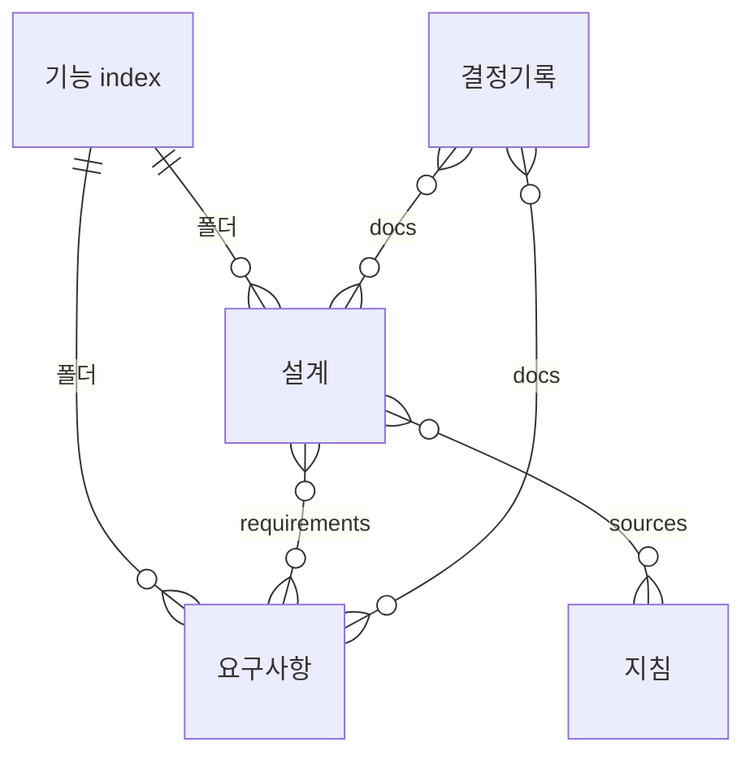
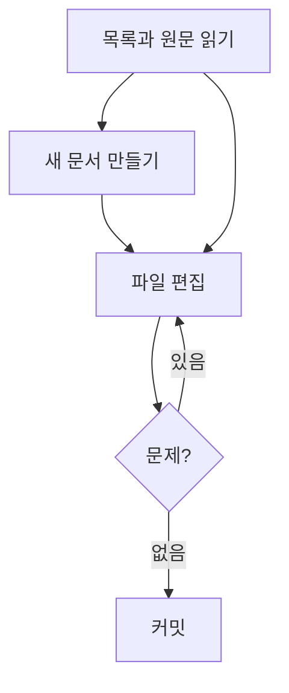

## 개요

기능별 현재 요구사항과 구현 설계를 문서 하나가 파일 하나인 Markdown으로 관리한다. 경로 판정·파싱·렌더링·전체 검사 같은 순수 형식 규칙은 packages/core에, 파일 읽기·쓰기와 캐시·ID 발급은 CLI 어댑터에 둔다. 결정기록을 커밋에 잇는 방식은 Git 기록 연결 설계에서 다룬다.

| 위치 | 맡는 일 |
| :--- | :--- |
| `packages/core/src/formats/document-file.ts` | 경로 판정(`classifyDocPath`), 문서 파싱·렌더링, 과거 커밋의 `history.jsonl` 줄 파싱 |
| `packages/core/src/formats/record-file.ts` | 결정기록 파싱·렌더링과 섹션 검사 |
| `packages/core/src/formats/frontmatter.ts` | 프론트매터 부분집합의 파싱과 렌더링(`quoteScalar`) |
| `packages/core/src/use-cases/check-documents.ts` | 문서 전체 검사(`checkDocuments`) |
| `apps/cli/src/adapters/filesystem/document-file.ts` | ID 발급(`generateId`), 새 문서 파일 쓰기 |
| `apps/cli/src/adapters/cache/documents.ts` | 작업 폴더 문서 읽기와 캐시, 크기·링크 파일 판정 |
| `apps/cli/src/commands/specs.ts`·`check.ts` | `specs list`·`show`·`new`, `check`. 명령 체계와 목록 옵션은 [문서 명령](interface.md) |
| `apps/cli/src/commands/records.ts` | `records list`·`show`·`new` |

기능 응집은 사용자의 제품 맥락으로 정하고 코드 모듈이나 DDD 계층을 강제하지 않는다. 설계는 기본 작성 대상으로 안내하되 빈 설계 파일을 만들게 하지 않는다. 별도 요구사항 목록, docs/specs 복사본, tasks.md는 두지 않는다.

## 문서와 관계

기능 폴더 `.gitifact/spec/<기능>/` 하나가 기능 하나다. 소속 기능은 폴더 위치로만 정하고, 문서 사이의 관계는 설계 프론트매터의 `requirements`·`sources`에만 둔다. 본문은 사람과 에이전트가 읽는 산문이며 CLI가 데이터를 뽑으려고 파싱하지 않는다. 그래서 본문의 링크나 코드 블록 예시는 참조로 해석하지 않는다.

```mermaid
erDiagram
  FEATURE["기능 index"]
  REQUIREMENT["요구사항"]
  DESIGN["설계"]
  INSTRUCTION["지침"]
  RECORD["결정기록"]
  FEATURE ||--o{ REQUIREMENT : "폴더"
  FEATURE ||--o{ DESIGN : "폴더"
  DESIGN }o--o{ REQUIREMENT : "requirements"
  DESIGN }o--o{ INSTRUCTION : "sources"
  RECORD }o--o{ REQUIREMENT : "docs"
  RECORD }o--o{ DESIGN : "docs"
```

| 문서 | 경로 | ID | 필수 키 | 선택 키 |
| :--- | :--- | :--- | :--- | :--- |
| 기능 소개 | `<기능>/index.md` | S- | `id`·`title`·`description` | `draft` |
| 요구사항 | `<기능>/requirements/<slug>.md` | R- | 위 셋과 `order` | `draft` |
| 설계 | `<기능>/design/<slug>.md` | D- | 위 셋과 `order` | `requirements`·`sources`·`draft` |
| 결정기록 | `.gitifact/records/<yyyymmdd>/<DR-ID>.md` | DR- | `id`·`title`·`docs` | `draft` |

`sources`는 지침뿐 아니라 자기 자신이 아닌 모든 문서를 ID로 가리킬 수 있고, 외부 자료를 가리킬 수도 있다. 결정기록의 `docs`도 모든 종류의 문서 ID를 담으며, 지워진 문서(과거 위키 페이지의 W- 포함)도 가리킬 수 있다. 지침의 경로 규칙은 프로젝트 지침 기능이 다룬다.

기능 폴더와 slug 이름은 소문자·숫자·하이픈 80자 이하다. 설계가 하나라도 있으면 `design/overview.md`가 있어야 한다. 기능 폴더에 이 밖의 파일(0.7의 `requirements.md`·`design.md`·폴더별 `history.jsonl` 포함)이 있으면 검사가 문제로 알린다. 설계는 파일 하나 전체가 비교 단위이며 파일 안의 문단에는 ID가 없다. 그래서 설계와 요구사항도 절이 아니라 파일 단위(`requirements` 목록)로 이어진다.

## 프론트매터와 본문

프론트매터 파서는 `key: value` 스칼라, 스칼라 목록, 평평한 맵 목록만 읽는 YAML의 엄격한 부분집합이다. 그 밖의 줄은 거부해, 손으로 고친 줄이 다른 뜻으로 읽히지 않게 한다. 렌더러는 키를 `id`·`title`·`description`·`order`·`style`·`requirements`·`sources`·`draft` 순으로 쓰고, `quoteScalar`가 그대로 두면 다르게 읽힐 값만 큰따옴표로 감싼다.

| 키 | 값 |
| :--- | :--- |
| `title`·`description` | 한 줄, 각각 200자·300자 이하 |
| `order` | 0~999999 정수. 같은 기능·종류 폴더 안에서 겹치지 않는다 |
| `style` | 요구사항만. `usecase`(유즈케이스 방식) 또는 `default`(기본 형식). 없으면 기본 형식이다. 그 밖의 값은 `FRONTMATTER_VALUE` |
| `requirements` | 이 설계가 설명하는 R-ID 목록. 중복 불가 |
| `sources` | 저장소 안 문서 `{id, note?}` 또는 외부 자료 `{title, url, note?}`(http·https). 값마다 500자 이하 |
| `draft` | `true`만 쓴다 |

본문은 비어 있으면 안 되고 `#` 제목과 gitifact HTML 주석을 쓰지 않는다. 코드 펜스 안의 줄은 이 검사에서 빼며, 닫히지 않은 펜스는 문제다. 요구사항 본문은 사용자 역할·목표·이유를 담은 사용자 스토리로 시작하고, 확정 제약은 그다음 범위와 제약 절에 `-` 목록으로, 조건과 기대 동작은 마지막 수용 조건 절에 번호 항목으로 둔다. `style: usecase` 요구사항은 범위와 제약 뒤에 사전 조건·기본 흐름·대체 흐름·사후 조건을 두고, 수용 조건 항목마다 `경로:` 줄로 확인하는 경로를 적는다. 이 모양을 벗어난 요구사항은 고칠 때 경고한다([문서 검사와 에셋](errors.md)). 작성 방식은 `gitifact guide show spec`, 설계의 축과 파일 나누기는 `gitifact guide show design`이 안내하며, CLI는 사용자 스토리의 문형이나 의미를 검사하지 않는다.

## ID

ID는 종류 접두어(S·R·D·I·W, 결정기록은 DR)와 소문자 base32 10자다. `generateId`만 발급하며 `specs new`·`instructions new`·`records new`는 이미 쓰인 ID와 겹치지 않을 때까지 다시 뽑는다. ID는 이름·폴더와 독립적이어서 제목 변경, 파일 이동, 다른 기능 폴더로의 이동에도 유지한다. 이름 변경을 다른 요구사항 생성으로 처리하지 않으며, 설계의 `requirements`는 현재 전체 문서에서 찾으므로 다른 기능으로 옮긴 요구사항도 계속 가리킨다.

## 작성 흐름

문서 작성은 커밋이나 완료 선언을 만들지 않는다. 에이전트가 파일을 직접 고치고, 커밋은 `changes commit`이 맡는다.

```mermaid
flowchart TD
  R["목록과 원문 읽기"] --> N["새 문서 만들기"]
  N --> E["파일 편집"]
  R --> E
  E --> C{"문제?"}
  C -->|있음| E
  C -->|없음| M["커밋"]
```

| 단계 | 명령 | 하는 일 |
| :--- | :--- | :--- |
| 목록과 원문 읽기 | `specs list`, `specs show <ID…>` | 목록은 프론트매터만, `show`는 파일 원문과 가리키는·가리켜지는 문서 |
| 새 문서 만들기 | `specs new <종류> <경로> --title … --description …` | ID 발급, 프론트매터와 종류별 본문 뼈대, `order`는 같은 폴더의 최댓값+10, `draft: true`. 요구사항은 `--style` 또는 설정의 `requirementStyle`이 `usecase`면 유즈케이스 뼈대와 `style: usecase`를 쓴다 |
| 파일 편집 | (직접 편집) | 본문을 채우고 `draft: true` 줄을 지운다 |
| 검사 | `check` | [문서 검사와 에셋](errors.md) |
| 커밋 | `changes commit` | 커밋 직전에 같은 검사를 다시 돌려 문제가 있으면 커밋하지 않는다 |

`specs new`는 같은 경로에 파일이 있으면 거부하고, 링크를 거쳐 폴더를 만들지 않아 문서가 프로젝트 밖에 생기지 않는다. 설계의 `requirements`에는 `specs new`가 발급한 실제 R-ID만 적고 아직 없는 ID를 지어내지 않는다. 요구사항 이동·삭제와 기능 폴더 개명은 파일을 직접 옮기거나 지워서 하며, ID가 파일 안에 있어 옮긴 뒤에도 같은 문서로 추적한다.

> [!NOTE]
> 저장 명령이 없어 "읽은 뒤 바뀐 파일의 저장 거부" 같은 보호는 없다. 문서 파일은 일반 코드 파일과 같은 수준으로 보호된다.
