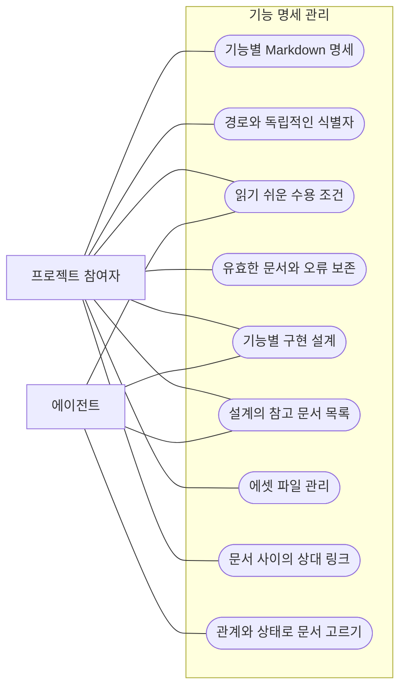

기능마다 요구사항과 구현 설계를 Markdown 문서로 관리한다. CLI가 발급한 ID로 문서를 식별하고, 잘못된 문서는 커밋 전에 거부한다.

## 유즈케이스 모델

```mermaid
flowchart LR
  member[프로젝트 참여자]
  agent[에이전트]
  subgraph specification[기능 명세 관리]
    uc1([기능별 Markdown 명세])
    uc2([경로와 독립적인 식별자])
    uc3([읽기 쉬운 수용 조건])
    uc4([유효한 문서와 오류 보존])
    uc5([기능별 구현 설계])
    uc6([설계의 참고 문서 목록])
    uc7([에셋 파일 관리])
    uc8([문서 사이의 상대 링크])
    uc9([관계와 상태로 문서 고르기])
  end
  member --- uc1
  member --- uc2
  member --- uc3
  member --- uc4
  member --- uc5
  member --- uc6
  member --- uc7
  member --- uc8
  agent --- uc3
  agent --- uc5
  agent --- uc6
  agent --- uc9
```
