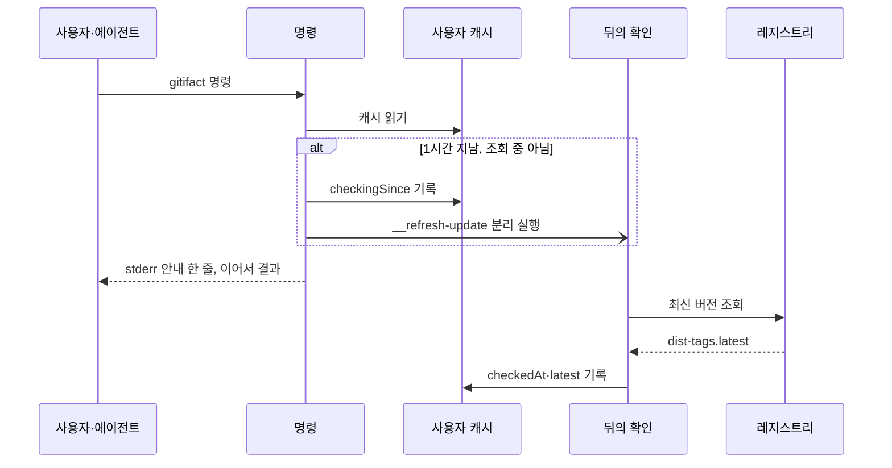
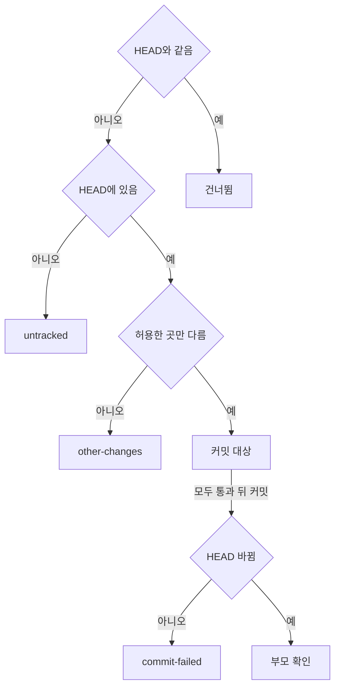

## 구성

`init`·`update`·`update --check`와 명령마다의 안내는 같은 레지스트리 조회와 버전 비교 코드를 쓴다.

| 파일 | 맡는 것 |
| :--- | :--- |
| `apps/cli/src/adapters/registry/latest-version.ts` | `https://registry.npmjs.org/gitifact`의 축약 매니페스트(`Accept: application/vnd.npm.install-v1+json`, 리디렉션 거부)에서 `dist-tags.latest`를 읽는다 |
| `apps/cli/src/shared/update-check.ts` | `isNewerRelease`, `resolveUpdate`(제한 시간 3초, 거부하지 않고 항상 상태를 반환), `updateCheckDisabled`, 전역 설치 명령(`npm install -g gitifact@<버전>`)과 `update-check` v1이 쓰는 npx 명령 문자열 |
| `apps/cli/src/adapters/filesystem/user-cache.ts` | 사용자 캐시 `update.json`의 위치·읽기·원자적 쓰기, 끝난 확인의 기록(`recordUpdateCheck`) |
| `apps/cli/src/commands/version-notice.ts` | 명령 앞의 안내(`noticeVersion`), 뒤에서 도는 확인(`__refresh-update`), `update --later` |
| `apps/cli/src/commands/project-settings.ts` | 설정의 `cli`·`language`를 읽고, init·update가 쓸 값을 정한다(`settleConfig`) |
| `apps/cli/src/shared/project-config.ts` | 위 폴더로 올라가며 가장 가까운 `.gitifact/config.json`을 찾는다. 안내와 `feedback`이 쓴다 |
| `apps/cli/src/commands/update-check.ts` | `update --check`. 레지스트리만 조회하고 결과를 캐시에 남긴다. 저장소·지침·Git 어댑터를 호출하지 않는다 |
| `apps/cli/src/commands/update.ts` | `update`. 확인, 블록 갱신, 설정의 `cli`·`language` 쓰기를 함께 하고 `--commit`을 처리한다 |
| `apps/cli/src/adapters/git/agent-docs-commit.ts` | `update --commit`의 Git 접근. HEAD의 파일 내용 조회, `git commit --only`, 커밋의 부모·변경 파일 조회만 한다 |

> [!WARNING]
> 레지스트리 조회는 CLI의 외부 요청 중 하나이며 프로젝트 정보를 보내지 않는다. 다른 요청이나 전송 항목을 더하지 않는다.

`isNewerRelease`는 x.y.z를 숫자로 비교하고, 같은 숫자의 사전 릴리스 빌드는 정식 릴리스보다 낮게 본다. 형식을 읽지 못하면 새 버전이 아니다. `GITIFACT_NO_UPDATE_CHECK`가 비어 있지 않고 `0`이 아니면 레지스트리 확인을 끈다. 현재 버전은 빌드 때 주입되는 CLI 버전이며 `gitifact --version`과 같다.

## 확인 결과

| 상태 | 뜻 | `latestVersion` | 업데이트 명령 |
| :--- | :--- | :--- | :--- |
| `available` | 실행 중인 CLI보다 새 정식 버전이 있다 | 있음 | 있음 |
| `up-to-date` | 확인에 성공했고 새 버전이 없다 | 있음 | 없음 |
| `unavailable` | 오프라인·시간 초과·중단, 또는 레지스트리 값이 x.y.z가 아님 | 없음 | 없음 |
| `disabled` | `GITIFACT_NO_UPDATE_CHECK`로 껐다 | 없음 | 없음 |

`update-state` v1에는 요청이 끝나지 않았다는 `checking`도 있지만 `update-check` 응답은 이를 허용하지 않는다. 업데이트 명령에는 형식을 검증한 정식 버전만 들어간다.

## 계약

계약은 strict라 필드가 바뀌면 버전을 올린다. 아래보다 이전 버전의 스키마는 코드에 없다.

| 계약 | 현재 버전 | 담는 것 |
| :--- | :--- | :--- |
| `update-check` | v1 | `update --check`의 읽기 전용 결과: `cliVersion`, `update`, `available`일 때만 `command`(npx 명령). 텍스트 출력은 전역 설치를 안내한다 |
| `update` | v6 | 확인 결과, `install`(`npmGlobal`), `agentDocs`, `project`, `commit`, `migrationRequired`. v6에서 `project`를 더하고 `install.npx`를 뺐다 |
| `update-later` | v1 | `update --later`의 결과: `cliVersion`, 조용히 둔 버전과 끝 시각(`later`), 미룰 버전이 없으면 null |
| `project-init` | v8 | `init` 결과와 같은 확인 결과·`install`(`npx`·`npmGlobal`). 텍스트 출력은 전역 설치를 안내한다 |
| `browser-session` | v3 | 세션 식별자와 `cliVersion`. v3에서 `update` 필드를 뺐다 |
| `changelog` | v1 | 패치노트 응답 |

## 명령마다의 안내

`main.ts`의 commander `preAction` 훅 하나가 모든 명령 앞에서 `noticeVersion`을 부른다. 안내는 로컬 파일만 읽고 stderr에 한 줄을 쓴 뒤 명령을 이어 간다. 읽기나 쓰기가 실패해도 명령을 막지 않는다.

| 안내 | 조건 | 알리는 것 |
| :--- | :--- | :--- |
| 프로젝트가 앞섬 | 설정의 `cli`가 실행 중인 버전보다 새 버전 | 두 버전과 `npm install -g gitifact@<cli>` |
| 새 버전 | 캐시의 `latest`가 실행 중인 버전보다 새 버전이고 `later`로 미루지 않음 | 두 버전, 전역 설치 뒤 `gitifact update`, `gitifact update --later` |
| 프로젝트가 뒤짐 | 실행 중인 버전이 설정의 `cli`보다 새 버전 | `gitifact update`로 기준을 올릴 수 있음 |

한 번에 하나만, 위 표의 순서로 고른다. `init`과 `update`는 레지스트리를 직접 확인해 결과에 담으므로 새 버전 안내와 뒤의 확인을 하지 않는다. `update`는 프로젝트가 뒤짐 안내도 하지 않는다. `GITIFACT_NO_UPDATE_CHECK`가 켜져 있으면 캐시를 읽지 않고 뒤의 확인도 걸지 않는다. 프로젝트 비교는 로컬 파일만 읽으므로 계속한다. 설정은 `findProjectConfig`로 위 폴더까지 찾고, 읽지 못하거나 `cli`가 형식에 맞지 않으면 없는 것으로 본다.

뒤의 확인은 같은 CLI를 `spawn(process.execPath, [...execArgv, main.js, '__refresh-update'], { detached, stdio: 'ignore', windowsHide, cwd: 홈 폴더 })`로 띄우고 `unref()`한다. Windows에서 실행 중인 프로세스의 폴더는 지울 수 없으므로 프로젝트 폴더에서 띄우지 않는다. `__refresh-update`는 도움말에 나오지 않고 안내도 하지 않는다.

## 사용자 캐시

캐시는 사용자의 것이며 프로젝트에 두지 않는다. 위치는 `GITIFACT_CACHE_DIR`, Windows는 `%LOCALAPPDATA%\gitifact`, macOS는 `~/Library/Caches/gitifact`, 그 밖은 `$XDG_CACHE_HOME/gitifact` 또는 `~/.cache/gitifact` 아래의 `update.json`이다.

| 필드 | 뜻 |
| :--- | :--- |
| `checkedAt` | 마지막으로 확인을 끝낸 시각 |
| `latest` | 마지막으로 알아낸 최신 정식 버전. `unavailable`이면 이전 값을 유지한다 |
| `checkingSince` | 뒤의 확인을 건 시각. 5분 안이면 다른 명령이 확인을 다시 걸지 않는다 |
| `later` | `update --later`로 조용히 둔 버전과 끝 시각(24시간 뒤) |

`checkedAt`이 1시간 안이거나 `checkingSince`가 5분 안이면 확인을 걸지 않는다. `init`·`update`·`update --check`도 끝난 확인을 같은 캐시에 남긴다. 파일은 임시 파일에 쓴 뒤 이름을 바꿔 교체하고, 쓰기 실패는 무시한다. 두 명령이 동시에 쓰면 한쪽 변경이 사라질 수 있지만 다음 확인이 바로잡는다. 깨진 파일은 빈 캐시로 읽는다.

`update --later`는 캐시의 `latest`가 실행 중인 버전보다 새 버전일 때만 `later`를 쓴다. `later.version`보다 새 버전이 캐시에 들어오면 새 버전 안내가 바로 다시 나온다. `--check`·`--commit`과 함께 쓰면 Commander가 옵션 충돌로 거부한다.

## update 명령

`gitifact update`는 레지스트리 확인, 지침 블록 갱신, 설정 갱신을 함께 하고 `update` 계약으로 출력한다(`--format text` 지원). 새 버전이 있으면 `install.npmGlobal`에 전역 설치 명령을 담고, 텍스트 출력은 설치 뒤 `update`를 다시 실행하라고 안내한다. 안내한 명령을 CLI가 실행하지 않으며, 확인이 꺼졌거나 실패하면 `install`은 null이다.

블록 갱신은 `planAgentDocs`의 `onlyExisting`으로 이미 블록이 있는 파일만 대상으로 하며 파일을 만들지 않는다. 블록 언어는 설정의 `language`로 정한다(D-qocsgecvk2). 블록을 쓴 뒤 `settleConfig`로 설정의 `cli`를 실행 중인 버전으로 올리고 `language`를 블록 언어로 맞춘다. 설정은 `formatManagedConfig`로 쓰므로 이 CLI가 모르는 필드는 그대로 남는다. 쓰기 전마다 HEAD·index·설정이 그대로인지 다시 확인한다. `init`은 도입, `update`는 유지를 맡는다.

| `agentDocs.state` | 조건 |
| :--- | :--- |
| `not-initialized` | Git 저장소가 아니거나 설정이 없다. 버전 확인만 한다 |
| `kept` | 설정의 `cli`가 실행 중인 버전보다 새 버전이다. 블록과 설정을 바꾸지 않는다 |
| `no-block` | 블록이 있는 파일이 없다 |
| `current` | 모든 블록이 이미 이 버전의 문구다 |
| `refreshed` | 블록을 바꿨다 |

`project.state`는 설정을 썼으면 `written`, 이미 같으면 `current`, 설정이 없으면 `not-initialized`이고 `project.cli`는 실행 뒤의 기준 버전이다. 사전 릴리스 빌드처럼 버전이 x.y.z가 아니면 `cli`를 바꾸지 않는다.

블록이 AGENTS.md에 있고 CLAUDE.md와 .claude/CLAUDE.md가 없으면 `agentDocs.missing`에 CLAUDE.md를 담고, 텍스트 출력은 `init` 재실행을 안내한다. 이미 도입한 프로젝트가 CLAUDE.md wrapper를 얻는 경로는 `init` 재실행 하나다.

설정이 0.7 저장 규약(schemaVersion 2)이면 블록은 그대로 갱신하고 설정은 바꾸지 않으며 `migrationRequired: true`를 담는다(core `needsMigration`). 텍스트 출력은 `guide show migrate`로 전환하라고 안내한다.

> [!NOTE]
> `migrationRequired`인 프로젝트는 전환을 끝내기 전까지 블록의 설명과 저장소 형식이 어긋나고, 문서 명령은 거부된다.

## 업데이트 커밋

`--commit`은 블록과 설정을 갱신한 뒤에 실행한다. 대상은 블록을 가진 지침 파일(`planAgentDocs`의 paths)과 `.gitifact/config.json`이다. wrapper에서 블록을 걷어낸 변경은 블록 안의 변경이 아니므로 넣지 않는다. 앞서 옵션 없이 갱신만 해 둔 파일도 같은 판정으로 커밋된다.

판단은 파일마다 한다. HEAD와 작업 트리 내용은 CRLF를 LF로 맞춰 비교한다. 지침 파일은 두 내용의 마커 구간을 같은 자리표시로 바꾼 나머지를, 설정은 JSON에서 `cli`·`language`를 뺀 나머지를 비교한다. `untracked`나 `other-changes`인 파일이 하나라도 있으면 전체를 멈춘다. 대상이 모두 통과하면 `git commit --only -m "chore(gitifact): update project to gitifact v<버전>" -- <파일>`을 실행한다. `--only`는 지정 파일의 작업 트리 내용만 커밋하고 다른 staging을 index에 남기며, 훅·서명 설정은 끄지 않는다.

`commit-failed`에는 감지한 오류 메시지를 `detail`에 싣는다. HEAD가 바뀌었으면 부모가 이전 HEAD 하나인지 확인한 뒤 커밋 해시와 실제 변경 파일을 싣는다. 부모가 다르면 `COMMIT_RESULT_UNKNOWN`으로 실패시키고 되돌리지 않는다.

| `commit.state` | 뜻 |
| :--- | :--- |
| `not-requested` | `--commit`을 주지 않았다 |
| `nothing` | HEAD와 다른 대상 파일이 없다 |
| `committed` | 허용한 곳만 바뀐 파일을 고정 메시지로 커밋했다 |
| `skipped` | 커밋하지 않았다. `reason`은 `untracked`·`other-changes`·`commit-failed` |

## 브라우저 서버

서버는 레지스트리 조회·확인 상태·종료 때의 대기를 갖지 않는다. 세션 v3은 고정된 세션 식별자와 현재 CLI 버전을 준다. 브라우저에는 반복 조회와 업데이트 대화상자가 없고, 사이드 메뉴 하단의 현재 버전 링크와 패치노트가 있다. `browser` 명령 앞의 안내는 다른 명령과 같다.

## 패치노트

원본은 `apps/cli/src/shared/i18n/<lang>/changelog.md`이며 빌드(`apps/cli/scripts/build.mjs`)가 `dist/i18n/<lang>/`으로 복사한다. core의 `parseChangelog`가 절 제목(영어 토큰 Added·Changed·Removed·Fixed)과 날짜 형식을 검증한다.

| `GET /api/v1/changelog?lang=<언어>` | 처리 |
| :--- | :--- |
| 세션 헤더 | 필요하다 |
| `lang` | `^[a-z]{2}(-[A-Z]{2})?$`만 받아 경로 조작을 막는다. 없으면 CLI 표시 언어 |
| 그 언어의 파일이 없음 | 기본 언어를 읽고 `fallback: true`로 알린다. 기본 언어도 없으면 404 |
| 형식 오류 | 503 |

브라우저의 `/changelog` 페이지는 버전마다 제목·날짜와 절별 항목을 세로 타임라인으로 그리고, 실행 중인 버전에 표시를 붙인다. 절 이름의 화면 표기는 브라우저의 메시지 표가 맡고, 항목은 Markdown으로 렌더링한다.
