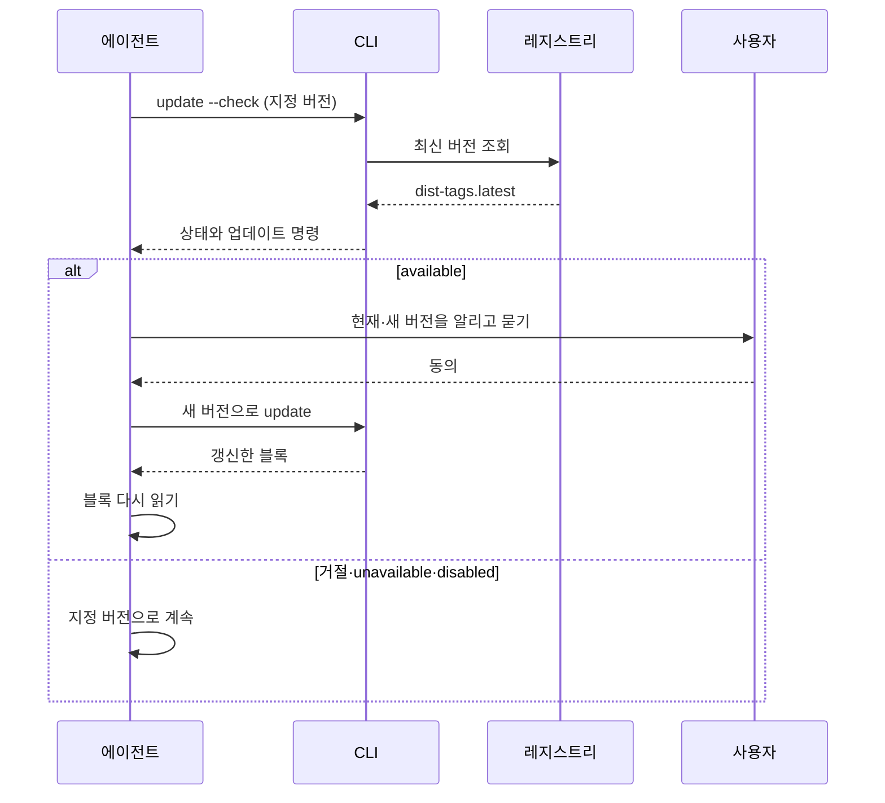
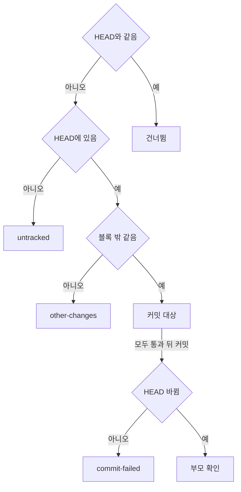

## 구성

`init`·`update`·`update --check`는 같은 레지스트리 조회와 버전 비교 코드를 쓴다.

| 파일 | 맡는 것 |
| :--- | :--- |
| `apps/cli/src/adapters/registry/latest-version.ts` | `https://registry.npmjs.org/gitifact`의 축약 매니페스트(`Accept: application/vnd.npm.install-v1+json`, 리디렉션 거부)에서 `dist-tags.latest`를 읽는다 |
| `apps/cli/src/shared/update-check.ts` | `isNewerRelease`, `resolveUpdate`(제한 시간 3초, 거부하지 않고 항상 상태를 반환), `updateCheckDisabled`, npx 업데이트 명령(`npx --yes gitifact@<버전> update`)과 전역 설치 명령(`npm install -g gitifact@<버전>`) 문자열 |
| `apps/cli/src/commands/update-check.ts` | `update --check`. 레지스트리만 조회하고 저장소·지침·Git 어댑터를 호출하지 않는다 |
| `apps/cli/src/commands/update.ts` | `update`. 확인과 블록 갱신을 함께 하고 `--commit`을 처리한다 |
| `apps/cli/src/adapters/git/agent-docs-commit.ts` | `update --commit`의 Git 접근. HEAD의 파일 내용 조회, `git commit --only`, 커밋의 부모·변경 파일 조회만 한다 |

> [!WARNING]
> 레지스트리 조회는 CLI의 유일한 외부 요청이며 프로젝트 정보를 보내지 않는다. 다른 요청이나 전송 항목을 더하지 않는다.

`isNewerRelease`는 x.y.z를 숫자로 비교하고, 같은 숫자의 사전 릴리스 빌드는 정식 릴리스보다 낮게 본다. 형식을 읽지 못하면 새 버전이 아니다. `GITIFACT_NO_UPDATE_CHECK`가 비어 있지 않고 `0`이 아니면 확인을 끈다.

현재 버전은 빌드 때 주입되는 CLI 버전이며 `gitifact --version`과 같다. 에이전트가 블록에 고정된 버전의 CLI(전역 설치본이나 npx)로 실행하므로 비교 기준은 프로젝트의 지정 버전이 된다. CLI는 AGENTS.md를 읽어 실행 버전을 바꾸지 않는다.

## 확인 결과

| 상태 | 뜻 | `latestVersion` | 업데이트 명령 |
| :--- | :--- | :--- | :--- |
| `available` | 실행 중인 CLI보다 새 정식 버전이 있다 | 있음 | 있음 |
| `up-to-date` | 확인에 성공했고 새 버전이 없다 | 있음 | 없음 |
| `unavailable` | 오프라인·시간 초과·중단, 또는 레지스트리 값이 x.y.z가 아님 | 없음 | 없음 |
| `disabled` | `GITIFACT_NO_UPDATE_CHECK`로 껐다 | 없음 | 없음 |

`update-state` v1에는 요청이 끝나지 않았다는 `checking`도 있지만 `update-check` 응답은 이를 허용하지 않는다. 업데이트 명령에는 형식을 검증한 정식 버전만 들어간다.

## 계약

계약은 strict라 필드가 바뀌면 버전을 올린다. 아래보다 이전 버전의 스키마는 코드에 없다.

| 계약 | 현재 버전 | 담는 것 |
| :--- | :--- | :--- |
| `update-check` | v1 | `update --check`의 읽기 전용 결과: `cliVersion`, `update`, `available`일 때만 `command` |
| `update` | v5 | 확인 결과, `install`(`npx`·`npmGlobal`), `agentDocs`, `commit`, `migrationRequired`. `install.npx`는 v4, `migrationRequired`는 v5에서 더했다 |
| `project-init` | v7 | `init` 결과와 같은 확인 결과·`install`. `install.npx`는 v6, `schemaVersion` 3은 v7에서 더했다 |
| `browser-session` | v3 | 세션 식별자와 `cliVersion`. v3에서 `update` 필드를 뺐다 |
| `changelog` | v1 | 패치노트 응답 |

## 세션 시작 확인

블록과 `guide show workflow`는 새 세션에서 지정 버전으로 `update --check`를 한 번 실행하도록 안내한다.

`update --check`는 `--format text`도 지원하고, `--commit`과 함께 쓰면 Commander가 옵션 충돌로 거부한다. 동의 후에는 프로젝트의 실행 방식으로 새 CLI를 실행한다. 전역 설치본은 `npm install -g`로 새 버전을 설치하고, npx는 새 버전을 직접 지정하고, 프로젝트 의존성은 기존 패키지 관리자로 갱신한다.

거절·확인 실패·비활성화 때는 같은 세션에서 다시 묻지 않는다. 업데이트 동의는 커밋·푸시 권한이 아니다. 갱신된 블록을 공유하면 팀원도 pull 뒤 새 세션에서 같은 버전을 쓴다.

## update 명령

`gitifact update`는 레지스트리 확인과 지침 블록 갱신을 함께 하고 `update` 계약으로 출력한다(`--format text` 지원). 새 버전이 있으면 `install.npx`에 버전을 고정한 npx 명령을, `install.npmGlobal`에 전역 설치 명령을 담고 텍스트 출력은 npx 명령을 안내한다. 프로젝트 의존성 사용자는 해당 패키지 관리자로 의존성을 먼저 갱신한다. 안내한 명령을 CLI가 실행하지 않으며, 확인이 꺼졌거나 실패하면 `install`은 null이다.

블록 갱신은 `planAgentDocs`의 `onlyExisting`으로 이미 블록이 있는 파일만 대상으로 하며 파일을 만들지 않는다. 쓰기 전에 HEAD·index·설정이 그대로인지 다시 확인한다. `init`은 도입, `update`는 유지를 맡는다.

| `agentDocs.state` | 조건 |
| :--- | :--- |
| `not-initialized` | Git 저장소가 아니거나 설정이 없다. 버전 확인만 한다 |
| `no-block` | 블록이 있는 파일이 없다 |
| `current` | 모든 블록이 이미 현재 버전이다 |
| `refreshed` | 블록을 바꿨다 |

블록이 AGENTS.md에 있고 CLAUDE.md와 .claude/CLAUDE.md가 없으면 `agentDocs.missing`에 CLAUDE.md를 담고, 텍스트 출력은 `init` 재실행을 안내한다. 이미 도입한 프로젝트가 CLAUDE.md wrapper를 얻는 경로는 `init` 재실행 하나다.

설정이 0.7 저장 규약(schemaVersion 2)이면 블록은 그대로 갱신하고 `migrationRequired: true`를 담는다(core `needsMigration`). 텍스트 출력은 `guide show migrate`로 전환하라고 안내한다.

> [!NOTE]
> `migrationRequired`인 프로젝트는 전환을 끝내기 전까지 블록의 설명과 저장소 형식이 어긋나고, 문서 명령은 거부된다.

## 블록 커밋

`--commit`은 블록 갱신 뒤에 실행한다. 대상은 블록을 가진 지침 파일(`planAgentDocs`의 paths)이다. wrapper에서 블록을 걷어낸 변경은 블록 안의 변경이 아니므로 넣지 않는다. 블록은 이미 현재 버전이므로 남은 차이는 갱신뿐이고, 앞서 옵션 없이 갱신만 해 둔 파일도 같은 판정으로 커밋된다.

판단은 대상 파일마다 한다. HEAD와 작업 트리 내용은 CRLF를 LF로 맞춰 비교하고, 블록 밖 비교는 두 내용의 마커 구간을 같은 자리표시로 바꾼 나머지를 비교한다. `untracked`나 `other-changes`인 파일이 하나라도 있으면 전체를 멈춘다. 대상이 모두 통과하면 `git commit --only -m "chore(gitifact): refresh GITIFACT block to v<버전>" -- <파일>`을 실행한다. `--only`는 지정 파일의 작업 트리 내용만 커밋하고 다른 staging을 index에 남기며, 훅·서명 설정은 끄지 않는다.

`commit-failed`에는 감지한 오류 메시지를 `detail`에 싣는다. HEAD가 바뀌었으면 부모가 이전 HEAD 하나인지 확인한 뒤 커밋 해시와 실제 변경 파일을 싣는다. 부모가 다르면 `COMMIT_RESULT_UNKNOWN`으로 실패시키고 되돌리지 않는다.

| `commit.state` | 뜻 |
| :--- | :--- |
| `not-requested` | `--commit`을 주지 않았다 |
| `nothing` | HEAD와 다른 블록 파일이 없다 |
| `committed` | 블록만 바뀐 파일을 고정 메시지로 커밋했다 |
| `skipped` | 커밋하지 않았다. `reason`은 `untracked`·`other-changes`·`commit-failed` |

## 브라우저 서버

서버는 레지스트리 조회·확인 상태·종료 때의 대기를 갖지 않는다. 세션 v3은 고정된 세션 식별자와 현재 CLI 버전을 준다. 브라우저에는 반복 조회와 업데이트 대화상자가 없고, 사이드 메뉴 하단의 현재 버전 링크와 패치노트가 있다. `browser --no-update-check` 옵션은 없다.

## 패치노트

원본은 `apps/cli/src/shared/i18n/<lang>/changelog.md`이며 빌드(`apps/cli/scripts/build.mjs`)가 `dist/i18n/<lang>/`으로 복사한다. core의 `parseChangelog`가 절 제목(영어 토큰 Added·Changed·Removed·Fixed)과 날짜 형식을 검증한다.

| `GET /api/v1/changelog?lang=<언어>` | 처리 |
| :--- | :--- |
| 세션 헤더 | 필요하다 |
| `lang` | `^[a-z]{2}(-[A-Z]{2})?$`만 받아 경로 조작을 막는다. 없으면 CLI 표시 언어 |
| 그 언어의 파일이 없음 | 기본 언어를 읽고 `fallback: true`로 알린다. 기본 언어도 없으면 404 |
| 형식 오류 | 503 |

브라우저의 `/changelog` 페이지는 버전마다 제목·날짜와 절별 항목을 세로 타임라인으로 그리고, 실행 중인 버전에 표시를 붙인다. 절 이름의 화면 표기는 브라우저의 메시지 표가 맡고, 항목은 Markdown으로 렌더링한다.
