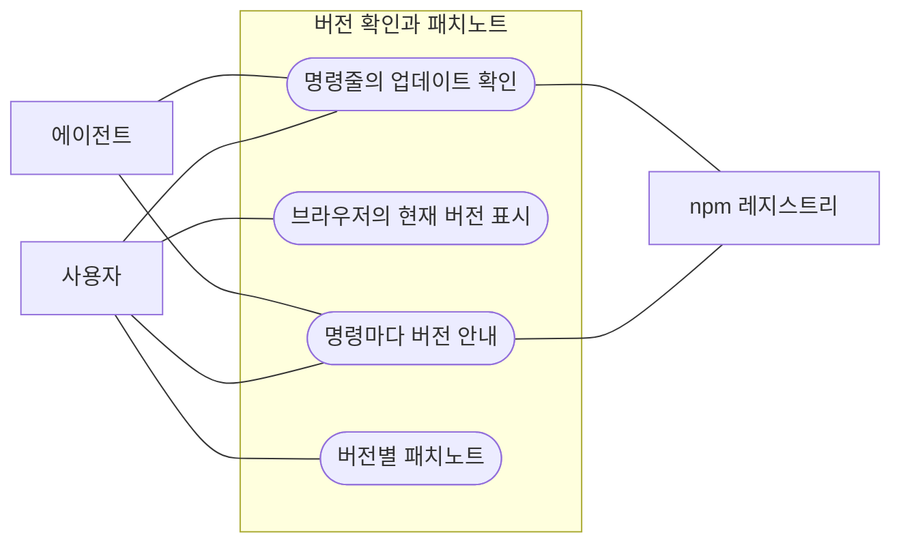

에이전트와 사용자가 새 버전을 확인하고 지침 블록을 실행 중인 버전에 맞추며, 버전마다 달라진 내용을 패치노트로 본다.

## 유즈케이스 모델

```mermaid
flowchart LR
  user[사용자]
  agent[에이전트]
  registry[npm 레지스트리]
  subgraph updates[버전 확인과 패치노트]
    uc1([명령마다 버전 안내])
    uc2([브라우저의 현재 버전 표시])
    uc3([명령줄의 업데이트 확인])
    uc4([버전별 패치노트])
  end
  user --- uc1
  agent --- uc1
  user --- uc2
  user --- uc3
  agent --- uc3
  user --- uc4
  uc1 --- registry
  uc3 --- registry
```
