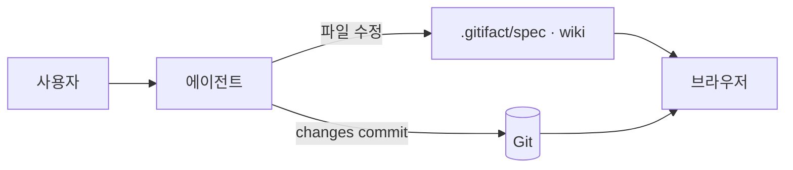
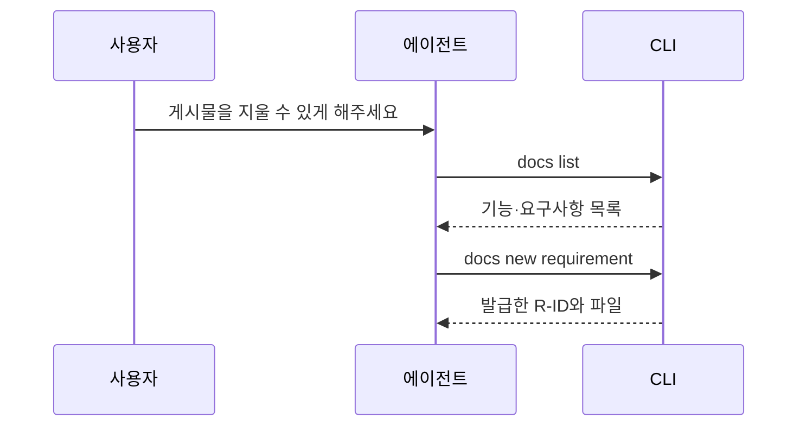

위키·명세·설계 본문에서 쓰는 표기를 정한다. 브라우저가 그리는 것과 에디터·GitHub가 그리는 것이 같아야 하므로, 양쪽이 모두 아는 표기만 쓴다.

## 쓸 수 있는 표기

| 표기 | 쓰임 |
| :--- | :--- |
| 제목·목록·표·인용 | 일반 Markdown 그대로다 |
| 코드 펜스 | 언어 이름을 붙이면 색이 입는다. 모르는 언어는 색 없이 나온다 |
| ` ```mermaid ` 펜스 | 다이어그램으로 그려진다 |
| `> [!NOTE]` 등 다섯 종류 | 알림 상자로 그려진다 |
| 상대 경로 링크·이미지 | 브라우저가 해당 페이지·기능·에셋으로 연결한다 |

원시 HTML은 쓰지 않는다. 브라우저가 실행하지 않으므로 글자 그대로 남는다.

## 다이어그램

쓰는 자리와 빈도는 `gitifact guide show writing`을 따른다. 아래는 브라우저가 그리는 것을 확인한 예다.



순서가 중요한 대화는 순서도로 적는다.



> [!NOTE]
> 다이어그램을 그리는 코드는 패키지에 함께 담겨 있다. 외부 서비스를 부르지 않으므로 오프라인에서도 같은 그림이 나온다.

## 알림

다섯 종류의 뜻과 쓰는 기준은 `gitifact guide show writing`에 있다. 브라우저에서는 이렇게 보인다.

> [!TIP]
> 알아 두면 편하지만 몰라도 되는 것.

> [!IMPORTANT]
> 읽는 사람이 놓치면 결과가 달라지는 것.

> [!WARNING]
> 하면 문제가 생기는 것.

> [!CAUTION]
> 되돌리기 어려운 것.

표지 없는 인용문은 인용 그대로 남는다.

> 인용문은 다른 문서나 사람의 말을 옮길 때 쓴다.

## 제한

문법이 틀린 다이어그램은 그 자리에 원문과 이유가 보이고 나머지 문서는 그대로 열린다. 수식(KaTeX)과 각주는 그리지 않는다. 자세한 구현은 [브라우저 설계](../../spec/browser/design/overview.md)와 [결정 0008](../adr/0008-bundled-diagram-rendering.md)에 있다.
