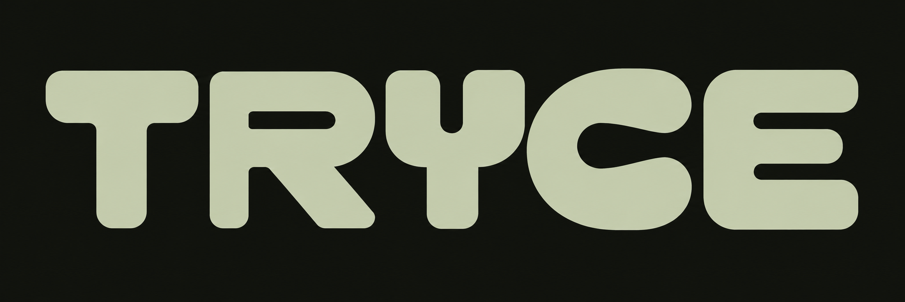

<p align="center">
  
</p>

제품을 만드는 대화가 요구사항과 결정의 기록으로 이어지도록 돕는 도구입니다.

tryce가 지향하는 것은 사용자가 자신의 제품을 만드는 일에 집중하는 환경입니다. 평소처럼 에이전트와 무엇을 만들지 고민하고, 구현하고, 고쳐나가세요. 그 과정에서 요구사항과 변경 이유가 Git에 쌓이고, 사람과 에이전트가 같은 기록을 보며 제품의 상태를 이해할 수 있도록 만들고 있습니다.

> 0.3.0에서는 요구사항과 확인 이력, 판단 기록을 읽기 전용 브라우저로 살펴볼 수 있습니다. 자동모드·승인모드, 요구사항 초안과 묶음 확인, Git 커밋 계획·실행을 지원하며 요구사항은 `.tryce/spec/`에 기록합니다. 자동 구현·검증 완료 판정은 아직 제공하지 않습니다.

## 에이전트에게 시작을 맡기세요

사용할 프로젝트를 Codex 또는 Claude Code에서 열고, 아래 내용을 복사해 전달하세요. 에이전트가 CLI를 준비하고 프로젝트에 연결한 뒤, **현재 세션에서 작업 지침을 직접 읽고 적용**하도록 요청하는 프롬프트입니다. 별도의 시작용 스킬을 설치할 필요는 없습니다.

```text
이 프로젝트에 tryce를 도입하고, 이번 세션부터 맥락과 기록 관리를 맡아주세요.

먼저 프로젝트 지침과 Git 상태, 기존 tryce 설정을 확인해주세요. 기존 파일과
작업 내용은 보존하고, 커밋 시점·메시지·브랜치 등은 프로젝트 정책을 따라주세요.
관련 없는 변경을 기록에 섞거나 사용자가 stage한 내용을 임의로 바꾸지 마세요.

프로젝트에서 지정한 tryce 실행 방법이 있으면 우선 사용해주세요. CLI가 없다면
Node.js 24.x와 Git을 확인한 뒤 npm install -g @tryce/cli로 설치해주세요.
설치된 버전의 도움말과 아래 CLI 안내를 읽고 지원하는 범위에서 진행해주세요.
https://github.com/dev-goraebap/tryce/blob/main/apps/cli/README.md

새로 도입하는 프로젝트는 0.2.1 이상에서 자동모드(auto)로 초기화해주세요.
제가 구현 전 확인을 원하면 승인모드(approval)를 사용해주세요.
이미 도입돼 있다면 설정·모드·기준선을 유지하고, 구형 CLI나 기존 형식 때문에
새 기능을 쓸 수 없다면 필요한 업데이트와 명시적 전환을 안내해주세요.
현재 에이전트에 맞게 tryce-workflow 스킬을 연결하고 기존 수정본은 보존해주세요.

현재 에이전트가 읽는 프로젝트 지침 파일에 스킬 연결 안내를 남겨주세요.
기존 AGENTS.md·CLAUDE.md와 그 참조를 확인해 이미 연결돼 있으면 중복으로
추가하지 마세요. 지침 파일이 없으면 현재 에이전트에 맞는 파일 하나만 만들고,
있으면 기존 정책을 보존하면서 설치된 스킬의 실제 경로와 다음 안내만 추가해주세요:
“개발 작업을 시작할 때 tryce-workflow를 읽고 적용한다. 기존 프로젝트의
작업·Git 정책을 따른다.” 기록 정책 전체를 지침 파일에 복사하지 마세요.

연결 후 .agents/skills/tryce-workflow/SKILL.md를 직접 읽고 이번 세션부터
적용해주세요. 파일 설치만으로 끝내지 말고 brief로 현재 맥락을 확인하고,
생략된 내용 중 필요한 원문도 읽어주세요. 이후 대화에서 요구사항을 모으고,
선택한 모드에 따라 확정하거나 관련 초안을 묶어 확인받아주세요. 중요한 발견·
제약·기각 이유도 제가 매번 지시하지 않아도 note로 남겨주세요. 커밋 정책이
없음을 확인했다면 관련 작업 단위에서 커밋하고, 푸시는 별도 요청을 따라주세요.
실제 적용한 범위와 남은 문제가 있으면 짧게 알려주세요.
```

Node.js 24.x와 Git이 필요하며 Windows에서 실행을 검증했습니다. auto/approval은 프로젝트의 개발 단계와 별개인 기록 정책입니다. 기존 프로젝트의 모드는 업데이트만으로 바뀌지 않습니다.

도입한 뒤에는 만들고 싶은 기능이나 바꾸고 싶은 내용을 평소처럼 이야기하면 됩니다. 현재 세션은 직접 읽은 지침을 적용하고, 이후 세션은 프로젝트에 설치된 `tryce-workflow`를 통해 이어갑니다. 새 세션에서 스킬을 인식하지 못하면 “프로젝트의 tryce-workflow를 읽고 현재 맥락을 확인해주세요”라고 요청할 수 있습니다.

기존 기능도 정리하고 싶다면 “프로젝트 맥락을 살펴 기존 요구사항을 Tryce에 등록해주세요”라고 요청하세요. 특정 문서 폴더가 없어도 코드·테스트·문서·Git 이력 등 이용 가능한 자료에서 초안을 도출합니다. 확인되지 않은 의도는 초안으로 남기고, 확정·승인은 선택한 모드를 따릅니다. 기존 문서나 코드를 이동하는 작업은 아닙니다.

설치·실행 방법을 직접 확인하려면 [CLI 참조 안내](apps/cli/README.md)를 참고하세요. 이 프롬프트는 현재 제공하는 CLI 명령과 스킬을 연결하며, 에이전트별 실제 도입 흐름의 검증은 진행 예정입니다.

## 제품에 집중할 수 있도록

tryce는 스펙 주도 개발과 Anthropic의 [AI-Native SDLC Playbook](https://academy.claude.com/courses/ai-native-sdlc-playbook)에서 영감을 받았습니다. 요구사항을 정리하고 변경을 추적한다는 기본 원리를 따릅니다. 사용자가 이 개념들을 먼저 공부하거나 정해진 개발 절차에 익숙해져야 할 필요는 없도록 하려 합니다.

CLI, 데스크탑 앱, VS Code 어디에서 에이전트와 대화하든 자신에게 익숙한 방식으로 제품을 만들 수 있어야 합니다. 개발자뿐 아니라 로컬 에이전트와 대화하며 제품을 만드는 비개발자와 바이브 코더도 같은 대상입니다.

에이전트는 대화의 맥락에서 요구사항과 결정을 식별하고, tryce는 그 기록을 프로젝트의 Git 이력에 연결합니다. 사용자가 매번 기록할 항목과 명령을 지정하지 않아도 필요한 맥락이 남는 것이 목표입니다. 사용자에게는 제품을 만드는 흐름이, 에이전트에게는 다음 작업을 이어갈 근거가 남아야 합니다.

## 기록과 승인은 필요한 만큼

**자동모드(`auto`) / 승인모드(`approval`)**를 지원합니다. 신규 도입의 기본인 자동모드는 의도가 명확하면 별도의 기록 승인을 기다리지 않고 작업을 이어갑니다. 승인모드는 관련 요구사항 초안을 묶어 보여주고 확인받은 뒤 진행합니다. 두 모드 모두 제품 동작이 불명확하면 질문합니다.

이 선택은 프로젝트가 프로토타입인지 운영 중인지와 별개입니다. 어떤 방식이든 중요한 발견·제약·기각 이유를 남기고, 실제 사용자 승인을 받은 내용은 따로 구분합니다. 모드를 바꿔도 과거 기록을 승인된 것으로 바꾸지 않습니다.

승인이 필요한 경우에는 요구사항의 내용뿐 아니라 사용자가 무엇을 승인했는지도 함께 남깁니다. 기록됨, 승인됨, 구현됨, 검증됨을 구분해 사람과 에이전트가 진행 상태를 명확히 추적할 수 있어야 합니다.

에이전트는 프로젝트의 기존 커밋 정책을 따르고, 별도 정책이 없으면 관련 작업 단위에서 자동 커밋합니다. 관련 기록과 코드는 같은 변경으로 담을 수 있지만, 관련 없는 변경은 섞지 않습니다. CLI는 기존 staging과 계획 이후 변경을 확인해 위험한 자동 구성을 보류합니다. 파일 저장과 Git 커밋도 구분하며 자동 푸시는 포함하지 않습니다.

에이전트는 이 기록으로 프로젝트의 맥락을 이어받고, 사용자는 읽기 전용 GUI에서 요구사항의 정리 상태, 변경 이유와 진행 상황을 빠르게 살펴볼 수 있도록 만들고 있습니다.

## 처음부터 완벽하게 정리하지 않아도

기존 프로젝트에는 도입한 시점부터 기록을 쌓아가면 됩니다. 유지보수하거나 기능을 추가하면서 해당 영역의 요구사항을 정리하고, 프로젝트에 맞는 방식으로 점차 적응할 수 있어야 합니다. 과거 전체를 먼저 문서화해야 시작할 수 있는 흐름은 요구하지 않습니다.

원한다면 에이전트에게 기존 기능을 살펴보고 요구사항 초안을 한 번에 정리하도록 맡기는 흐름도 제공하려 합니다. 코드에서 추정한 내용은 검토할 초안으로 다루고, 이후의 변경부터 계속 기록합니다.

새 프로젝트라면 처음 아이디어를 나누는 대화부터 시작하면 됩니다. 만들고 싶은 제품을 자신의 방식으로 구체화하는 동안, 에이전트가 선택한 정책에 따라 요구사항을 정리하고 필요한 승인을 받는 것이 목표입니다. 처음에는 발견과 제약, 시도하지 않기로 한 이유부터 가볍게 남겨도 됩니다.

## 적용 범위와 한계

tryce는 개인이나 팀이 **하나의 Git 저장소 안에서 제품을 만드는 환경**을 전제로 합니다. 해당 저장소 안에서 사용하는 브랜치와 Git worktree 흐름을 존중합니다.

하나의 제품을 여러 저장소로 나누어 운영하는 멀티 레포의 통합 요구사항 관리는 지원 범위에서 제외합니다. 요구사항의 소유 위치와 저장소 사이의 상태 동기화가 필요해지고, 프로젝트 안에서 단순하게 기록을 관리하려는 방향과도 거리가 있기 때문입니다. 각 저장소의 기록을 하나의 제품 상태로 합쳐 보여주는 기능도 제공하지 않습니다.

이슈 트래커 연계는 검토한 적이 있지만, 개발 여부와 일정은 미정입니다.

## 프로젝트 상태

설정·기준선, 발견·제약·기각 이유, 세션 브리핑, Git 상태 조회, 읽기 전용 브라우저와 프로젝트 스킬 설치를 지원합니다.

0.2.0에서는 에이전트가 요구사항 초안을 모으고 묶음 단위로 확정·확인한 뒤 Git에 기록하는 흐름을 GUI 없이 사용할 수 있습니다. 모드를 바꿔도 과거 승인을 만들지 않으며 확인 뒤 수정한 내용은 다시 초안으로 구분합니다. CLI는 원문·참조·해시와 커밋 범위를 검사하고, 제품 의미와 실제 확인 여부는 에이전트가 판단합니다.

0.3.0에는 읽기 전용 브리핑·요구사항 목록과 상세·판단 기록 화면이 포함됩니다. 에이전트에게 “tryce 브라우저를 열어주세요”라고 요청해 살펴보세요. 변경된 기록을 확인하며 조회 결과를 재사용해 반복 조회의 대기 시간을 줄였습니다. 자동 구현·검증 완료 판정, 대체·폐기 상태 전이, 전체 Git 이력 검사와 훅은 아직 제공하지 않습니다. 저장 상한과 실패 복구, 정확한 지원 범위는 [실행 형식](docs/specs/workflow-format.md)에 정리했습니다.

확정 사항과 남은 설계 항목은 [제품·설계 기준](docs/bref.md)에서 확인할 수 있습니다.

## tryce 개발에 참여하려면

실행·빌드·검증은 [개발 환경](docs/development.md), 코드 구조는 [아키텍처 기준](docs/architecture/README.md)을 참고하세요. 스킬 원본과 복사본의 관리 방식은 [스킬 연결](docs/specs/agent-skills.md)과 [프로젝트 스킬 배포](docs/specs/skill-distribution.md)에 설명되어 있습니다.

## 라이선스

[MIT](LICENSE). 배포물에 포함된 의존성의 라이선스 고지는 `dist/THIRD_PARTY_NOTICES.txt`에 제공합니다.
