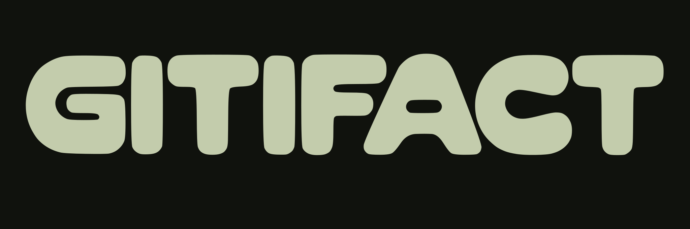

<p align="center">
  
</p>

AI 에이전트와 함께 코드를 작성하는 환경에서는 빠른 구현 속도만큼이나 제품의 본래 의도와 맥락을 보존하는 일도 중요합니다. 대화 속에 흩어지는 요구사항과 빠르게 쌓여가는 커밋 사이에서, 특정 명세가 언제 어떤 이유로 바뀌었는지는 쉽게 유실되기 때문입니다.

Gitifact CLI는 사용자가 문서 형식이나 복잡한 규칙을 고민하지 않고 개발에만 집중할 수 있도록 돕습니다. 요구사항마다 고유 ID를 부여해 문서 위치나 제목이 바뀌어도 추적을 자동으로 이어주고, 커밋 시점에는 바뀐 요구사항과 그 이유를 코드 변경과 함께 한 번에 묶어 기록합니다. 별도의 외부 도구 없이 가벼운 CLI 하나로, 제품의 모든 명세와 결정 배경을 Git 저장소 안에서 가장 간편하게 관리할 수 있습니다.

## 에이전트에게 시작을 맡기세요

아래 프롬프트를 프로젝트에서 사용하는 에이전트에게 전달하세요.

```text
이 프로젝트에 gitifact가 없으면 npm install -g gitifact@latest로 설치하고 gitifact init을 실행하세요.
init이 AGENTS.md 등에 쓴 GITIFACT 블록을 읽고 이번 세션부터 따르세요.
```

Node.js 24.x와 Git이 필요합니다. `init`은 프로젝트의 AGENTS.md 같은 에이전트 지침 파일에 작업 규칙 블록을 씁니다. 그 뒤로는 평소처럼 제품을 설명하고 개발을 이어가면 됩니다. 브라우저가 새 버전을 알려 주면 에이전트에게 업데이트를 맡기거나 직접 설치하고, `gitifact update`로 블록을 새 버전에 맞추세요. 명령 목록은 [CLI 안내](https://github.com/dev-goraebap/gitifact/blob/main/apps/cli/README.md)에 있습니다.

## 제품에 집중할 수 있도록

Gitifact의 목표는 에이전트와 함께 제품을 만드는 사람이 제품을 만드는 일 자체에 집중하게 하는 것입니다. 개발자든 비개발자든, CLI·데스크탑 앱·VS Code 어디에서 에이전트와 대화하든 마찬가지입니다.

스펙 주도 개발 같은 방법론을 먼저 이해하고 따를 필요는 없습니다. 평소처럼 무엇을 만들지 이야기하고, 구현하고, 고쳐나가면 에이전트가 대화에서 요구사항을 정리하고 그것이 추가·변경·삭제된 이유를 기록합니다. 기록을 위해 명령을 외우거나 문서를 따로 관리하지 않아도 됩니다. Gitifact는 사용자의 작업을 가로막지 않고, 사용자에게 익숙한 방식과 수준에 맞춰 뒤에서 동작하는 것을 지향합니다.

이렇게 쌓인 기록은 사람에게는 제품이 어떻게 지금에 이르렀는지를, 에이전트에게는 다음 작업을 이어갈 맥락을 줍니다.

## Git만으로 부족했던 것

Gitifact는 전혀 새로운 발상에서 나오지 않았습니다. 요구사항과 지침을 저장소의 Markdown으로 두고 에이전트가 읽게 하는 방식은 이미 널리 쓰이고 있고, 스펙 주도 개발 도구들에서도 많은 아이디어를 가져왔습니다. 다만 그 방식들에서 채워지지 않은 부분이 있었습니다. **명세가 언제, 어떤 이유로 바뀌었는가**입니다. 요구사항 문서를 어떤 관점으로 추적할지 다시 생각하게 된 계기는 Anthropic의 [AI-Native SDLC Playbook](https://academy.claude.com/courses/ai-native-sdlc-playbook)이었습니다. 다만 Gitifact가 그 글이 제시한 방식을 그대로 따르지는 않습니다.

Git은 뛰어난 추적 도구지만 추적의 단위는 파일과 텍스트 줄(line), 그리고 커밋입니다. 반면 요구사항은 줄 단위가 아니라 제품의 기능과 규칙을 나타내는 의미 단위입니다. 문서 구조가 바뀌어 제목이 달라지거나 다른 파일로 옮겨지면 Git diff는 이를 단순한 삭제와 추가로 인식해 요구사항의 연속성을 놓치기 쉽습니다. 또한 커밋 메시지는 여러 파일의 변경을 한 번에 설명하므로, 특정 요구사항이 구체적으로 어떤 이유로 바뀌었는지는 커밋 diff와 이미 지나간 대화 속에 흩어집니다. Git이 이 정보를 담지 못한다기보다, 순수한 Markdown 문서와 기본 커밋만으로는 요구사항을 축으로 기록을 모아보기 어렵습니다.

그래서 Gitifact는 Git 위에 최소한의 장치만 더합니다.

- **문서 규칙.** 기능마다 요구사항(requirements.md)과 설계(design.md)를 두고, 요구사항마다 CLI가 발급한 ID를 붙입니다. 제목이나 위치가 바뀌어도 같은 요구사항으로 이어서 추적합니다.
- **커밋 시점의 연결.** 커밋할 때 바뀐 요구사항과 그 이유를 ID로 묶어 같은 커밋에 담습니다. 이유가 빠진 변경이 있으면 커밋 결과에서 알려줍니다.
- **이력은 Git에.** 과거 원문, 작성자, 시각을 따로 복제하지 않고 Git 커밋에서 읽습니다. 별도로 남기는 것은 변경 이유와 그 연결뿐입니다.

이런 문제는 보통 에이전트 스킬이나 MCP로 풀려고 합니다. 하지만 둘 다 표준화됐어도 에이전트마다 동작 방식이 달라, 이를 지원하려다 보면 도입 과정이 오히려 복잡해질 수 있습니다. Gitifact는 CLI와 AGENTS.md 같은 에이전트 지침 파일만으로 동작하므로, 프로젝트나 모델에 따라 스킬 구성을 따로 고민할 필요가 없습니다.

이 기록은 읽기 전용 브라우저에서 요구사항별 활동으로 볼 수 있습니다.

## 커밋된 명세를 기준으로

작업 중 에이전트와 대화하며 명세를 다듬고, 커밋할 때 최종 변경과 맞는지 확인하는 방식입니다. 초안의 모든 수정 과정을 따로 보존하지 않고 Git에 남은 버전에서 과거 내용과 변경 전후를 읽습니다. 자동 기록은 자동 커밋·푸시 권한이 아니며 프로젝트의 정책을 따릅니다.

## 처음부터 완벽하게 정리하지 않아도

기존 프로젝트에는 도입한 시점부터 기록을 쌓아가면 됩니다. 유지보수하거나 기능을 추가하면서 해당 영역의 요구사항을 정리하면 되고, 과거 전체를 먼저 문서화해야 시작할 수 있는 흐름은 요구하지 않습니다. 원한다면 에이전트에게 기존 기능을 살펴보고 요구사항과 설계 초안을 함께 정리하도록 맡길 수 있습니다.

새 프로젝트라면 처음 아이디어를 나누는 대화부터 시작하면 됩니다. 만들고 싶은 제품을 구체화하는 동안 에이전트가 요구사항과 구현 설계를 함께 정리하고 불명확한 제품 동작을 질문합니다.

## 적용 범위와 한계

Gitifact는 개인이나 팀이 **하나의 Git 저장소 안에서 제품을 만드는 환경**을 전제로 합니다. 하나의 제품을 여러 저장소로 나누어 운영하는 멀티 레포의 통합 요구사항 관리는 지원하지 않습니다. 이슈 트래커 연계는 검토한 적이 있지만 개발 여부와 일정은 미정입니다.

## 프로젝트 상태

Markdown 요구사항·설계와 커밋 시점의 변경 이유를 Git에 연결하고, 읽기 전용 브라우저에서 활동·요구사항·참여자를 볼 수 있습니다. 에이전트에게 "gitifact 브라우저를 열어주세요"라고 요청하세요.

최신 공개 버전은 [npm](https://www.npmjs.com/package/gitifact)에서, 버전별 변경 내역은 [패치노트](https://github.com/dev-goraebap/gitifact/blob/main/apps/cli/src/shared/i18n/ko/changelog.md)에서 확인하세요.

제품의 목적·원칙·범위는 이 문서에서, 기능별 요구사항과 설계는 [요구사항](https://github.com/dev-goraebap/gitifact/tree/main/.gitifact/spec)에서 확인할 수 있습니다.

## 라이선스

[MIT](https://github.com/dev-goraebap/gitifact/blob/main/LICENSE).
