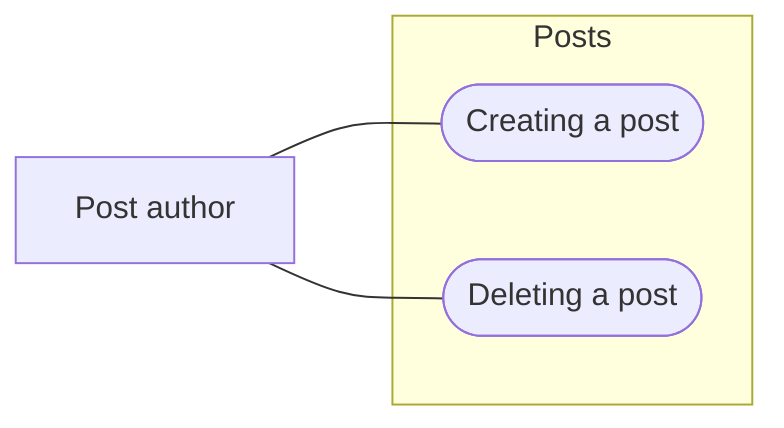

A feature is one folder, `.gitifact/spec/<feature>/`. The feature introduction is `index.md`, each requirement is its own `requirements/<slug>.md`, and the design is the files under `design/` (`gitifact guide show design`). Why a document changed is kept in records (`.gitifact/records/`, `gitifact guide show records`).

```text
.gitifact/spec/posts/
  index.md                 feature introduction (S-)
  requirements/
    create.md              one requirement (R-)
    delete.md
  design/
    overview.md            design (D-)
```

## Creating

Create files through the CLI. It issues the ID, fills in the frontmatter and writes a body skeleton.

```text
gitifact specs new feature posts --title "Posts" --description "Writing, editing and deleting posts"
gitifact specs new requirement posts/create --title "Create a post" --description "An author saves a post with a title and body"
```

A new file carries `draft: true`. Fill in the body, remove that line and run `gitifact check`. While the line remains, `check` and `changes commit` fail. Do not invent IDs or copy another document's ID.

## File structure

```markdown
---
id: R-issued-by-the-CLI
title: Create a post
description: An author saves a post with a title and body
order: 10
---

As a post author, I want to save a title and body so that I can return to my writing later.

### Scope and constraints

- A title takes up to 100 characters.
- Uploading attachments is not part of this requirement.

### Acceptance criteria

1. Condition: The user requests a save with an empty title.
   Expected: The system asks for a title and does not save the post.
```

These IDs and sentences illustrate the structure and are not valid input. The body is the user story, `### Scope and constraints` (left out when there is none), then `### Acceptance criteria`.

- **`id`:** issued by the CLI. Features use `S-`, requirements `R-`, followed by ten lowercase base32 characters. It stays the same when the file moves or its title changes.
- **`title` and `description`:** required, one line each. Do not repeat the title as a `#` heading in the body. Write the description so that the list (`specs list`) tells what the document is without opening it.
- **`order`:** requirements only. Number them in the order of the feature's use; two in one feature may not share a number. `specs new` uses the folder's highest value plus 10, leaving room to insert between.
- **Body:** required. Do not use a `#` heading or gitifact comments (`<!-- gitifact-… -->`). The body of a feature's `index.md` states in a paragraph or two what the feature is and where it ends.

A requirement written as a use case also has `style` (see "Use-case style" below). Put no other keys in the frontmatter. Relations between documents are expressed by a design's `requirements` and `sources`; the folder decides which feature a requirement belongs to.

Links to other documents are relative to this file (from a requirement to an asset: `../../../assets/flow.png`). The browser opens their destinations. `check` and `changes list` report a missing target as a `MISSING_LINK_TARGET` warning. Warnings do not block a commit.

## Reading

| Command | When |
| :--- | :--- |
| `gitifact specs list [--feature <feature>]` | IDs, titles and descriptions of features, requirements and designs, without bodies |
| `gitifact specs list --uncovered` | Requirements no design covers. `--without-design` finds features without a design, `--draft` documents still marked draft |
| `gitifact specs list --changed-since <date\|commit>` | Documents changed since then. Combine with `--author` and `--sort updated` |
| `gitifact specs list --q <query>` | Finding text in bodies that titles and descriptions do not mention |
| `gitifact specs show <ID…>` | The source of the chosen documents and the designs that point to them. `--ref <commit>` shows them as of that commit |
| `gitifact records list --doc <ID>` | Why a document changed over time, with its records and commits |

Lists show 20 at a time (the default order 20 features with all their documents). Read the next page with the `--after <value>` printed at the end, or everything with `--all`. A document not committed yet ends its line with added, modified or to be deleted, and a deleted one stays listed as to be deleted until the commit. Choose with the list's conditions, then `show` only the documents you need. A list also gives only the columns you ask for (`--fields id,title`) or JSON (`--format json`). This reads far less than grepping or opening every file.

## Editing, moving and deleting

Edit the files directly; there is no save command. Afterwards run `gitifact check` to verify format and references.

| Task | How |
| :--- | :--- |
| Change content | Edit `title`, `description` and the body. Keep the ID |
| Move to another feature | Move the file into that feature's `requirements/`, keep the ID, and adjust `order` to its place there |
| Rename the slug | Rename the file only. ID and content stay |
| Delete | Delete the file. Remove its ID from the `requirements` of any design that pointed to it, or `check` fails |
| Rename a feature (folder) | Move the folder. The S- ID in `index.md` stays |

Do not duplicate a document under a new ID when moving or renaming it, and do not reuse a deleted ID. When a requirement changes, review the designs that point to it (“Referenced by” in `specs show <R-ID>`).

## Grouping features

Group requirements into cohesive features that mean something to users. Do not reproduce code modules or DDD layers. Before creating a feature, check whether an existing one is a suitable home. A common feature that gathers system-wide quality targets (see "Scope and constraints" below) is the exception. Use the feature name as its title without a suffix such as “requirements.” Slugs and folder names use lowercase letters, digits and hyphens.

## User stories and acceptance criteria

Start each requirement with a user story: one or two sentences explaining who wants what and why. The default pattern is “As a [role], I want [goal] so that [reason],” expressed naturally in the project's language. Use an actual user or operator of the product. Do not copy the post author in this example, or a Gitifact user, into an unrelated product.

The acceptance-criteria section (`###`) holds numbered condition/expected pairs only, in the project's language, with no paragraphs added outside them. Do not substitute paths, IDs or storage conventions for user goals. Base roles, goals and reasons on the conversation and verified context. Do not invent motives to fill the template; ask only for information needed to settle the meaning.

Apply this to new requirements and those being revised for the current request. Preserve existing IDs, agreed constraints and the meaning of acceptance criteria. Do not rewrite unrelated requirements in bulk. When done, check that the story states a role, goal and reason, and that its criteria determine success or failure. `changes list` and `changes commit` warn with `REQUIREMENT_SCOPE_FORMAT` or `REQUIREMENT_CRITERIA_FORMAT` when a requirement changed in this work leaves this order and shape. The warnings do not block a commit, and `check` does not give them. The CLI does not validate what sentences mean or what the user intends.

## Scope and constraints

`### Scope and constraints` is optional. It comes after the user story and before the acceptance criteria, as `-` items only. Each item is one independent rule that is either true or false.

- Put business rules (input limits, retention, the result of sending the same request twice) and what is not provided yet ("… is not part of this requirement") here.
- A rule whose result can be checked in a given situation becomes an acceptance criterion instead. Do not write the same rule in both places.
- A quality target for this feature alone (performance, availability, security, accessibility, compatibility) is one item with a number. Example: "- One page of the list shows within 1 second for 95% of requests." Do not write targets without an agreed number ("fast", "stable").

System-wide quality targets (response time of every query, supported browsers, session expiry) are not repeated per requirement; gather them in one common feature. For example, `.gitifact/spec/quality/` holds one target per requirement, with what can be judged written as acceptance criteria. Do not put them in project instructions: instructions describe how to work, and what the product promises belongs in the specs.

## Use-case style (optional)

A requirement can also be written as a use case: it walks through the normal flow and every way it branches, and each acceptance criterion names the path it checks. If you do not use it, the default shape above stays as it is and this section can be skipped.

- **Marker:** `style: usecase` in the requirement's frontmatter. Without it the requirement has the default shape.
- **Project default:** write `"requirementStyle": "usecase"` into `.gitifact/config.json` by hand, and `specs new requirement` writes `style: usecase` and a use-case skeleton. `init` and `update` neither write nor change the value. To make one file differently, pass `--style usecase` or `--style default`.
- **In a project with that value:** a changed requirement without `style` draws the `REQUIREMENT_STYLE_MISSING` warning. A requirement that keeps the default shape says `style: default`.

```markdown
---
id: R-issued-by-the-CLI
title: Deleting a post
description: The author removes their own post
order: 30
style: usecase
---

As a post author, I want to delete my post so that I can take back something posted by mistake.

### Scope and constraints

- A deleted post stays in the trash for 30 days.

### Basic flow

1. The author chooses delete on the post.
2. The system asks for confirmation.
3. When the author confirms, the system moves the post to the trash.

### Alternative flows

- **A1. Not the author** (at step 1)
  1. The delete button is not shown.
- **A2. Confirmation cancelled** (at step 3)
  1. The post stays as it is.

### Acceptance criteria

1. Path: Basic flow
   Condition: The author confirms the deletion.
   Expected: The post leaves the list and shows in the trash.
2. Path: Basic flow, A2
   Condition: The author cancels the confirmation.
   Expected: The post stays.
3. Path: A1
   Condition: Another user opens the post.
   Expected: There is no delete button.
```

The body runs: user story, `### Scope and constraints`, `### Preconditions`, `### Basic flow`, `### Alternative flows`, `### Postconditions`, `### Acceptance criteria`. The basic flow and the acceptance criteria are required; the rest only when needed.

- **Basic flow:** the normal exchange between the actor and the system as numbered steps, one action per step.
- **Alternative flows:** `- **A1. Situation** (at step N)`: a number, where it branches and from which step, with its steps below. Errors and exceptions go here too. Say so when a flow returns to the basic flow.
- **Pre- and postconditions:** what must hold before it starts and after it ends, as `-` items.
- **Acceptance criteria:** three lines per item, `Path:`, `Condition:` and `Expected:`. The path joins `Basic flow` and this requirement's alternative flow numbers with commas (for example `Path: Basic flow, A2`). Give every path at least one criterion.
- **Scope:** write the flows as behavior the user can check; screen layout and APIs belong in the design (see "What stays out of a requirement" below). Implementation order and effort stay out of the requirement.

For a use-case requirement changed in this commit, `changes list` and `changes commit` warn `REQUIREMENT_FLOW_FORMAT` when the basic flow is missing or the sections are out of order, and `REQUIREMENT_PATH_FORMAT` when a criterion has no `Path:` or names a flow that does not exist. As with the default shape, they do not stop the commit and `check` does not give them.

A feature's `index.md` may draw its use-case model as a Mermaid flowchart: the actors, the feature's boundary (`subgraph`) and a use case per requirement, joined. It is optional and the CLI does not check it.

````markdown
## Use-case model


````

## What stays out of a requirement

A requirement says what to build, as results the user can check. Keep the following in the design (ui, interface, data). In a requirement, every design or screen change would also change the requirement and add records.

- Screen layout, components, the columns a table shows, items per page, the shape of addresses
- API paths, field names, storage structure
- The libraries used, and details settled only after implementation

Example: instead of "each row shows the applicant, period and status columns", write "the user can tell applications apart by applicant, period and status".

Follow `gitifact guide show writing` for prose. Its style rules do not replace the user-story pattern and the acceptance criteria format above (condition/expected, with a path first in a use case). Write project content in the project's language; the language of these instructions does not change it.

Refine the files during the conversation. When an existing requirement changes or one of several options is chosen, write a draft record then (`gitifact guide show records`). Simply adding a requirement needs no record. While changing code and tests, bring requirements into line with the final agreement.
