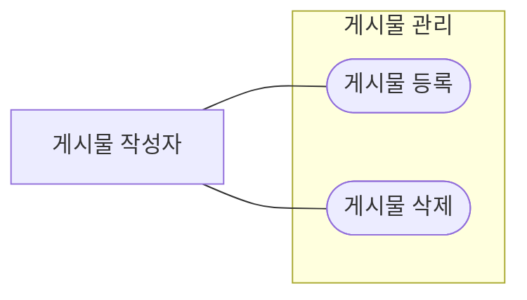

기능 하나는 `.gitifact/spec/<기능>/` 폴더 하나다. 기능 소개는 `index.md`, 요구사항은 `requirements/<slug>.md`에 하나씩, 설계는 `design/` 아래 파일들(`gitifact guide show design`)이다. 문서가 왜 바뀌었는지는 결정기록(`.gitifact/records/`)이 남긴다(`gitifact guide show records`).

```text
.gitifact/spec/posts/
  index.md                 기능 소개 (S-)
  requirements/
    create.md              요구사항 하나 (R-)
    delete.md
  design/
    overview.md            설계 (D-)
```

## 만들기

파일은 CLI로 만든다. CLI가 ID를 발급하고 프론트매터를 채우며 본문 뼈대를 쓴다.

```text
gitifact specs new feature posts --title "게시물 관리" --description "게시물을 쓰고 고치고 지우는 기능"
gitifact specs new requirement posts/create --title "게시물 등록" --description "작성자가 제목과 내용으로 게시물을 저장한다"
```

만든 파일에는 `draft: true`가 붙는다. 본문을 채운 뒤 이 줄을 지우고 `gitifact check`로 확인한다. 이 줄이 남아 있으면 `check`와 `changes commit`이 실패한다. ID를 직접 만들거나 다른 문서의 ID를 복사하지 않는다.

## 파일 구조

```markdown
---
id: R-CLI가발급한값
title: 게시물 등록
description: 작성자가 제목과 내용으로 게시물을 저장한다
order: 10
---

게시물 작성자로서, 작성한 글을 나중에 다시 확인하기 위해 제목과 내용을 저장하고 싶다.

### 범위와 제약

- 제목은 100자까지 받는다.
- 첨부 파일 올리기는 이 요구사항에 들지 않는다.

### 수용 조건

1. 조건: 사용자가 제목을 비운 채 저장을 요청합니다.
   기대 동작: 시스템은 제목 입력 안내를 표시하고 저장을 중단합니다.
```

위 ID와 문장은 구조 설명이며 유효한 입력이 아니다. 본문은 사용자 스토리, `### 범위와 제약`(없으면 뺀다), `### 수용 조건` 순서다.

- **`id`:** CLI가 발급한 값이다. 기능은 `S-`, 요구사항은 `R-`, 뒤는 소문자 base32 10자다. 파일을 옮기거나 제목을 바꿔도 그대로 둔다.
- **`title`·`description`:** 필수이며 한 줄이다. 제목은 본문에 `#`로 다시 쓰지 않는다. 설명은 목록(`specs list`)에서 본문을 열지 않고도 무엇인지 알 수 있게 쓴다.
- **`order`:** 요구사항에만 있다. 기능 안에서 사용 흐름에 맞는 순서로 매기고, 같은 기능에서 겹치면 안 된다. `specs new`는 그 폴더의 최댓값+10을 넣으므로 사이에 끼울 자리가 남는다.
- **본문:** 비워 둘 수 없다. `#` 제목과 gitifact 주석(`<!-- gitifact-… -->`)을 쓰지 않는다. 기능 `index.md`의 본문은 그 기능이 무엇이고 어디까지인지를 한두 문단으로 쓴다.

요구사항은 유즈케이스 방식일 때 `style`을 더 둔다(아래 "유즈케이스 방식"). 프론트매터에 다른 키를 두지 않는다. 문서 사이의 관계는 설계의 `requirements`·`sources`로 나타내고, 요구사항이 어느 기능에 속하는지는 폴더가 정한다.

다른 문서로 가는 링크는 이 파일 기준 상대 경로로 쓴다(요구사항에서 에셋으로는 `../../../assets/flow.png`). 브라우저가 해당 페이지로 연결한다. 대상이 없으면 `check`와 `changes list`가 `MISSING_LINK_TARGET` 경고로 알린다. 경고는 커밋을 막지 않는다.

## 읽기

| 명령 | 쓰는 때 |
| :--- | :--- |
| `gitifact specs list [--feature <기능>]` | 기능·요구사항·설계의 ID·제목·설명을 본문 없이 본다 |
| `gitifact specs list --uncovered` | 어떤 설계도 다루지 않는 요구사항을 찾는다. `--without-design`은 설계 없는 기능, `--draft`는 초안이 남은 문서다 |
| `gitifact specs list --changed-since <날짜\|커밋>` | 그 뒤에 바뀐 문서를 찾는다. `--author`, `--sort updated`와 함께 쓴다 |
| `gitifact specs list --q <검색어>` | 제목이나 설명에 없는 내용을 본문에서 찾는다 |
| `gitifact specs show <ID…>` | 고른 문서의 원문과 그 문서를 가리키는 설계를 본다. `--ref <커밋>`은 그 시점의 원문이다 |
| `gitifact records list --doc <ID>` | 그 문서가 왜 바뀌어 왔는지 결정기록과 커밋을 본다 |

목록은 20개씩(기본 정렬은 기능 20개와 그 문서 전부씩) 보인다. 끝에 나온 `--after <값>`으로 다음 페이지를, `--all`로 전부를 본다. 커밋하지 않은 문서는 줄 끝에 추가·변경·삭제 예정이 붙고, 지운 문서는 커밋할 때까지 삭제 예정으로 남는다. 목록의 조건으로 고른 뒤 필요한 문서만 `show`로 읽는다. 목록은 `--fields id,title`처럼 필요한 열만, `--format json`으로도 받는다. 전체 파일을 grep하거나 모두 여는 것보다 적게 읽는다.

## 고치기·옮기기·지우기

파일을 직접 고친다. 저장 명령은 없다. 고친 뒤에는 `gitifact check`로 형식과 참조를 확인한다.

| 작업 | 방법 |
| :--- | :--- |
| 내용 고치기 | 파일의 `title`·`description`·본문을 고친다. ID는 그대로 둔다 |
| 다른 기능으로 옮기기 | 파일을 그 기능의 `requirements/`로 옮기고 ID를 유지한다. 옮긴 곳의 순서에 맞게 `order`를 고친다 |
| slug 바꾸기 | 파일 이름만 바꾼다. ID와 내용은 그대로다 |
| 지우기 | 파일을 지운다. 그 요구사항을 가리키던 설계의 `requirements`에서 ID를 빼야 `check`가 통과한다 |
| 기능 이름(폴더) 바꾸기 | 폴더를 옮긴다. `index.md`의 S- ID는 그대로다 |

옮기거나 이름을 바꿀 때 새 ID로 복제하지 않는다. 지운 ID를 다른 문서에 다시 쓰지 않는다. 요구사항을 바꾸면 그것을 가리키는 설계도 확인한다(`specs show <R-ID>`의 "가리키는 문서").

## 기능으로 묶는 기준

사용자에게 의미 있는 응집된 기능으로 묶는다. 코드 모듈이나 DDD 계층을 그대로 복제하지 않는다. 새 기능을 만들기 전에 기존 기능에 넣을 수 있는지 먼저 확인한다. 시스템 전체의 품질 목표를 모은 공통 기능(아래 "범위와 제약")은 이 기준의 예외다. 기능 제목은 기능 이름 그대로 쓰고 "요구사항" 같은 접미어를 붙이지 않는다. slug와 폴더 이름은 소문자·숫자·하이픈이다.

## 사용자 스토리와 수용 조건

각 요구사항의 본문은 사용자 스토리로 시작한다. 누가 어떤 목표를 이루려 하며 왜 필요한지를 한두 문장으로 표현한다. 기본 문형은 “［역할］로서, ［이유］를 위해 ［목표］하고 싶다.”이며 프로젝트의 언어에 맞게 자연스럽게 쓴다. 역할은 해당 제품의 실제 사용자나 운영자 등이며, 이 문서의 게시물 예시나 Gitifact 사용자를 다른 제품에 그대로 대입하지 않는다.

`### 수용 조건`에는 번호별 `조건: / 기대 동작:` 항목만 둔다. 항목 밖에 문단을 덧붙이지 않는다. 파일 경로·ID·저장 규약으로 사용자 목표를 대신하지 않는다. 역할·목표·이유는 대화와 확인한 맥락에 근거하며, 모르는 동기를 만들어 문형을 채우지 않는다. 의미를 결정할 정보가 부족하면 필요한 부분만 질문한다.

새 요구사항과 요청받아 개정하는 요구사항에 적용한다. 기존 문서를 정리할 때 ID·확정된 제약·수용 조건의 의미를 보존하고, 이번 작업과 무관한 요구사항을 일괄 개정하지 않는다. 다 쓴 뒤에는 스토리의 역할·목표·이유가 드러나는지, 수용 조건이 그 목표의 성공·실패를 판정하는지 대조한다. `changes list`와 `changes commit`은 이번에 바뀐 요구사항이 이 순서와 모양을 벗어나면 `REQUIREMENT_SCOPE_FORMAT`·`REQUIREMENT_CRITERIA_FORMAT` 경고로 알린다. 경고는 커밋을 막지 않으며, `check`는 이 경고를 내지 않는다. CLI는 문장의 뜻이나 사용자 의도는 검증하지 않는다.

## 범위와 제약

`### 범위와 제약`은 선택이고, 사용자 스토리 다음, 수용 조건 앞에 `-` 목록으로만 쓴다. 한 항목은 참·거짓을 가릴 수 있는 독립된 규칙 한 문장이다.

- 업무 규칙(입력 상한, 보존 기간, 같은 요청을 두 번 보냈을 때의 결과 등)과 아직 제공하지 않는 범위("…는 이 요구사항에 들지 않는다")를 둔다.
- 특정 상황에서 결과로 확인할 수 있는 규칙은 수용 조건 항목으로 올린다. 같은 규칙을 두 곳에 쓰지 않는다.
- 이 기능에만 해당하는 품질 목표(성능·가용성·보안·접근성·호환성)는 수치를 넣은 한 항목으로 쓴다. 예: "- 목록 한 쪽은 요청의 95%에서 1초 안에 보여 준다." 수치가 합의되지 않은 목표("빠르게", "안정적으로")는 쓰지 않는다.

시스템 전체에 해당하는 품질 목표(모든 조회의 응답 시간, 지원 브라우저, 세션 만료 등)는 요구사항마다 되풀이하지 않고 공통 기능 한 곳에 모은다. 예: `.gitifact/spec/quality/`의 요구사항마다 목표 하나를 두고, 판정할 수 있는 것은 수용 조건으로 쓴다. 프로젝트 지침에는 두지 않는다. 지침은 일하는 방식이고, 제품이 지킬 약속은 명세다.

## 유즈케이스 방식 (선택)

요구사항을 유즈케이스 방식으로 쓸 수도 있다. 정상 흐름과 갈라지는 경우를 빠짐없이 짚고, 수용 조건마다 어느 경로를 확인하는지 적는다. 쓰지 않으면 위의 기본 형식 그대로이고, 이 절은 건너뛴다.

- **표지:** 요구사항 프론트매터의 `style: usecase`. 값이 없으면 기본 형식이다.
- **프로젝트 기본값:** `.gitifact/config.json`에 `"requirementStyle": "usecase"`를 직접 적으면 `specs new requirement`가 `style: usecase`와 유즈케이스 뼈대를 쓴다. `init`·`update`는 이 값을 쓰거나 바꾸지 않는다. 파일 하나만 다르게 만들려면 `--style usecase` 또는 `--style default`를 준다.
- **이 값을 둔 프로젝트:** 바뀐 요구사항에 `style`이 없으면 `REQUIREMENT_STYLE_MISSING` 경고가 난다. 기본 형식으로 둘 요구사항은 `style: default`를 적는다.

```markdown
---
id: R-CLI가발급한값
title: 게시물 삭제
description: 작성자가 자기 게시물을 지운다
order: 30
style: usecase
---

게시물 작성자로서, 잘못 올린 글을 거두기 위해 내 게시물을 지우고 싶다.

### 범위와 제약

- 지운 게시물은 30일 동안 휴지통에 남는다.

### 기본 흐름

1. 작성자가 게시물에서 삭제를 누른다.
2. 시스템이 확인을 묻는다.
3. 작성자가 확인하면 시스템이 게시물을 휴지통으로 옮긴다.

### 대체 흐름

- **A1. 작성자가 아님** (1단계에서)
  1. 삭제 버튼을 보이지 않는다.
- **A2. 확인을 취소함** (3단계에서)
  1. 게시물을 그대로 둔다.

### 수용 조건

1. 경로: 기본 흐름
   조건: 작성자가 삭제를 확인합니다.
   기대 동작: 게시물이 목록에서 사라지고 휴지통에 보입니다.
2. 경로: 기본 흐름, A2
   조건: 작성자가 확인 창에서 취소합니다.
   기대 동작: 게시물이 그대로 남습니다.
3. 경로: A1
   조건: 다른 사용자가 게시물을 엽니다.
   기대 동작: 삭제 버튼이 없습니다.
```

본문은 사용자 스토리, `### 범위와 제약`, `### 사전 조건`, `### 기본 흐름`, `### 대체 흐름`, `### 사후 조건`, `### 수용 조건` 순서다. 기본 흐름과 수용 조건은 필수이고, 나머지는 필요할 때만 둔다.

- **기본 흐름:** 행위자와 시스템이 주고받는 정상 흐름을 번호 단계로 쓴다. 한 단계는 한 동작이다.
- **대체 흐름:** `- **A1. 상황** (N단계에서)`처럼 번호, 갈라지는 상황, 갈라지는 단계를 적고 그 아래에 단계를 쓴다. 오류와 예외도 여기에 둔다. 기본 흐름으로 돌아오면 그렇게 적는다.
- **사전·사후 조건:** 시작 전에, 끝난 뒤에 참이어야 하는 것을 `-` 목록으로 쓴다.
- **수용 조건:** 항목마다 `경로:`·`조건:`·`기대 동작:` 세 줄이다. 경로는 `기본 흐름`과 이 요구사항의 대체 흐름 번호를 쉼표로 잇는다(예: `경로: 기본 흐름, A2`). 경로마다 수용 조건이 하나 이상 있게 한다.
- **범위:** 흐름은 사용자가 확인할 수 있는 동작으로 쓰고, 화면 배치나 API는 설계에 둔다(아래 "요구사항에 두지 않을 것"). 구현 순서나 작업량은 요구사항에 두지 않는다.

`changes list`와 `changes commit`은 이번에 바뀐 유즈케이스 요구사항에 기본 흐름이 없거나 절 순서가 다르면 `REQUIREMENT_FLOW_FORMAT`, 수용 조건에 `경로:`가 없거나 없는 흐름을 가리키면 `REQUIREMENT_PATH_FORMAT` 경고를 낸다. 기본 형식과 같이 커밋을 막지 않고 `check`는 내지 않는다.

기능 `index.md`에는 유즈케이스 모델을 Mermaid 흐름도로 그려 둘 수 있다. 액터, 기능 경계(`subgraph`), 요구사항마다의 유즈케이스를 잇는다. 선택이며 CLI는 검사하지 않는다.

````markdown
## 유즈케이스 모델


````

## 요구사항에 두지 않을 것

요구사항은 무엇을 만들지, 사용자가 확인할 수 있는 결과로 말한다. 아래는 설계(ui·interface·data)에 둔다. 요구사항에 들어가면 설계나 화면을 바꿀 때마다 요구사항과 결정기록까지 바뀐다.

- 화면 배치, 컴포넌트, 표에 보일 열, 한 쪽의 건수, 주소 모양
- API 경로, 필드 이름, 저장 구조
- 쓰는 라이브러리나 구현 뒤에야 정해지는 세부

예: "행마다 신청자·기간·상태 열을 보여 준다" 대신 "사용자는 신청자·기간·상태로 신청을 구분할 수 있다".

본문의 문체는 `gitifact guide show writing`을 따른다. 그 문서의 문체 규칙은 위 사용자 스토리 문형과 수용 조건 형식(`조건: / 기대 동작:`, 유즈케이스는 앞에 `경로:`)을 대체하지 않는다.

대화 중에는 파일을 다듬는다. 기존 요구사항을 바꾸거나 여러 안 중 하나를 고르면 그때 결정기록 초안을 쓴다(`gitifact guide show records`). 새 요구사항을 추가하기만 하면 기록은 필요 없다. 코드와 테스트를 고치는 동안 달라진 요구사항은 마지막 합의 내용으로 맞춘다.
